# Алгоритмічне мислення у Python — Урок 7

## Сценарій: власник ресторану хоче аналітику

До нас прийшов власник ресторану з реальними даними чеків (seaborn tips dataset).
Він хоче відповіді на питання:

* Коли найприбутковіші дні?
* Обід чи вечеря приносить більше?
* Скільки людей в середньому за столом?
* Який відсоток чайових?

Наш інструмент: `NamedTuple`, `for`, `dict`, `list`, `set`, `comprehensions`.

---

# 1. Архітектура даних

Де і як зберігаються дані на кожному кроці.

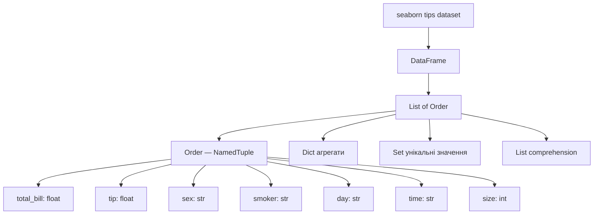

```
реальні дані → NamedTuple → алгоритми → аналітика
```

---

# 2. NamedTuple: структура чеку

Чому NamedTuple краще за звичайний tuple.

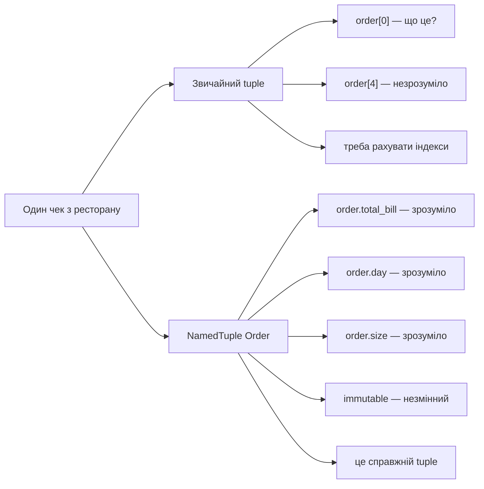

```
order[0]          → незрозуміло
order.total_bill  → одразу ясно
```

Розрахунки — прості вирази у коді, не методи:

```python
tip_percent     = (order.tip / order.total_bill) * 100
bill_per_person = order.total_bill / order.size
is_large_table  = order.size >= 5
```

---

# 3. Завантаження даних: DataFrame → List[Order]

Два способи перетворити DataFrame на список Python-об'єктів.

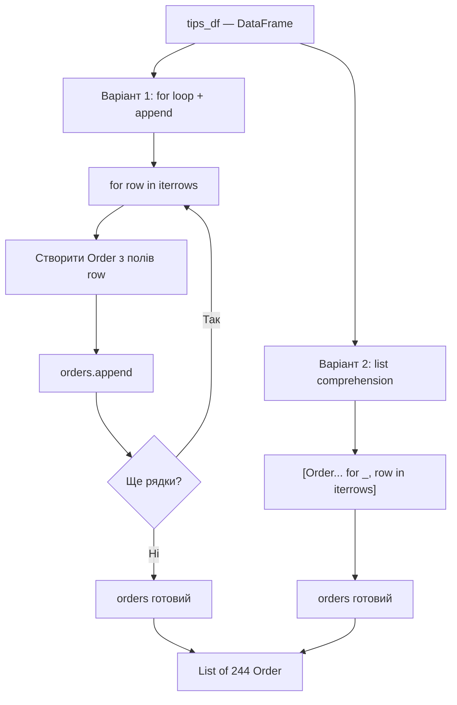

```
DataFrame → for loop або list comp → List[Order]
Після цього pandas більше не потрібен
```

---

# 4. For Loop: обробка потоку подій

Кожна ітерація — це один клієнт, який заплатив рахунок.

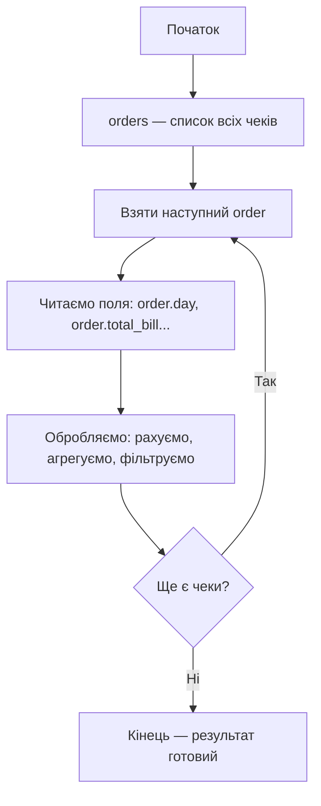

```
for loop = event processor
кожна ітерація = один клієнт заплатив
```

---

# 5. Dict: Counting Pattern

Найважливіший патерн уроку.

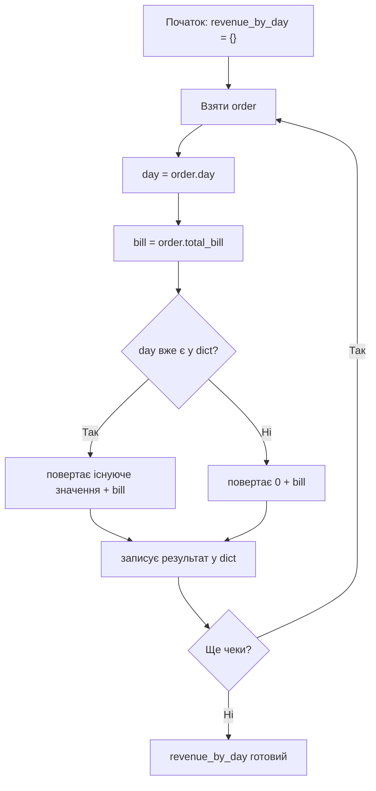

Код цього алгоритму:

```python
revenue_by_day[day] = revenue_by_day.get(day, 0) + bill
```

```
.get(key, 0) → шукаємо коробку у шафі:
  є   → беремо значення
  нема → повертаємо 0
```

---

# 6. Три словники за один цикл

За один прохід по даних рахуємо одразу три метрики.

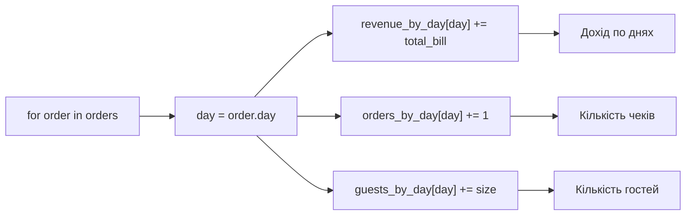

```python
revenue_by_day[day] = revenue_by_day.get(day, 0) + order.total_bill
orders_by_day[day]  = orders_by_day.get(day, 0)  + 1
guests_by_day[day]  = guests_by_day.get(day, 0)  + order.size
```

```
один цикл → три результати
```

---

# 7. Leader Algorithm

Знаходимо найприбутковіший день.

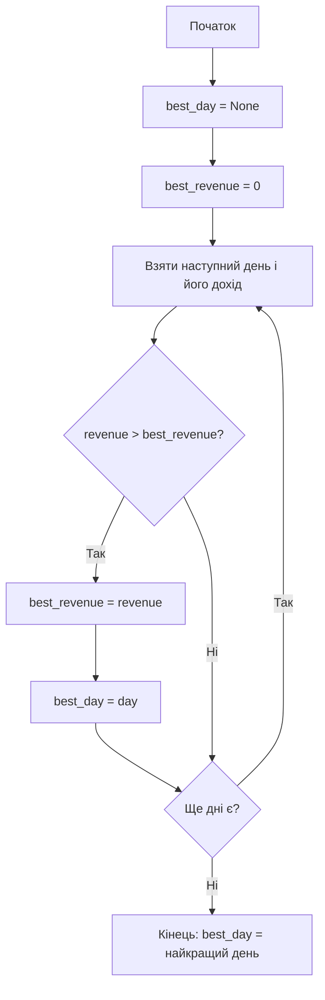

Або через вбудований Python:

```python
best_day = max(revenue_by_day, key=revenue_by_day.get)
```

```
ручний алгоритм → розуміємо логіку
max() → pythonic варіант
```

---

# 8. Set Pattern

Знаходимо унікальні дні, типи зміни, розміри столів.

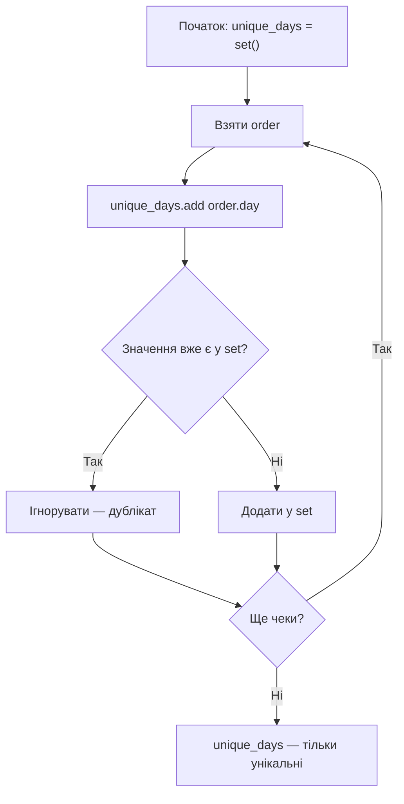

```
set автоматично прибирає дублікати
```

Set comprehension — компактніше:

```python
unique_days  = {order.day  for order in orders}
unique_times = {order.time for order in orders}
unique_sizes = {order.size for order in orders}
```

---

# 9. Grouping Pattern: dict of lists

Зберігаємо не суму, а список всіх чеків.

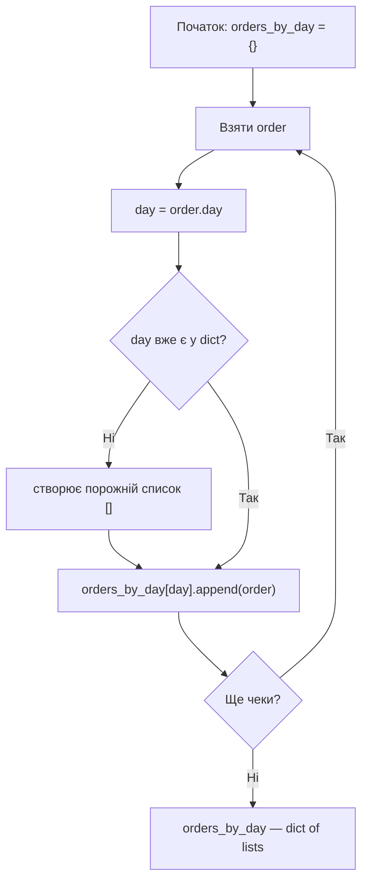

```python
orders_by_day.setdefault(day, []).append(order)
```

```
Counting:  {день: кількість}
Grouping:  {день: [order1, order2, order3...]}
```

---

# 10. defaultdict: еволюція коду

`defaultdict` робить те саме що `.get()` і `setdefault()`, але коротше.

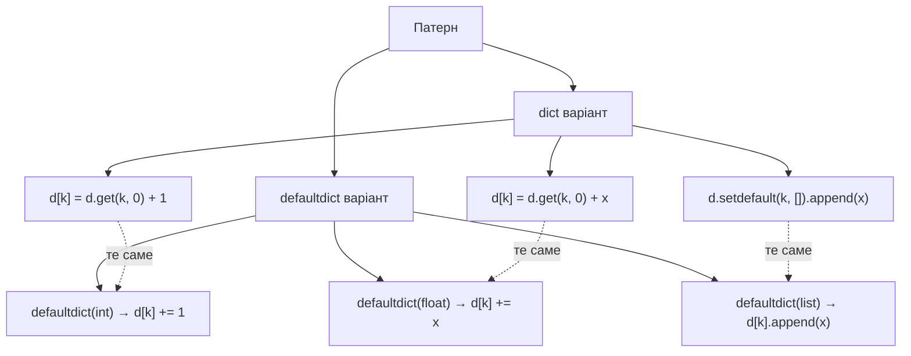

```python
from collections import defaultdict

orders_count = defaultdict(int)
revenue      = defaultdict(float)
groups       = defaultdict(list)

for order in orders:
    orders_count[order.day] += 1
    revenue[order.day]      += order.total_bill
    groups[order.day].append(order)
```

```
спочатку вчимо .get() — розуміємо механіку
потім defaultdict — той самий алгоритм, чистіший синтаксис
```

---

# 11. List Comprehension

Три форми — filter, mapping, filter+transform.

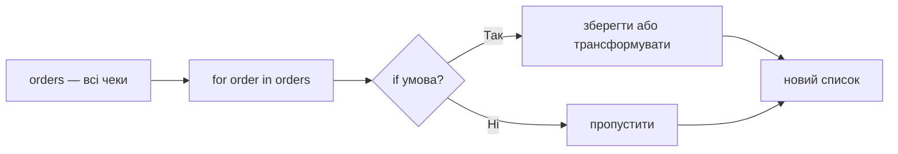

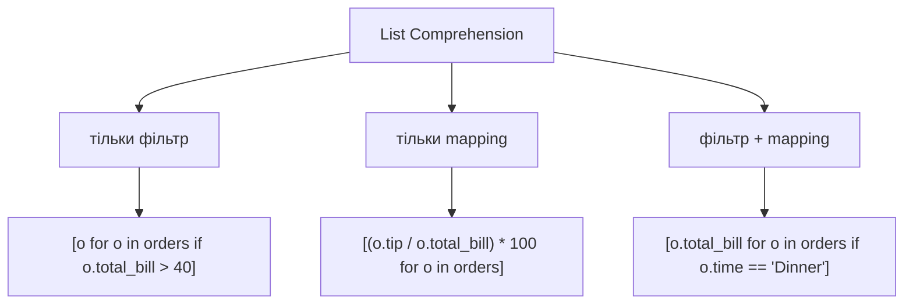

```
[що_зберегти  for елемент in колекція  if умова]
   Transform       Iterate               Filter
```

Важливо:

```python
# Замість методу — простий вираз
(o.tip / o.total_bill) * 100   # tip%
o.total_bill / o.size          # чек на людину
o.size >= 5                    # великий стіл
```

---

# 12. Dict Comprehension

Будуємо словник з агрегатом в один рядок.

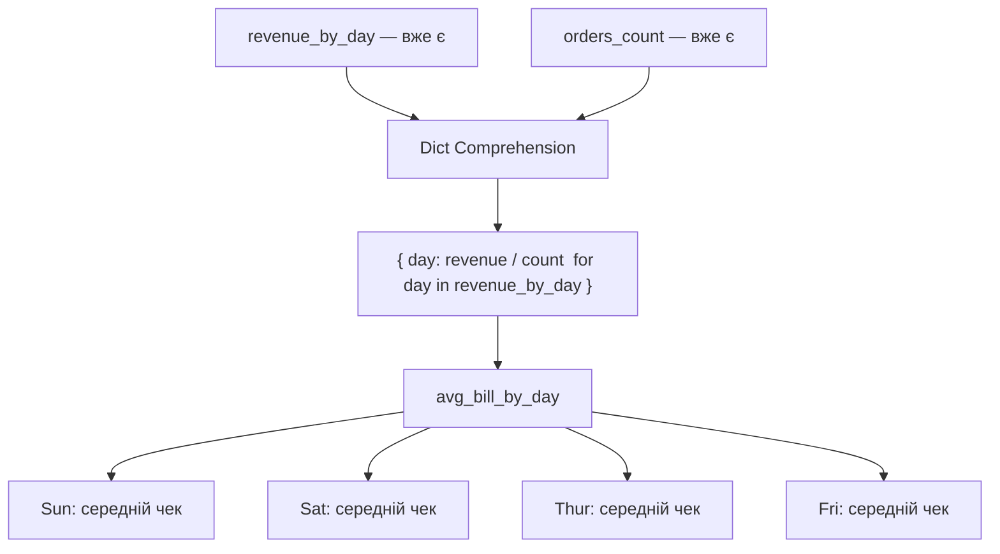

```python
avg_bill_by_day = {
    day: revenue_by_day[day] / orders_count[day]
    for day in revenue_by_day
}

tip_pct_by_day = {
    day: sum((o.tip / o.total_bill) * 100 for o in groups[day]) / len(groups[day])
    for day in groups
}
```

---

# 13. Повний Pipeline аналітики

Як дані течуть від seaborn до відповіді для власника.

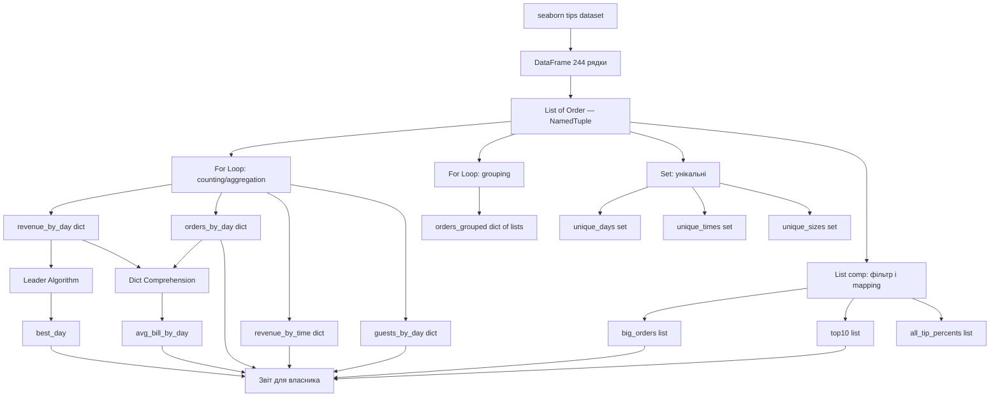

---

# 14. Відповідь на питання власника

Від даних до рішення.

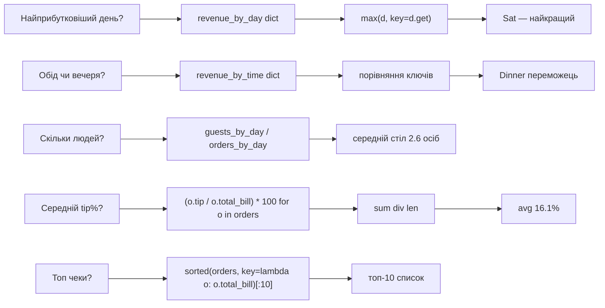

---

# 15. Чотири патерни мислення

Будь-яку задачу аналізу даних можна розкласти так:

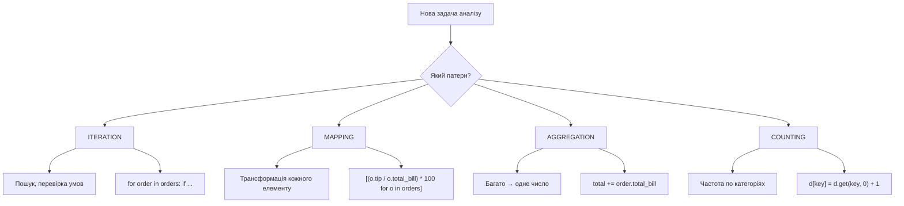

---

# 16. Відповідність патернів і Python

| Патерн | Інструмент | Приклад |
|---|---|---|
| Iteration | `for` + `if` | пошук великих чеків |
| Mapping | `list comprehension` | `[(o.tip / o.total_bill) * 100 for o in orders]` |
| Aggregation | `+=` накопичувач | `total += order.total_bill` |
| Counting | `d.get(k, 0) + 1` | кількість чеків по днях |
| Aggregation dict | `d.get(k, 0) + x` | дохід по днях |
| Grouping | `setdefault + append` | всі чеки по днях |
| Leader | `max(d, key=d.get)` | найкращий день |
| Unique | `set` | унікальні дні |
| defaultdict | `defaultdict(int/float/list)` | те саме без `.get()` |

---

# Головна ідея уроку

```
NamedTuple  = tuple з іменами полів (незмінний)
for loop    = система обробки потоку подій
dict        = база даних аналітики
list comp   = конвеєр трансформацій
set         = індекс унікальних значень
defaultdict = dict без .get() і setdefault()
```

Три рядки, які пояснюють всю аналітику реального бізнесу:

```python
revenue_by_day[day] = revenue_by_day.get(day, 0) + bill        # counting
best_day = max(revenue_by_day, key=revenue_by_day.get)          # leader
tip_pcts = [(o.tip / o.total_bill) * 100 for o in orders]      # mapping
```

```
дані → NamedTuple → цикл → dict → аналітика → рішення
```
