# Алгоритмічне мислення у Python — Урок 8

## Завдання

Власник ресторану хоче **інтерактивний дашборд**:
фільтрує чеки в реальному часі й одразу бачить KPI, графіки, таблиці.

**Проблема, яку вирішуємо:**
Аналітичний код з урока 7 — один великий блок.
Щоб змінити фільтр, треба переписувати весь цикл.
Щоб підключити UI — неможливо, код не розбитий на частини.

**Рішення — функціональна декомпозиція:**

```
Монолітний блок 200 рядків
        ↓
Чисті функції:  предикати + трансформери + редьюсери
        ↓
Pipeline: apply_filters → enrich_all → calc_kpis → ...
        ↓
Dash callback викликає pipeline при кожній зміні UI
```

**Що виконує алгоритм:**
Будь-яка комбінація фільтрів (день, зміна, стать, курці, гості, сума) → повний перерахунок KPI, шести графіків і двох таблиць — за один виклик `run_pipeline()`.

---

# 1. Архітектура: структури даних

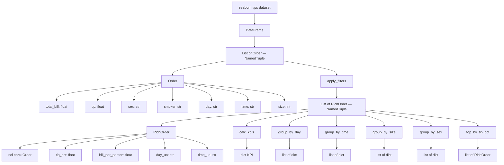

```
Order      = сирий чек (7 полів)
RichOrder  = збагачений чек (11 полів, незмінний)
Різниця:   enrich_order() додає tip_pct, bill_per_person, day_ua, time_ua
```

---

# 2. load_orders() — Трансформер завантаження

**Задача:** перетворити DataFrame на `List[Order]` один раз при старті.
Після цього pandas більше не потрібен — тільки чистий Python.

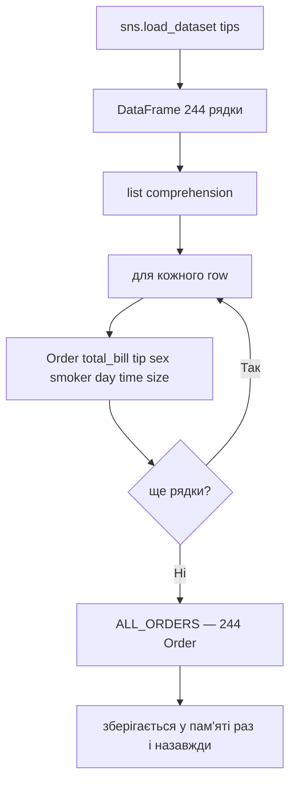

```python
ALL_ORDERS: list[Order] = load_orders()
# викликається один раз при імпорті модуля
```

```
DataFrame рядок → Order(total_bill=..., tip=..., ...)
float(row[...]) → гарантує правильний тип
```

---

# 3. Предикати (Predicates)

**Задача:** вирішити для кожного чека — потрапляє він у вибірку чи ні.
Предикат → чиста функція → завжди `True` або `False`.

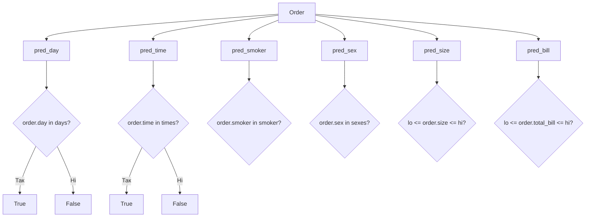

```python
pred_day(order, ["Sat", "Sun"])         # True якщо субота або неділя
pred_size(order, lo=2, hi=4)            # True якщо стіл 2–4 особи
pred_bill(order, lo=10.0, hi=30.0)      # True якщо чек $10–$30
pred_sex(order, ["Female"])             # True якщо клієнтка
```

```
Предикат:
  вхід  → Order + параметри фільтра
  вихід → True (пропускаємо) або False (відкидаємо)
  ефект → жодного (чиста функція)
```

---

# 4. apply_filters() — Комбінований фільтр

**Задача:** застосувати всі шість предикатів одночасно (логічне AND).
Залишити тільки ті чеки, що пройшли всі перевірки.

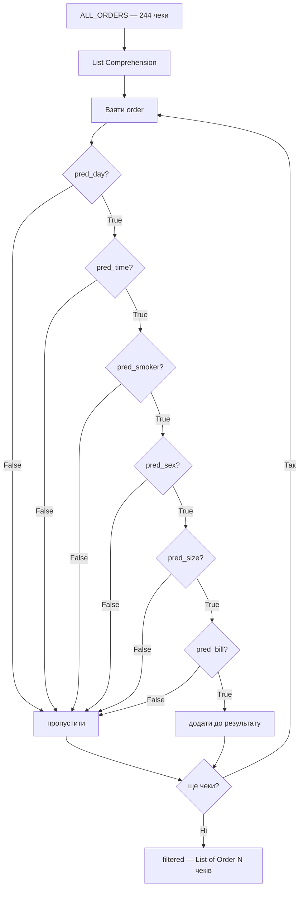

```python
return [
    o for o in orders
    if pred_day(o, days)
    and pred_time(o, times)
    and pred_smoker(o, smoker)
    and pred_sex(o, sexes)
    and pred_size(o, lo_s, hi_s)
    and pred_bill(o, lo_b, hi_b)
]
```

```
244 чеків → apply_filters() → N чеків (N ≤ 244)
AND-ланцюг: якщо хоча б один предикат False → чек відкидається
```

---

# 5. enrich_order() — Трансформер збагачення

**Задача:** перетворити `Order` на `RichOrder` — додати обчислені поля.
Кількість елементів не змінюється. Оригінал не змінюється (immutable).

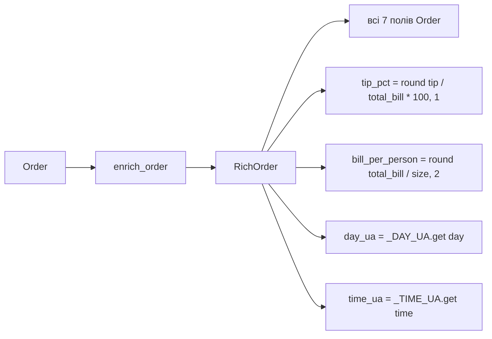

```python
# Маппінги для перекладу
_DAY_UA  = {"Thur": "Четвер", "Fri": "П'ятниця", "Sat": "Субота", "Sun": "Неділя"}
_TIME_UA = {"Lunch": "Обід", "Dinner": "Вечеря"}
```

```
Order(23.68, 3.31, ..., "Sun", "Dinner", 2)
        ↓  enrich_order()
RichOrder(23.68, 3.31, ..., "Sun", "Dinner", 2,
          tip_pct=14.0, bill_per_person=11.84,
          day_ua="Неділя", time_ua="Вечеря")
```

---

# 6. enrich_all() — Map Pattern

**Задача:** застосувати `enrich_order` до кожного чека у списку.
Класичний map: `len(input) == len(output)`.

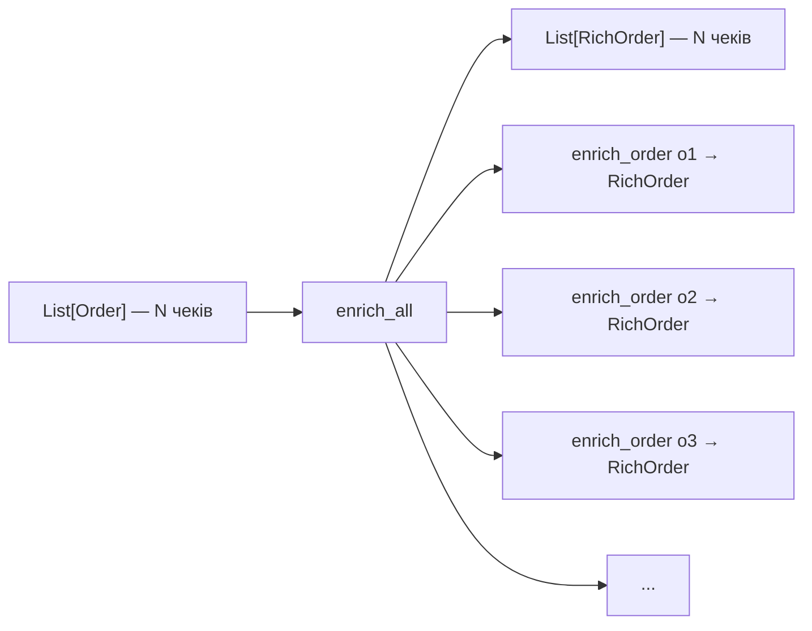

```python
def enrich_all(orders):
    return [enrich_order(o) for o in orders]
```

```
Map Pattern:
  [transform(x) for x in data]
  Кількість не змінюється — тільки форма
```

---

# 7. calc_kpis() — Редьюсер KPI

**Задача:** зменшити список до словника з шістьма числовими показниками.
Вбудовані редьюсери: `sum()`, `len()`, `max()`.

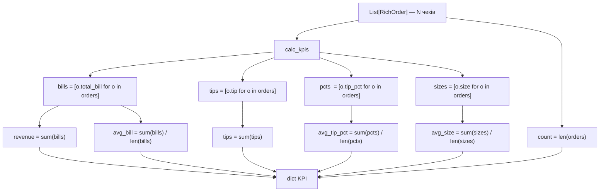

```python
{
    "revenue":     4827.77,   # ← sum(bills)
    "tips":         731.58,   # ← sum(tips)
    "avg_bill":      19.79,   # ← sum / len
    "avg_tip_pct":   16.1,    # ← sum / len
    "count":           244,   # ← len
    "avg_size":        2.6,   # ← sum / len
}
```

```
Reducer Pattern:
  List[RichOrder] → одне значення або агрегат
  Багато → одне (список 244 → 6 чисел)
```

---

# 8. group_by_day() — Редьюсер з групуванням

**Задача:** порахувати виручку, чайові, кількість чеків по кожному дню.
Той самий Counting Pattern з урока 7, але тепер у функції.

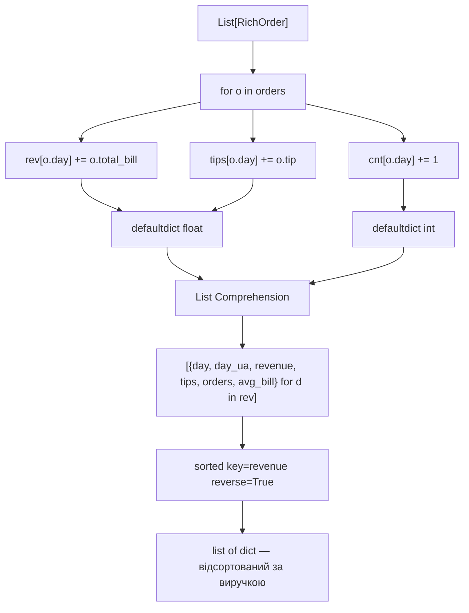

```python
# Counting Pattern (урок 7) → тепер у функції (урок 8)
rev[o.day]  += o.total_bill   # defaultdict(float)
cnt[o.day]  += 1              # defaultdict(int)
```

```
group_by_day повертає:
  [{"day": "Sat", "day_ua": "Субота", "revenue": 1778.40, ...},
   {"day": "Sun", "day_ua": "Неділя", "revenue": 1627.16, ...}, ...]
```

---

# 9. group_by_time() — Редьюсер Lunch vs Dinner

**Задача:** порівняти середній tip% і середній чек для обіду і вечері.
Зберігаємо списки значень, потім рахуємо середнє.

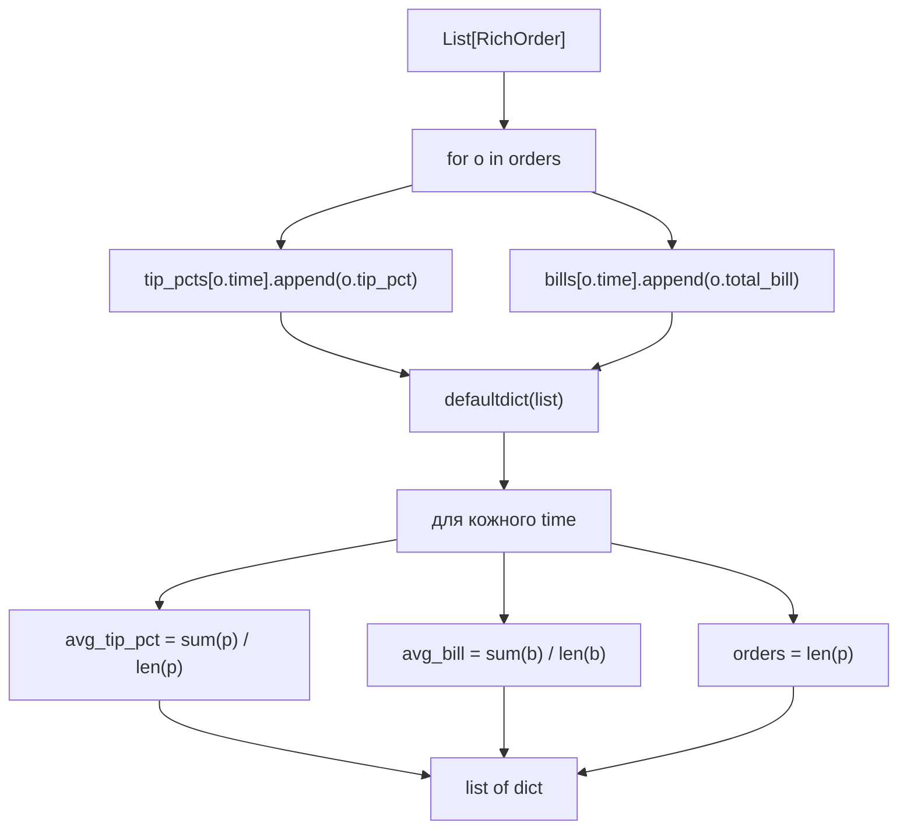

```
Grouping Pattern (урок 7) → агрегат списків
tip_pcts["Dinner"] = [14.0, 16.1, 5.9, ...]  → середнє
```

---

# 10. group_by_size() — Редьюсер по розміру столу

**Задача:** показати як розмір столу впливає на виручку і tip%.

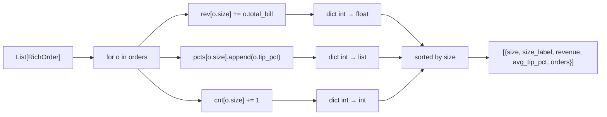

```python
# size_label — локалізована назва
f"{s} {'особа' if s == 1 else 'особи' if s <= 4 else 'осіб'}"
# 1 → "1 особа",  2 → "2 особи",  6 → "6 осіб"
```

---

# 11. group_by_sex() — Редьюсер статі

**Задача:** порівняти виручку і tip% між Male і Female для pie chart.

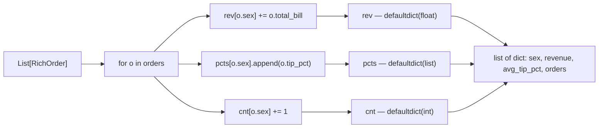

```
Повертає:
  [{"sex": "Male",   "revenue": 3256.61, "avg_tip_pct": 15.8, "orders": 157},
   {"sex": "Female", "revenue": 1571.16, "avg_tip_pct": 16.6, "orders": 87}]
```

---

# 12. top_by_tip_pct() — Редьюсер топ-N

**Задача:** знайти N чеків з найвищим відсотком чайових.

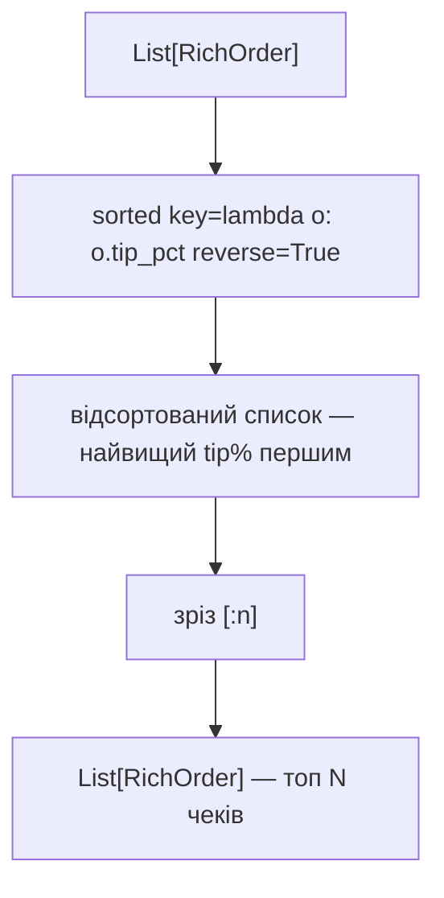

```python
def top_by_tip_pct(orders, n=5):
    return sorted(orders, key=lambda o: o.tip_pct, reverse=True)[:n]
```

```
sorted() + зріз → Leader Algorithm для N кращих
```

---

# 13. run_pipeline() — Головний Pipeline

**Задача:** один виклик → повна аналітика для будь-якої комбінації фільтрів.
Оркеструє всі функції у правильному порядку.

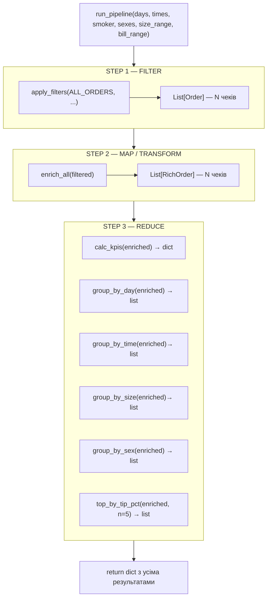

```python
def run_pipeline(days, times, smoker, size_range, bill_range, sexes) -> dict:
    filtered = apply_filters(ALL_ORDERS, days, times, smoker, size_range, bill_range, sexes)
    enriched = enrich_all(filtered)
    return {
        "count":    len(enriched),
        "enriched": enriched,
        "kpis":     calc_kpis(enriched),
        "by_day":   group_by_day(enriched),
        "by_time":  group_by_time(enriched),
        "by_size":  group_by_size(enriched),
        "by_sex":   group_by_sex(enriched),
        "top_tips": top_by_tip_pct(enriched, n=5),
    }
```

```
Закон pipeline:
  вихід однієї функції = вхід наступної
  apply_filters → List[Order] → enrich_all → List[RichOrder] → редьюсери
```

---

# 14. Dash Callback — UI як обгортка навколо pipeline

**Задача:** при зміні будь-якого фільтра у sidebar перерахувати все і оновити UI.

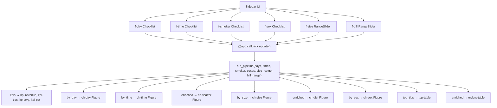

```
Dash callback = обгортка навколо run_pipeline()
Кожна зміна фільтра → callback → pipeline → 14 Output-оновлень
```

---

# 15. Повний потік даних

Від сирих даних до кожного елемента UI.

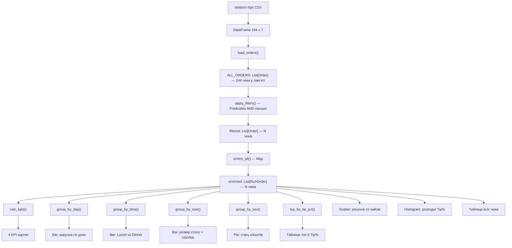

---

# 16. Типи функцій у app.py

| Функція | Тип | Вхід | Вихід |
|---|---|---|---|
| `load_orders` | Трансформер | DataFrame | `List[Order]` |
| `pred_day` | Предикат | `Order`, `list[str]` | `bool` |
| `pred_time` | Предикат | `Order`, `list[str]` | `bool` |
| `pred_smoker` | Предикат | `Order`, `list[str]` | `bool` |
| `pred_sex` | Предикат | `Order`, `list[str]` | `bool` |
| `pred_size` | Предикат | `Order`, `int`, `int` | `bool` |
| `pred_bill` | Предикат | `Order`, `float`, `float` | `bool` |
| `apply_filters` | Комбінований фільтр | `List[Order]` + 6 параметрів | `List[Order]` |
| `enrich_order` | Трансформер | `Order` | `RichOrder` |
| `enrich_all` | Map | `List[Order]` | `List[RichOrder]` |
| `calc_kpis` | Редьюсер | `List[RichOrder]` | `dict` |
| `group_by_day` | Редьюсер | `List[RichOrder]` | `list[dict]` |
| `group_by_time` | Редьюсер | `List[RichOrder]` | `list[dict]` |
| `group_by_size` | Редьюсер | `List[RichOrder]` | `list[dict]` |
| `group_by_sex` | Редьюсер | `List[RichOrder]` | `list[dict]` |
| `top_by_tip_pct` | Редьюсер | `List[RichOrder]`, `int` | `List[RichOrder]` |
| `run_pipeline` | Оркестратор | 6 параметрів фільтрів | `dict` з усім |
| `update` | Dash callback | 6 Input | 14 Output |

---

# 17. Порівняння: Урок 7 vs Урок 8

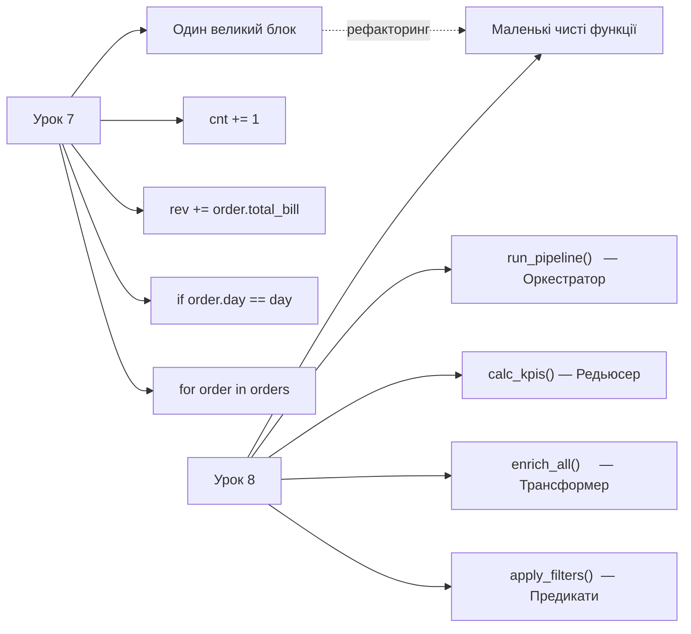

| | Урок 7 | Урок 8 |
|---|---|---|
| Код | Один великий for-блок | Маленькі функції |
| Зміна фільтра | Переписати весь цикл | Змінити параметр |
| Тестування | Важко — все разом | Кожна функція окремо |
| UI | Неможливо підключити | `run_pipeline()` → Dash callback |
| Читабельність | `rev += bill` | `calc_kpis(enriched)` |

---

# Головна ідея уроку

```
Чиста функція  = лише параметри → лише return, завжди той самий результат
Предикат       = (Order) → bool, фейсконтроль для кожного чека
Трансформер    = (Order) → RichOrder, форма змінюється, кількість — ні
Редьюсер       = List[RichOrder] → dict, багато → одне
Pipeline       = Filter → Map → Reduce
Dash callback  = UI-обгортка навколо pipeline
```

Три рядки, які пояснюють весь дашборд:

```python
filtered = apply_filters(ALL_ORDERS, days, times, ...)   # Predicate
enriched = enrich_all(filtered)                          # Transformer
kpis     = calc_kpis(enriched)                           # Reducer
```

```
сирі дані → предикати (хто входить?) → трансформер (яка форма?)
         → редьюсери (яка відповідь?) → UI (що показати?)
```
