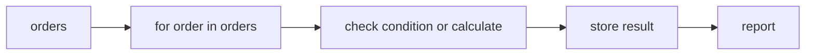
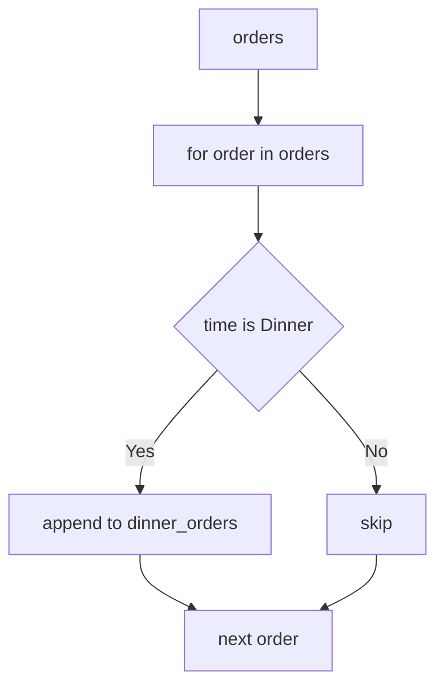
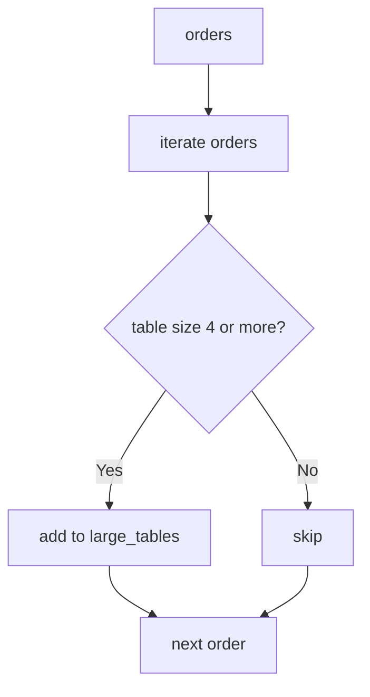
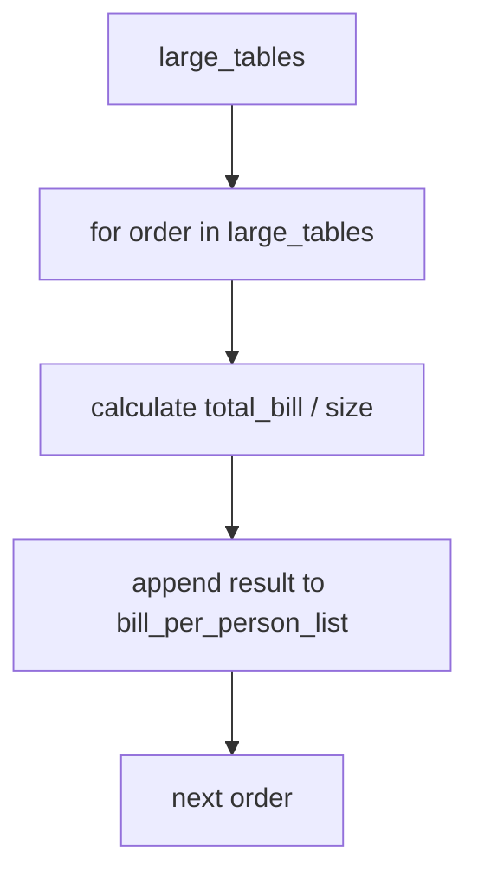
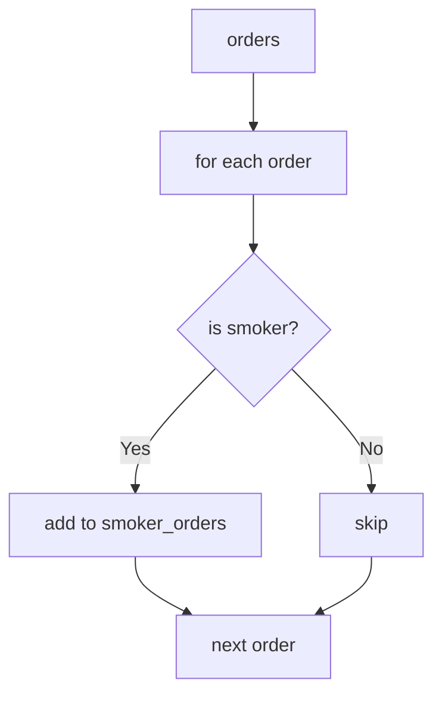
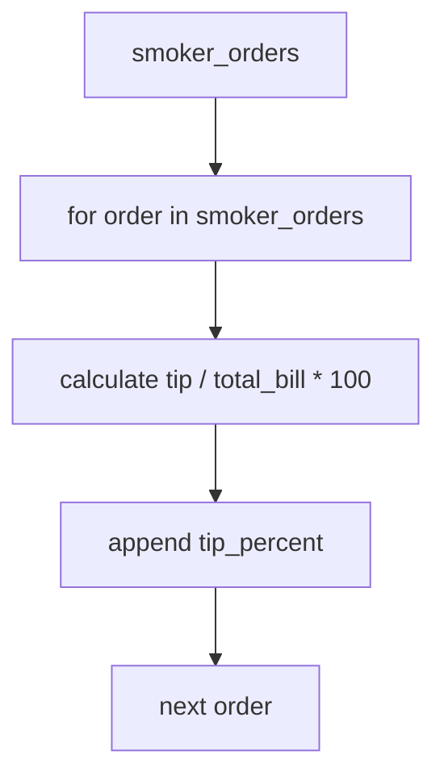
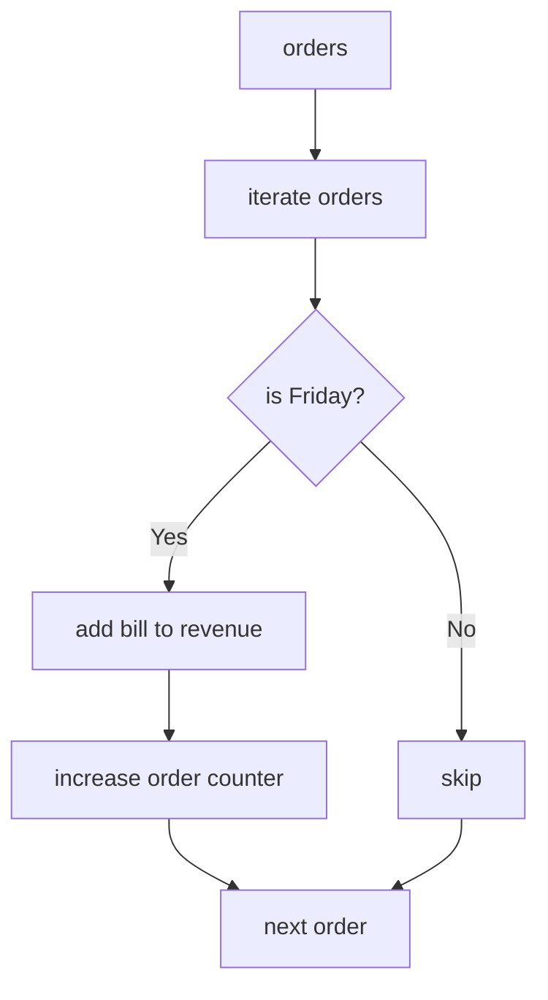
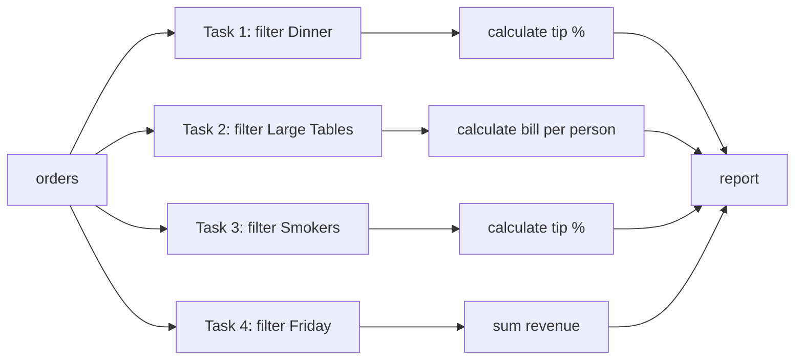

# 🍽 Restaurant Orders Dataset — Data Manipulation Tasks

У цій лабораторній роботі ви будете працювати з **даними ресторанних чеків**.

Кожен чек представлений об'єктом `Order`.

```python
from typing import NamedTuple

class Order(NamedTuple):
    total_bill: float
    tip: float
    sex: str
    smoker: str
    day: str
    time: str
    size: int
```

## Що означають поля `Order`

| Поле         | Опис                                  |
| ------------ | ------------------------------------- |
| `total_bill` | загальна сума чеку                    |
| `tip`        | чайові                                |
| `sex`        | стать клієнта                         |
| `smoker`     | чи курить клієнт                      |
| `day`        | день тижня                            |
| `time`       | тип прийому їжі: `Lunch` або `Dinner` |
| `size`       | кількість людей за столом             |

---

# 📥 Завантаження датасету

Ми використаємо датасет `tips` з бібліотеки `seaborn`.

```python
import seaborn as sns

tips_df = sns.load_dataset("tips")
print(tips_df.head())
```

Після цього потрібно перетворити `DataFrame` у список `Order`.

```python
def orders_from_df(df) -> list[Order]:
    orders = []

    for _, row in df.iterrows():
        order = Order(
            total_bill=float(row["total_bill"]),
            tip=float(row["tip"]),
            sex=str(row["sex"]),
            smoker=str(row["smoker"]),
            day=str(row["day"]),
            time=str(row["time"]),
            size=int(row["size"]),
        )
        orders.append(order)

    return orders


orders = orders_from_df(tips_df)

print(len(orders))
print(orders[0])
```

Тепер у вас є основний список для роботи:

```python
orders: list[Order]
```

---

# 📊 Загальна логіка вправ

У всіх завданнях ви працюєте за однаковою схемою:

```text
список orders → цикл for → перевірка / обчислення → нові дані → короткий звіт
```



## Важливе правило

У кожному завданні **перший крок — це цикл `for`**.

Це потрібно, щоб потренувати:

* `for`
* `if`
* `append()`
* `+=`
* створення нових списків
* просту агрегацію даних

---

# 🧩 Task 1 — Dinner Analytics

## Мета завдання

Знайти **усі чеки Dinner**, створити окремий список цих чеків, а потім порахувати для них просту статистику.

---

## Як проходить фільтрація




---

## Крок 1 — Filter

Створіть новий список:

```python
dinner_orders = []
```

Потім пройдіться по всіх `orders` через цикл `for`.

Для кожного `order` перевіряйте:

```python
order.time == "Dinner"
```

Якщо умова виконується, додайте цей чек у список `dinner_orders`.

---

## Крок 2 — Transform

Для кожного чеку зі списку `dinner_orders` порахуйте **відсоток чайових**.

Формула:

```text
tip_percent = tip / total_bill * 100
```

Створіть новий список:

```python
tip_percentages = []
```

Потім пройдіться по `dinner_orders` через `for` і для кожного чеку:

* порахуйте `tip_percent`
* додайте значення у список `tip_percentages`

---

## Крок 3 — Report

Виведіть короткий звіт:

```text
Dinner orders: N
Average dinner bill: X
Average tip %: Y
```

де:

* `N` — кількість Dinner чеків
* `X` — середня сума чеку серед Dinner
* `Y` — середній відсоток чайових серед Dinner

---

# 🧩 Task 2 — Large Tables

## Мета завдання

Знайти **усі чеки, де за столом 4 або більше людей**, а потім порахувати, скільки в середньому платить одна людина.

---

## Як проходить фільтрація





---

## Крок 1 — Filter

Створіть новий список:

```python
large_tables = []
```

Потім пройдіться по всіх `orders`.

Для кожного чеку перевіряйте:

```python
order.size >= 4
```

Якщо умова виконується, додайте чек у список `large_tables`.

---

## Крок 2 — Transform

Для кожного чеку зі списку `large_tables` порахуйте, **скільки платить одна людина**.

Формула:

```text
bill_per_person = total_bill / size
```

Створіть новий список:

```python
bill_per_person_list = []
```

Далі через цикл `for`:

* беріть один чек
* рахуйте `bill_per_person`
* додавайте це значення у список `bill_per_person_list`

---

## Як проходить обчислення



---

## Крок 3 — Report

Виведіть:

```text
Large tables: N
Average bill: X
Average bill per person: Y
```

де:

* `N` — кількість великих столів
* `X` — середня сума чеку
* `Y` — середня сума на одну людину

---

# 🧩 Task 3 — Smokers Analytics

## Мета завдання

Проаналізувати **чеки клієнтів, які курять**.

---

## Як проходить фільтрація




---

## Крок 1 — Filter

Створіть новий список:

```python
smoker_orders = []
```

Потім пройдіться по всіх `orders`.

Для кожного чеку перевіряйте:

```python
order.smoker == "Yes"
```

Якщо умова виконується, додайте чек у список `smoker_orders`.

---

## Крок 2 — Transform

Для кожного чеку зі списку `smoker_orders` порахуйте **відсоток чайових**.

Формула:

```text
tip_percent = tip / total_bill * 100
```

Створіть новий список:

```python
tip_percentages = []
```

Потім через цикл `for`:

* порахуйте `tip_percent`
* додайте значення у список `tip_percentages`

---

## Як проходить обчислення



---

## Крок 3 — Report

Виведіть:

```text
Smokers orders: N
Average bill (smokers): X
Average tip % (smokers): Y
```

де:

* `N` — кількість чеків курців
* `X` — середня сума чеку
* `Y` — середній відсоток чайових

---

# 🧩 Task 4 — Friday Revenue

## Мета завдання

Порахувати **загальну виручку ресторану у Friday** і **кількість чеків у цей день**.

---


## Як проходить фільтрація




---

## Крок 1 — Початкові змінні

Створіть дві змінні:

```python
friday_revenue = 0
friday_orders = 0
```

---

## Крок 2 — Filter + Accumulation

Пройдіться по всіх `orders` через цикл `for`.

Для кожного `order` перевіряйте:

```python
order.day == "Fri"
```

Якщо умова виконується:

* додайте `order.total_bill` до `friday_revenue`
* збільште `friday_orders` на 1

---

## Крок 3 — Report

Виведіть:

```text
Friday orders: N
Friday revenue: X
```

де:

* `N` — кількість чеків у Friday
* `X` — загальна виручка у Friday

---

# 🧠 Підсумкова схема всіх 4 задач



---

# 🎯 Що тренують ці вправи

Після виконання цих завдань ви потренуєте:

* роботу зі списком об'єктів
* цикл `for`
* умову `if`
* створення нових списків
* `append()`
* прості обчислення
* `+=`
* базову логіку аналітики даних

---

# ✅ Результат

Ці вправи навчають вас мислити так:

```text
дані → перевірка умови → нові дані → короткий звіт
```

