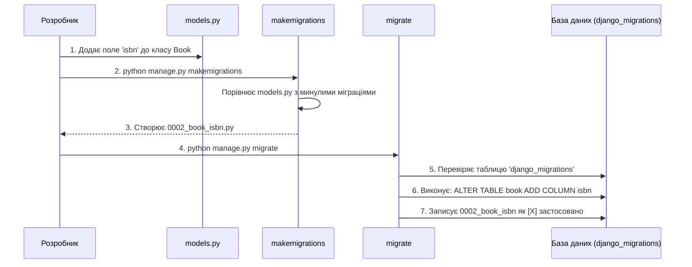
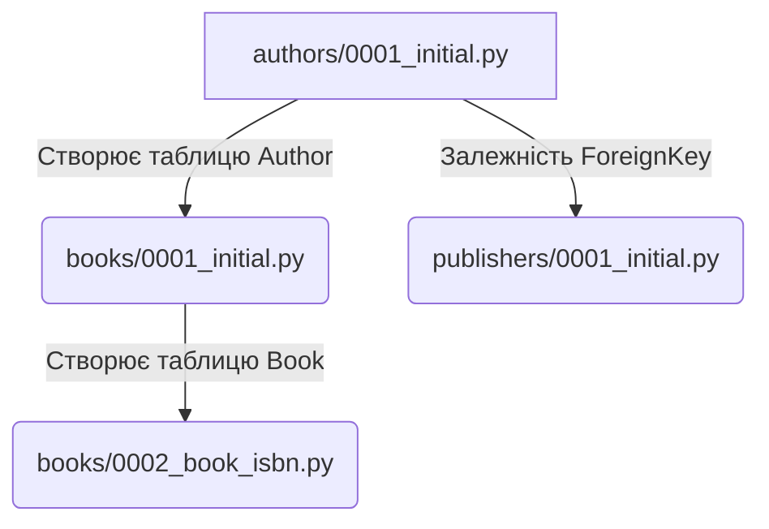

# Архітектура проєкту Django та Еволюція бази даних

Цей посібник розкриває глибинні механізми роботи Django, зосереджуючись на тому, як Django керує еволюцією бази даних за допомогою міграцій.

## Частина 1: Оркестрування еволюції бази даних (Міграції та ORM)

### 1. Основний механізм: Чому існують міграції

Бази даних вимагають використання чистого SQL (наприклад, `CREATE TABLE` або `ALTER TABLE`) для зміни своєї структури. Водночас моделі Django пишуться мовою Python. **Міграції слугують мостом між ними**, діючи як система контролю версій для схеми вашої бази даних. Вони гарантують, що в міру розвитку вашого Python-коду, структура бази даних безпечно еволюціонує разом з ним без втрати даних користувачів.

### 2. Потік виконання: `makemigrations` проти `migrate`

* **`makemigrations`**: Django зчитує ваші файли `models.py` і порівнює їх із представленням історичної схеми бази даних у пам'яті. Потім він генерує новий Python-файл на вашому жорсткому диску (наприклад, `0001_initial.py`). Цей файл містить декларативний список операцій (що змінилося) та залежностей (що має відбутися спочатку). **Ця команда не вносить жодних змін до самої бази даних.**
* **`migrate`**: Django підключається до бази даних і перевіряє спеціальну внутрішню таблицю під назвою `django_migrations`, щоб дізнатися, які файли вже були застосовані. Для будь-яких незастосованих файлів Django перетворює Python-операції на специфічний для бази даних SQL і виконує їх, незворотно змінюючи структуру бази даних.

### 3. Ментальна модель: Архітектор і Будівельники

Уявіть, що `makemigrations` — це **архітектор**, який малює креслення нового плану поверху. А `migrate` — це **будівельна бригада**, яка читає це креслення і фактично зносить стіни та заливає бетон.

### 4. Залежності міграцій

Міграції не виконуються в алфавітному порядку; вони виконуються на основі **графа залежностей**. Якщо ваш додаток `books` додає поле `ForeignKey`, яке вказує на додаток `authors`, файл міграції для `books` автоматично додасть залежність від міграції `authors`. Це гарантує, що таблиця авторів буде створена до того, як база даних спробує створити обмеження (constraint), що посилається на неї.

#### Візуалізація: Хронологія еволюції схеми

#### Візуалізація: Граф залежностей міграцій

### Практичне застосування

#### 5. Типові проблеми початківців з міграціями

* **Поле, що не може бути порожнім (The Non-Nullable Field):** Якщо ви додаєте нове поле до існуючої моделі (наприклад, `age = models.IntegerField()`) без надання значення за замовчуванням, база даних панікує, оскільки не знає, що записати в уже існуючі рядки. Django перехопить `makemigrations` і попросить вас у терміналі надати одноразове значення за замовчуванням.
* **Неузгоджена історія (Inconsistent History):** Видалення файлу міграції з жорсткого диска після того, як він уже був застосований через `migrate`, ламає граф залежностей. Django відмовиться виконувати майбутні міграції, доки історія не буде виправлена вручну.

#### 6. Інтуїція налагодження (Debugging intuition)

Якщо ви хочете точно знати, які зміни Django планує внести в систему прямо зараз, запустіть `python manage.py sqlmigrate <app_name> <migration_number>`. Ця команда не змінює базу даних; вона просто виводить у термінал точні "сирі" SQL-інструкції (наприклад, `CREATE INDEX` або `ALTER TABLE`), які Django планує виконати.

#### 7. Релевантність для розгортання у продакшені

Файли міграцій фіксуються у вашому Git-репозиторії разом із Python-кодом. Коли ваш код розгортається на продакшен-сервері, CI/CD пайплайн автоматично запускає `python manage.py migrate`. Оскільки граф залежностей чітко визначений у файлах, продакшен-база оновлює свою схему в точно такій самій послідовності, яку ви використовували на локальній машині.

---

