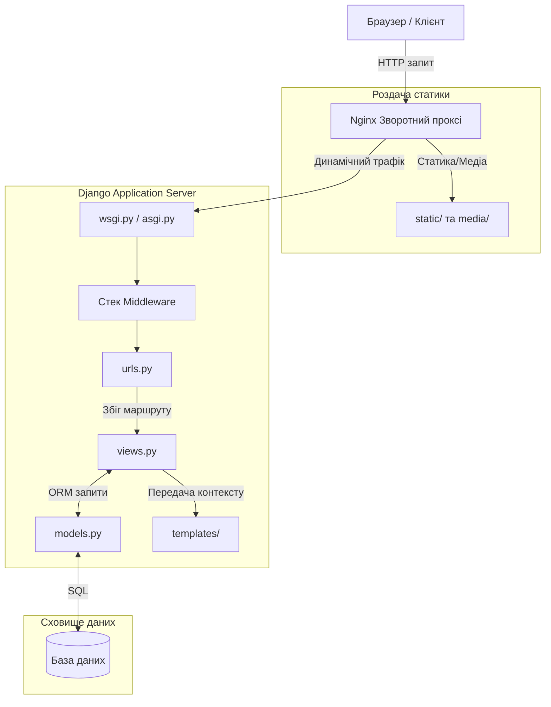
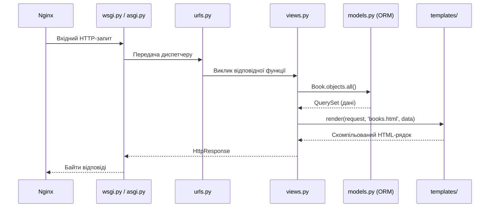
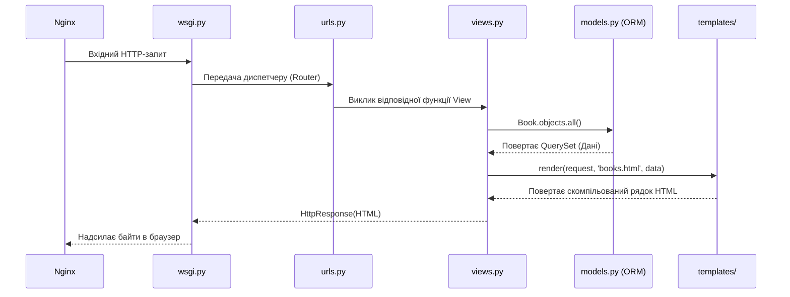

# Структура проєкту Django

## Стандартна ієрархія файлів

```text
my_project/                 # Коренева директорія (Контейнер всього проєкту)
├── manage.py               # ⚙️ Оркестратор командного рядка
├── my_project/             # 🛠 ГОЛОВНИЙ ПАКЕТ КОНФІГУРАЦІЇ (System Level)
│   ├── __init__.py
│   ├── settings.py         # 🎛 Центральний хаб налаштувань
│   ├── urls.py             # 🔀 Головний маршрутизатор (Root URLconf)
│   ├── asgi.py             # ⚡️ Асинхронний шлюз (WebSockets / Async)
│   └── wsgi.py             # 🌐 Синхронний шлюз (HTTP)
├── my_app/                 # 📦 МОДУЛЬНИЙ ДОДАТОК (App Level)
│   ├── __init__.py
│   ├── admin.py            # 🛡 Конфігурація бек-офісу
│   ├── apps.py             # 📝 Реєстрація додатку
│   ├── models.py           # 🗄 Схема бази даних (Data Layer)
│   ├── views.py            # 🧠 HTTP-оркестратор (делегує в services/selectors)
│   ├── urls.py             # 🔀 Маршрути додатку
│   ├── forms.py            # 📋 Django Forms / ModelForms
│   ├── tests.py            # ✅ Тести
│   └── migrations/         # 🕰 Історія еволюції БД
│       ├── __init__.py
│       └── 0001_initial.py
├── templates/              # 🎨 ГЛОБАЛЬНІ ШАБЛОНИ (Presentation Layer)
│   └── base.html
└── static/                 # 🖼 СТАТИЧНІ РЕСУРСИ
    ├── css/
    ├── js/
    └── images/
```

---

## Архітектура та потік виконання

### Високорівнева архітектура бекенду



### Життєвий цикл HTTP-запиту



---

## Детальний розбір компонентів

### Системний рівень — Оркестрування

#### `manage.py`

| Аспект | Опис |
|--------|------|
| **Призначення** | Оркестратор командного рядка для всього проєкту |
| **Внутрішня роль** | Встановлює `DJANGO_SETTINGS_MODULE` та виконує команди Django |
| **У lifecycle запиту** | Жодної участі — не обробляє живий вебтрафік |
| **У CI/CD** | Запускає тести, збирає статику, застосовує міграції |

**Ментальна модель:** Виконроб на будівництві — ти віддаєш йому накази, він делегує фреймворку.

> **Помилка:** Думати, що `manage.py` запускає продакшен-сервер. У продакшені цей файл ігнорується при обробці трафіку.

---

#### `settings.py`

| Аспект | Опис |
|--------|------|
| **Призначення** | Центральний конфігураційний хаб |
| **Внутрішня роль** | Python-модуль зі глобальними змінними (БД, встановлені додатки, ключі безпеки) |
| **У lifecycle запиту** | Завантажується в пам'ять **один раз** під час старту сервера |
| **Зовнішні сервіси** | PostgreSQL, Redis, AWS S3, Celery — все підключається тут |

**Ментальна модель:** Головний електрощит і панель управління всією будівлею.

```python
# Критичні налаштування
INSTALLED_APPS = ['django.contrib.auth', 'myapp']
DATABASES = {'default': {'ENGINE': 'django.db.backends.postgresql', ...}}
MIDDLEWARE = ['django.middleware.security.SecurityMiddleware', ...]
```

> **Помилка:** Намагатися динамічно змінювати `settings.py` для різних користувачів під час роботи. Налаштування — глобальні та статичні.

---

#### `wsgi.py` та `asgi.py`

| Аспект | Опис |
|--------|------|
| **Призначення** | Точки входу для серверів додатків (Gunicorn, Uvicorn) |
| **Внутрішня роль** | Надає стандартний об'єкт `application` для зв'язку з Django |
| **У lifecycle запиту** | Перший рядок Django-коду при надходженні HTTP-запиту |
| **`wsgi.py`** | Синхронний протокол — традиційні HTTP-запити |
| **`asgi.py`** | Асинхронний протокол — WebSockets, Server-Sent Events |

**Ментальна модель:** Стіл перекладача — перетворює "сирі" мережеві HTTP-байти в Python-словники.

> **Помилка:** Думати, що Django самостійно слухає Інтернет. Трафік завжди спочатку проходить через WSGI/ASGI сервер.

---

### Рівень додатку — Логіка та маршрутизація

#### `urls.py`

| Аспект | Опис |
|--------|------|
| **Призначення** | Диспетчер URL-адрес |
| **Внутрішня роль** | Список `urlpatterns` — зіставлення URL-рядків з Python-функціями |
| **Алгоритм** | Пошук **зверху вниз**, зупиняється на **першому** збігу |
| **Для API** | Визначає контракт ендпоінтів |

**Ментальна модель:** Сортувальник пошти — читає адресу та віддає конверт потрібному кур'єру.

> **Помилка:** Очікувати, що Django знайде "найкращий" збіг. Він бере перший — статичні маршрути мають стояти вище динамічних.

---

#### `views.py`

| Аспект | Опис |
|--------|------|
| **Призначення** | HTTP-оркестратор — тонкий шар між мережею і бізнес-доменом |
| **Внутрішня роль** | Приймає `HttpRequest`, викликає serializer → service/selector, повертає `HttpResponse` |
| **У lifecycle запиту** | Парсить запит, делегує логіку, форматує відповідь |
| **Може повертати** | HTML, JSON, PDF, CSV, Redirect |

**Ментальна модель:** Диспетчер — приймає дзвінок, з'єднує з потрібним фахівцем і передає відповідь. Сам нічого не вирішує.

```python
# View у clean architecture — максимально тонка
class FloodEventCreateAPIView(APIView):

    def post(self, request):
        serializer = FloodEventInputSerializer(data=request.data)  # валідація
        serializer.is_valid(raise_exception=True)

        event = flood_event_create(**serializer.validated_data)    # бізнес-логіка у service

        return Response(FloodEventOutputSerializer(event).data, status=201)
```

| View НЕ повинна | View ПОВИННА |
|-----------------|--------------|
| ❌ містити SQL або ORM-запити | ✅ валідувати через `InputSerializer` |
| ❌ містити бізнес-логіку | ✅ викликати `service` (мутації) |
| ❌ оркеструвати транзакції | ✅ викликати `selector` (читання) |
| ❌ рахувати або трансформувати дані | ✅ форматувати через `OutputSerializer` |
| ❌ знати про Celery tasks напряму | ✅ повертати `Response` |

> **Помилка у стандартній архітектурі:** `views.py` описується як місце для "бізнес-логіки". У clean/production архітектурі view — лише HTTP-шар. Вся логіка — у `services.py` і `selectors.py`.

---

#### `apps.py`

| Аспект | Опис |
|--------|------|
| **Призначення** | Конфігурація конкретного додатку |
| **Внутрішня роль** | Підклас `AppConfig` — ініціалізація при старті Django (наприклад, підключення Signals) |
| **У lifecycle запиту** | Жодної участі — виконується лише один раз при старті фреймворку |

> **Помилка:** Писати тут бізнес-логіку або запити до БД — призведе до збою при старті.

---

### Рівень даних (Data Layer)

#### `models.py`

| Аспект | Опис |
|--------|------|
| **Призначення** | Визначення схеми бази даних |
| **Внутрішня роль** | Python-класи (нащадки `models.Model`) → SQL-таблиці |
| **Єдине джерело істини** | Структура даних описана тут — не в SQL-скриптах |
| **У lifecycle запиту** | Використовується `views.py` для читання/запису |

**Ментальна модель:** Архітектурні креслення бази даних.

> **Помилка:** Додати поле і думати, що БД оновиться сама. Потрібно `makemigrations` + `migrate`.

---

#### `migrations/`

| Аспект | Опис |
|--------|------|
| **Призначення** | Контроль версій схеми бази даних |
| **Внутрішня роль** | Автоматично згенеровані Python-скрипти змін схеми |
| **У lifecycle запиту** | Жодної участі |
| **У CI/CD** | Фундамент безпечного деплою — гарантує ідентичну схему на всіх серверах |

**Ментальна модель:** Git-коміти для таблиць БД — кожна зміна схеми зафіксована у версії.

> **Небезпечна помилка:** Видаляти файли міграцій "для чистоти" після того, як вони застосовані — руйнує граф залежностей та синхронізацію з БД.

---

#### `admin.py`

| Аспект | Опис |
|--------|------|
| **Призначення** | Конфігурація вбудованого адмін-інтерфейсу |
| **Внутрішня роль** | Реєструє моделі на `admin.site` → CRUD через `/admin/` |
| **У lifecycle запиту** | Обробляє лише запити на шляхи `/admin/` |
| **Економить** | Сотні годин розробки внутрішніх дашбордів |

**Ментальна модель:** Бек-офіс магазину — тільки для довіреного персоналу.

> **Помилка:** Використовувати адмін-панель як фронтенд для звичайних клієнтів.

---

### Рівень представлення (Presentation Layer)

#### `templates/`

| Аспект | Опис |
|--------|------|
| **Призначення** | HTML-структура з динамічними даними |
| **Внутрішня роль** | DTL (Django Template Language) — `{{ змінні }}`, `` |
| **У lifecycle запиту** | Викликається наприкінці View для генерації HTML-рядка |
| **У сучасних SPA** | Замінюється JSON-відповіддю якщо фронтенд — React/Vue |

**Ментальна модель:** Бланк документа з порожніми полями для заповнення.

> **Помилка:** Писати повноцінний Python-код в шаблонах. DTL навмисно обмежений — бізнес-логіка належить у `views.py`.

---

#### `static/`

| Аспект | Опис |
|--------|------|
| **Призначення** | Незмінні ресурси (CSS, JS, шрифти, зображення) |
| **Внутрішня роль** | Передається клієнту "як є", без обробки Python |
| **У lifecycle запиту** | У продакшені повністю оминає Django — Nginx роздає напряму |
| **`collectstatic`** | Збирає всі static-файли з додатків в `STATIC_ROOT` |

**Ментальна модель:** Фарба, меблі та декорації будівлі.

> **Помилка:** Очікувати, що Django автоматично роздаватиме статику на реальному сервері без Nginx.

---

## Схема взаємодії файлів при запиті



---

## Сучасна production-архітектура Django-проєкту

Стандартна структура `my_project/my_app/` підходить для навчання і невеликих додатків. У середніх і великих системах застосовується інший підхід — **bounded context** структура.

### Структура production-проєкту

```text
project/
│
├── config/                      ← Конфігурація (замість my_project/)
│   ├── settings/                ← Розділені settings: base.py, local.py, prod.py
│   ├── urls.py
│   ├── asgi.py
│   └── wsgi.py
│
├── apps/                        ← Всі бізнес-домени
│   │
│   ├── users/                   ← Один bounded context = один app
│   │   ├── models.py
│   │   ├── views.py
│   │   ├── urls.py
│   │   ├── services.py          ← Бізнес-логіка (мутації)
│   │   ├── selectors.py         ← Читання даних (SELECT)
│   │   ├── serializers.py       ← HTTP validation + serialization
│   │   ├── permissions.py       ← DRF permissions
│   │   ├── tasks.py             ← Celery tasks (transport, не логіка)
│   │   ├── validators.py        ← Складна доменна валідація
│   │   ├── filters.py           ← django-filter
│   │   ├── admin.py
│   │   ├── tests/
│   │   └── migrations/
│   │
│   ├── flood/                   ← Окремий бізнес-домен
│   ├── dem/
│   ├── ml/
│   └── papers/
│
├── shared/                      ← Спільні абстракції між app-ами
│   ├── exceptions/              ← Кастомний DRF exception handler
│   ├── middleware/
│   ├── auth/
│   ├── utils/
│   └── logging/
│
├── infrastructure/              ← Інтеграції з зовнішнім світом
│   ├── redis/
│   ├── s3/
│   ├── email/
│   ├── celery/
│   └── external_apis/
│
├── requirements/
├── docker/
├── scripts/
└── manage.py
```

---

### Головне правило: app = bounded context

App — це не технічний модуль, а **окремий бізнес-домен**.

```
✅ Правильно          ❌ Неправильно
apps/users/           models/          ← глобально для всіх
apps/payments/        views/           ← глобально для всіх
apps/flood/           utils/           ← глобально для всіх
apps/papers/
```

Кожен app інкапсулює весь стек для свого домену: моделі, логіку, запити, серіалайзери, задачі.

---

### Нові файли всередині app

Порівняно зі стандартним `my_app/` у production-архітектурі з'являються нові файли:

| Файл | Роль | Детальна документація |
|------|------|-----------------------|
| `services.py` | Бізнес-логіка: мутації, транзакції, side effects | [DJANGO_SERVICES.md](DJANGO_SERVICES.md) |
| `selectors.py` | Читання даних: named queries, ORM-оптимізації | [DJANGO_SELECTORS.md](DJANGO_SELECTORS.md) |
| `serializers.py` | HTTP ↔ domain: InputSerializer, OutputSerializer | [DJANGO_SERIALIZERS.md](DJANGO_SERIALIZERS.md) |
| `tasks.py` | Celery tasks — транспортний шар, делегують у services | — |
| `validators.py` | Складна доменна валідація (`validate_dem_resolution()`) | — |
| `permissions.py` | DRF permissions (`IsOwner`, `IsAdminOrReadOnly`) | — |
| `filters.py` | `django-filter` FilterSet для динамічної фільтрації | — |

#### `services.py`

```python
# ПОГАНО — бізнес-логіка у моделі
class FloodEvent(models.Model):
    def run_ml_pipeline(self):
        ...

# ДОБРЕ — бізнес-логіка у service
# services.py
def flood_event_process(*, event: FloodEvent) -> FloodEvent:
    ...
```

Детальніше: [DJANGO_SERVICES.md](DJANGO_SERVICES.md)

#### `selectors.py`

```python
# ПОГАНО — ORM прямо у View, дублюється по всьому проєкту
FloodEvent.objects.filter(is_active=True, region_id=region_id)

# ДОБРЕ — named query у selector
# selectors.py
def flood_events_get_for_region(*, region_id: int) -> QuerySet:
    return FloodEvent.objects.filter(is_active=True, region_id=region_id)
```

Детальніше: [DJANGO_SELECTORS.md](DJANGO_SELECTORS.md)

#### `tasks.py`

```python
# ПОГАНО — бізнес-логіка в Celery task
@shared_task
def calculate_everything(event_id):
    event = FloodEvent.objects.get(id=event_id)
    event.status = 'done'
    event.save()
    send_email(event.user.email, ...)

# ДОБРЕ — task тільки транспортує виклик у service
@shared_task
def process_flood_task(event_id: int):
    event = flood_event_get_by_id(event_id=event_id)
    flood_event_process(event=event)
```

#### `views.py` у production-архітектурі

View повинна бути максимально тонкою:

```python
# View НЕ повинна:        View ПОВИННА:
# ❌ містити SQL           ✅ валідувати через serializer
# ❌ містити ML            ✅ викликати service
# ❌ оркеструвати логіку   ✅ повертати Response
# ❌ рахувати метрики

class FloodEventCreateAPIView(APIView):

    def post(self, request):
        serializer = FloodEventInputSerializer(data=request.data)
        serializer.is_valid(raise_exception=True)
        event = flood_event_create(**serializer.validated_data, created_by=request.user)
        return Response(FloodEventOutputSerializer(event).data, status=201)
```

---

### `shared/` — Спільні абстракції

`shared/` містить код, що використовується **кількома app-ами**, але не належить жодному конкретному домену.

| Папка | Що всередині |
|-------|--------------|
| `shared/exceptions/` | Кастомний DRF exception handler (маппінг `DjangoValidationError` → HTTP 400) |
| `shared/middleware/` | Middleware для логування, correlation ID, rate limiting |
| `shared/auth/` | Спільна логіка аутентифікації між app-ами |
| `shared/utils/` | Дрібні утиліти без бізнес-домену |
| `shared/logging/` | Конфігурація структурованого логування |

```python
# shared/exceptions/handlers.py — реєструється один раз у settings.py
# і автоматично перехоплює помилки в усіх app-ах
REST_FRAMEWORK = {
    'EXCEPTION_HANDLER': 'shared.exceptions.handlers.custom_exception_handler',
}
```

---

### `infrastructure/` — Інтеграції з зовнішнім світом

`infrastructure/` містить **адаптери до зовнішніх сервісів**. Ключова ідея:

```
Business Layer     →   ЩО система робить
Infrastructure     →   ЯК система говорить з зовнішнім світом
```

| Папка | Що всередині |
|-------|--------------|
| `infrastructure/redis/` | Redis клієнт, конфігурація кешу |
| `infrastructure/s3/` | AWS S3 / MinIO клієнт для збереження файлів |
| `infrastructure/email/` | Email backend (SendGrid, SES) |
| `infrastructure/celery/` | Конфігурація Celery, routing задач |
| `infrastructure/external_apis/` | Клієнти зовнішніх API (SlideRule NASA, OpenWeather, тощо) |

```python
# infrastructure/s3/client.py
# S3 — це не flood domain і не dem domain.
# Це зовнішній сервіс зберігання, ізольований в infrastructure/.
class S3Client:
    def upload_file(self, file_path: str, bucket: str) -> str:
        ...
```

App-и **імпортують** з infrastructure, але infrastructure **не знає** про app-и.

---

### Порівняння: навчальна vs production структура

| Аспект | Навчальна (стандартна) | Production |
|--------|----------------------|------------|
| Конфігурація | `my_project/settings.py` | `config/settings/base.py` + `local.py` + `prod.py` |
| App-и | `my_app/` у корені | `apps/users/`, `apps/flood/` |
| Бізнес-логіка | У `views.py` | У `services.py` |
| ORM-запити | У `views.py` або `models.py` | У `selectors.py` |
| Серіалізація | `ModelSerializer` | `InputSerializer` + `OutputSerializer` |
| Зовнішні сервіси | Напряму у `views.py` | `infrastructure/` |
| Спільний код | `utils.py` у корені | `shared/` |

> Навчальна структура — правильна для вивчення Django. Production-структура — правильна коли проєкт росте і над ним працює команда.
