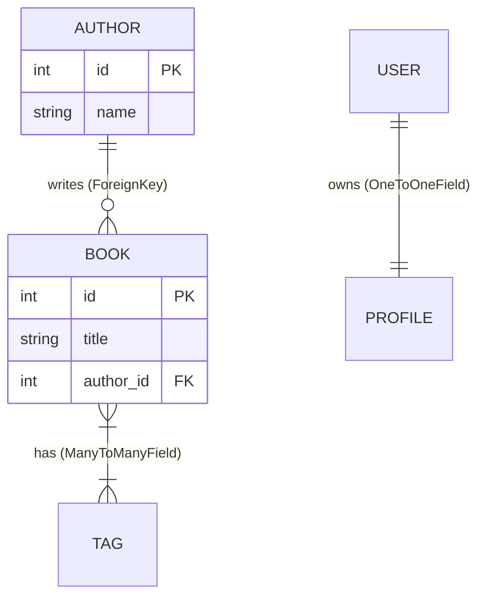
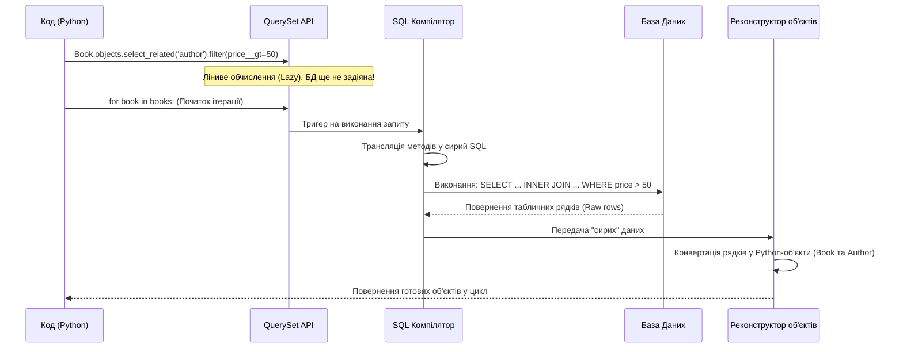
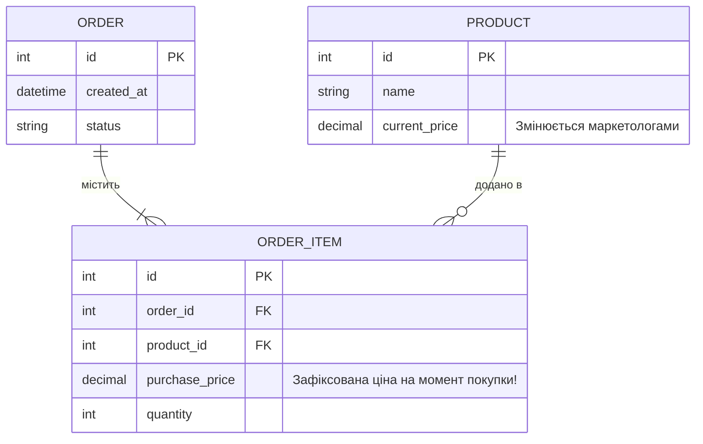

# Django ORM та Бази Даних

Цей посібник пояснює, як Django взаємодіє з базою даних через ORM (Object-Relational Mapping), розкриває механізми "лінивих" обчислень та демонструє правильну архітектуру побудови запитів.

## 1. Основний механізм (Core Mechanism)

ORM — це міст між світом об'єктно-орієнтованого Python та світом реляційного SQL.

* **Трансляція схем:** Ви створюєте Python-клас (Модель), а Django генерує SQL-команди `CREATE TABLE`.
* **Трансляція даних:** Атрибути класу стають колонками, а екземпляри (instances) цього класу — рядками бази даних.
* **Генерація запитів:** Ви викликаєте Python-методи (наприклад, `.filter()`), а ORM динамічно компілює їх у безпечні SQL-запити (`SELECT ... WHERE`), екрануючи змінні для захисту від SQL-ін'єкцій.

## 2. Потік виконання (Execution Flow)

Життєвий цикл даних у бекенді виглядає так:

1. **Model definition:** models.py.
Визначаєте структуру даних за допомогою Python-класів.


2. **Migration:** makemigrations.
Django порівнює класи зі станом БД і генерує інструкції для змін.


3. **Execution:** migrate.
Виконується SQL для фактичного створення або зміни таблиць у БД.


4. **QuerySet:** selectors.py (або services.py).
ORM-запити живуть у `selectors.py` (читання) або `services.py` (мутації). View отримує вже готові дані — не будує запити самостійно.


5. **SQL Generation & Execution:** SQL Execution.
При ітерації по QuerySet, ORM генерує чистий SQL і надсилає його до БД.


6. **Reconstruction:** Python Objects.
База повертає "сирі" рядки, які ORM автоматично упаковує назад у Python-об'єкти.


> **Ментальна модель:**
> Уявіть, що база даних — це гігантський, суворо організований склад із мільйонами коробок. Ви (розробник) не знаєте, як керувати навантажувачем (SQL), тому просите **Менеджера складу (ORM)**. Ви кажете Менеджеру: *"Знайди всі книги автора Стівена Кінга"* (Python). Менеджер сам будує оптимальний маршрут, керує навантажувачем, забирає дані та приносить їх вам у зручному вигляді на стіл.

---

## 3. Реляційна інтуїція (Relational Intuition)

* **Primary Key (Первинний ключ):** Унікальний ідентифікатор (паспорт) кожного рядка, зазвичай `id`.
* **Foreign Key (Зовнішній ключ):** Посилання на "паспорт" іншого об'єкта. Замість того, щоб копіювати всі дані автора в кожну його книгу, книга зберігає лише `author_id`.
* **Нормалізація:** Процес розподілу даних по різних таблицях для уникнення їх дублювання та забезпечення цілісності.

## 4. Моделі Django (Django Models)

* **Fields (Поля):** Визначають тип даних (наприклад, `CharField` -> `VARCHAR`) та поведінку.
* **Meta class:** Зберігає не пов'язані з полями налаштування (наприклад, ім'я таблиці, індекси, сортування за замовчуванням).
* **Managers:** Клас `objects` є інтерфейсом для звернення до БД (наприклад, `Book.objects.all()`).
* **`.save()` / `.delete()`:** Транслюються в миттєві команди `INSERT`/`UPDATE` та `DELETE` відповідно.

```python
from django.db import models
from django.contrib.auth.models import User

class Tag(models.Model):
    name = models.CharField(max_length=50, unique=True)
    
    def __str__(self):
        return self.name

class Book(models.Model):
    # Текстові поля
    title = models.CharField(max_length=200, verbose_name="Назва книги")
    summary = models.TextField(blank=True, help_text="Короткий опис")
    
    # Числові поля
    price = models.DecimalField(max_digits=7, decimal_places=2, default=0.00)
    pages = models.IntegerField(null=True, blank=True)
    
    # Дати та час
    published_date = models.DateField(null=True, blank=True)
    created_at = models.DateTimeField(auto_now_add=True)
    updated_at = models.DateTimeField(auto_now=True)
    
    # Логічні та спеціальні поля
    is_active = models.BooleanField(default=True)
    cover_image = models.ImageField(upload_to='books/covers/', null=True, blank=True)
    contact_email = models.EmailField(blank=True)
    
    # Зв'язки між таблицями
    author = models.ForeignKey(User, on_delete=models.CASCADE, related_name='books')
    tags = models.ManyToManyField(Tag, blank=True)

    def __str__(self):
        return self.title
```

**Основні типи полів у Django:**
*   `CharField` — для короткого тексту, де обов'язково треба вказати максимальну довжину `max_length`.
*   `TextField` — для великих текстів без обмеження довжини.
*   `IntegerField` — для цілих чисел.
*   `DecimalField` — для точних дробів (наприклад, грошей). Обов'язково вказується `max_digits` (всього цифр) та `decimal_places` (цифр після коми).
*   `DateField` та `DateTimeField` — для дат і часу. Параметр `auto_now_add=True` записує час створення об'єкта, а `auto_now=True` — час його останнього оновлення.
*   `BooleanField` — для значень Так/Ні (True/False).
*   `EmailField` / `URLField` — текстові поля, які автоматично перевіряють, чи ввів користувач валідну пошту або посилання.

**Найуживаніші параметри (аргументи) полів:**
*   `null=True` — дозволяє базі даних зберігати порожнє значення як `NULL`.
*   `blank=True` — дозволяє залишати поле порожнім при заповненні HTML-форм.
*   `default` — встановлює значення за замовчуванням.
*   `verbose_name` — зрозуміла для людини назва поля (використовується в панелі адміністратора).
*   `unique=True` — гарантує, що значення в цьому полі не повторюватиметься в інших записах.

---

## 5. Взаємозв'язки (Relationships) та Візуалізація



* **1-до-Багатьох (`ForeignKey`):** Одна компанія -> багато товарів. Ключ зберігається на стороні "Багатьох".
* **Багато-до-Багатьох (`ManyToManyField`):** Багато книг -> багато авторів. ORM непомітно створює приховану третю таблицю для відстеження цих зв'язків.
* **1-до-1 (`OneToOneField`):** Користувач -> Профіль. По суті, розширення існуючої таблиці.
* **Cascading (`on_delete=models.CASCADE`):** Архітектурний захист. Якщо видалити Автора, БД каскадно видалить усі його книги, щоб запобігти появі "осиротілих" даних.

---

## 6. Внутрішня будова QuerySet (QuerySet Internals)

Найважливіша концепція ORM — **ліниві обчислення (Lazy Evaluation)**.

Створення QuerySet **не звертається** до бази даних. Ви можете об'єднувати фільтри:
`Book.objects.filter(price__gt=10).exclude(stock=0).order_by('title')`.
Це просто конструювання SQL-рядка в пам'яті. Запит до БД відправляється **лише тоді**, коли ви починаєте ітерацію (наприклад, у циклі `for` або викликом `list()`).

### Життєвий цикл складного запиту



---

## 7. Проблеми продуктивності ORM: проблема N+1

**Проблема N+1** виникає, коли ви ітеруєте 100 книг і для кожної викликаєте `book.author.name`. ORM зробить 1 запит для списку книг і ще 100 окремих запитів для кожного автора (1 + N).

### Мінімальний, але глибокий приклад коду

```python
# views.py
def get_books(request):
    # ❌ ПОГАНО: N+1 проблема (викличе БД стільки разів, скільки є книг)
    # books = Book.objects.all()

    # ✅ АРХІТЕКТУРНО ПРАВИЛЬНО: SQL JOIN під капотом (1 запит до БД)
    books = Book.objects.select_related('author').all()

    for book in books:
        # Дані автора вже завантажені в пам'ять, додаткових SQL-запитів не буде
        print(book.author.name) 

```

*Для `ForeignKey` використовуйте `.select_related()`, а для `ManyToManyField` — `.prefetch_related()`.*

---

## 7а. Архітектурні пастки ORM — Продакшн рівень

### Транзакції та конкурентність

**Race Condition та `F()` вирази:**

Патерн Read-Modify-Write — одна з головних причин втрати даних у конкурентних системах:

```python
# ПОГАНО: Race Condition — два процеси можуть прочитати одне значення
product = Product.objects.get(id=1)
product.stock -= 1  # читаємо, змінюємо в Python
product.save()      # записуємо — але інший процес міг вже змінити stock!

# ДОБРЕ: F() вираз — операція виконується в БД атомарно
from django.db.models import F
Product.objects.filter(id=1).update(stock=F('stock') - 1)
# Генерує: UPDATE product SET stock = stock - 1 WHERE id = 1
```

**`atomic()` — пастка з винятками:**

```python
# ПОГАНО: перехоплення виключення ВСЕРЕДИНІ atomic() 
with transaction.atomic():
    try:
        Order.objects.create(...)       # якщо тут IntegrityError
    except IntegrityError:
        pass                            # транзакція “зламана”
    Product.objects.update(stock=5)    # CRASH: TransactionManagementError!

# ДОБРЕ: перехоплення ЗОВНІ
try:
    with transaction.atomic():
        Order.objects.create(...)
        Product.objects.update(stock=5)
except IntegrityError:
    pass  # тут rollback вже відбувся безпечно
```

> Ніколи не роби мережеві виклики або повільні операції всередині `atomic()` — відкрита транзакція тримає блокування БД.

---

### OOM та великі датасети

```python
# ПОГАНО: завантажує 1 мільйон рядків у пам'ять → крах сервера
for book in Book.objects.all():
    process(book)

# ДОБРЕ: ітератор із server-side cursor (PostgreSQL)
# Завантажує по 2000 рядків за раз
for book in Book.objects.all().iterator(chunk_size=2000):
    process(book)
```

`iterator()` реалізує серверний курсор на рівні PostgreSQL — дані стримуються батчами, не завантажуючи весь результат у RAM.

---

### `select_related` vs `prefetch_related` — де відбувається JOIN

| Метод | Де виконується JOIN | Для яких зв'язків |
|-------|---------------------|-------------------|
| `select_related` | На рівні БД (SQL `INNER/LEFT JOIN`) | `ForeignKey`, `OneToOneField` |
| `prefetch_related` | В пам'яті Python (окремий `IN` запит) | `ManyToManyField`, зворотні FK |

```python
# select_related → 1 SQL запит з JOIN
books = Book.objects.select_related('author').all()
# SQL: SELECT b.*, a.* FROM book b JOIN author a ON b.author_id = a.id

# prefetch_related → 2 SQL запити + Python join
books = Book.objects.prefetch_related('tags').all()
# SQL 1: SELECT * FROM book
# SQL 2: SELECT * FROM tag WHERE id IN (1,2,3,...,N)
# Python: об'єднує в пам'яті
```

> **Пастка `prefetch_related`:** На величезних QuerySet генерується колосальний `IN` clause, що може перевантажити парсер БД або впасти на SQLite/Oracle з лімітом `IN`.

---

### Оптимізація запитів та SQL-рентген

```python
# Переглянь план виконання запиту
qs = Book.objects.filter(price__gt=50).select_related('author')
print(qs.explain(verbose=True, analyze=True))
# Виводить: EXPLAIN ANALYZE SELECT ... — показує чи є Index Scan чи Sequential Scan
```

**`alias()` vs `annotate()`:**

```python
from django.db.models import Count

# annotate() — додає значення в SELECT (включає в результат)
books = Book.objects.annotate(order_count=Count('orders'))

# alias() — обчислює лише для фільтрації, не включає в SELECT (економить ресурси БД)
books = Book.objects.alias(order_count=Count('orders')).filter(order_count__gt=10)
```

---

### Масштабування та з'єднання з БД

**Persistent connections (постійні з'єднання):**

```python
# settings.py — без цього Django створює нове TCP з'єднання на кожен запит!
DATABASES = {
    'default': {
        'ENGINE': 'django.db.backends.postgresql',
        'CONN_MAX_AGE': 60,  # тримати з'єднання відкритим 60 секунд
    }
}
```

**Primary/Replica (розподіл читання і запису):**

```python
# settings.py — читання з репліки, запис на master
DATABASES = {
    'default': {'HOST': 'primary.db'},
    'replica': {'HOST': 'replica.db'},
}

# database_router.py
class PrimaryReplicaRouter:
    def db_for_read(self, model, **hints):
        return 'replica'
    def db_for_write(self, model, **hints):
        return 'default'
```

> **Replication Lag:** Між записом на primary та його появою на репліці є затримка. Якщо після `save()` одразу читати з репліки — можуть повернутися старі дані.

---

## 7б. MVCC та ізоляція транзакцій PostgreSQL

Без розуміння MVCC (Multi-Version Concurrency Control) неможливо усвідомити, як PostgreSQL забезпечує ізоляцію транзакцій без постійних блокувань.

Ось архітектурний розбір цих концепцій:

**1. Суть MVCC (Багатоверсійність)**
Замість того, щоб жорстко блокувати рядок при кожному читанні чи записі, база даних зберігає кілька історичних версій одного й того ж запису. Кожна версія непомітно маркується ідентифікатором (відміткою часу) транзакції, яка її створила. 
*   **Архітектурне правило:** "Читачі не блокують письменників, а письменники не блокують читачів". Читаюча транзакція завжди отримує цілісний "зрізок" (snapshot) даних на момент свого початку, ігноруючи дані від ще не зафіксованих або новіших транзакцій.

**2. Ізоляція транзакцій (На базі MVCC)**
Саме MVCC дозволяє базі даних ефективно імплементувати рівні ізоляції без блокування цілих таблиць:
*   **Read Committed (за замовчуванням у PostgreSQL та Django):** Захищає від читання незафіксованих даних. Однак він вразливий до "неповторюваного читання": якщо між двома вашими запитами `SELECT` інша транзакція змінить дані і зробить `COMMIT`, ваш другий запит побачить вже нові дані.
*   **Repeatable Read:** Використовує MVCC для "заморожування" snapshot-у на весь час вашої транзакції. Ви завжди бачитимете узгоджений стан БД, навіть якщо інші транзакції паралельно змінюють ці ж записи.
*   **Serializable:** Найсуворіший рівень. База даних гарантує, що паралельне виконання транзакцій дасть точно такий самий результат, якби вони виконувалися строго послідовно в черзі. Запобігає всім аномаліям, але сильно знижує пропускну здатність бази даних через потребу іноді скасовувати конфліктні транзакції.

**3. Блокування (Locking) та Конкурентність**
Хоча MVCC ідеально вирішує конфлікти "читання-запис", для конфліктів "запис-запис" (коли два клієнти одночасно намагаються змінити один рядок) все ще потрібні жорсткі монопольні блокування.
*   **Row-level locks у Django:** Це реалізується через метод `select_for_update()`, який генерує SQL-інструкцію `SELECT ... FOR UPDATE`. Він накладає блокування на вибрані рядки до самого кінця транзакції, змушуючи інші процеси, що хочуть змінити ці ж дані, чекати.
*   **Deadlocks (Взаємоблокування):** Якщо дві транзакції намагаються заблокувати одні й ті ж ресурси, але в різному порядку, виникає "тупик". База даних автоматично виявить це і примусово відкотить (rollback) одну з транзакцій. Щоб цього уникнути, архітектори мінімізують розмір транзакцій та завжди оновлюють таблиці в строго однаковому порядку.


## 8. Поширені хибні уявлення та Дебагінг

* **"QuerySets повільні":** Ні, повільним є їх неправильне використання. Виконання `.count()` в БД блискавичне; натомість завантаження всіх об'єктів у Python через `len(Book.objects.all())` — повільне і споживає багато пам'яті.
* **"Видалення об'єкта впливає лише на нього":** Через архітектуру зв'язків (Cascade), видалення одного об'єкта може каскадно очистити половину БД.
* **Інтуїція дебагінгу:** Якщо логіка працює повільно, проблема рідко в Python. Додавши `.query` до будь-якого QuerySet (напр. `print(books.query)`), ви побачите чистий SQL, який генерує Django. У розробці використання **Django Debug Toolbar** є обов'язковим для візуалізації дубльованих запитів.

## 9. Вправа на передбачення (Prediction Exercise)

Проаналізуйте наступний код:

```python
users = User.objects.filter(is_active=True)
users.filter(last_name="Smith")

```

**Запитання:** Скільки запитів до бази даних відбудеться?

> **Відповідь:** Нуль (0). QuerySets ліниві, ми їх не роздрукували і не перебрали в циклі. Ба більше, другий рядок створює *новий* QuerySet, який нікуди не зберігається (результат втрачається).

## 10. Питання для системного мислення (Reflection)

Якщо у вас є модель `Order` (замовлення) і `Product` (товар). Чому ціна товару в момент покупки має зберігатися **безпосередньо** в моделі `Order` (наприклад, як `purchase_price`), а не просто запитуватися через зв'язок `ForeignKey` до таблиці товарів?

---
Це класичне питання, яке часто ставлять на співбесідах. Відповідь на нього криється не в обмеженнях фреймворку Django, а у **фундаментальних принципах проєктування баз даних та фінансового аудиту**.

Ось детальний розбір того, чому покладатися лише на `ForeignKey` для ціни — це катастрофічна помилка, і чому ціну потрібно "фіксувати" в момент покупки.

---

### 1. Проблема мутабельності (змінності) даних

Уявіть, що ви спроєктували базу даних лише зі зв'язком `ForeignKey` без збереження ціни в замовленні.

* **1 Травня:** Клієнт купує книгу "Django для початківців". Поточна ціна в моделі `Product` — **$20**. Клієнт платить $20, ви генеруєте чек на $20.
* **10 Травня:** Автор книги випускає оновлення, і ви підвищуєте ціну в каталозі (`Product`) до **$25**.
* **15 Травня:** Клієнт заходить в особистий кабінет, щоб подивитися історію своїх замовлень. Ваш код робить запит: `order.product.price`.
* **Наслідок:** Система показує клієнту, що він купив книгу за **$25**, хоча він заплатив $20.

**Висновок:** Дані каталогу (товари) є *мутабельними* (змінними). Ціни, назви та характеристики товарів постійно змінюються. Якщо ви посилаєтесь на ціну через `ForeignKey`, ви дозволяєте майбутнім змінам переписувати минуле.

### 2. Розділення "Стану каталогу" та "Стану транзакції"

Хороша архітектура вимагає чіткого розділення двох різних сутностей:

1. **Каталог (Product):** Відображає *теперішній* стан бізнесу. (Скільки це коштує зараз? Чи є це на складі зараз?)
2. **Транзакція (Order / OrderItem):** Відображає *історичний факт*. (Скільки це коштувало в той конкретний момент часу? Скільки одиниць було продано?)

Транзакції в базах даних мають бути **іммутабельними** (незмінними). Історичний факт не може змінитися задля зручності нормалізації бази даних.

### 3. Фінансовий та юридичний аудит

У реальних проєктах (e-commerce, ERP, CRM) бухгалтерія та податкова вимагають точних звітів.

* Якщо податковий інспектор запитає: "Скільки грошей ви заробили за Травень?", ваш SQL-запит має просумувати ціни всіх замовлень за травень.
* Якщо ціна не зафіксована в замовленні, зміна ціни в каталозі у грудні повністю зруйнує ваш фінансовий звіт за травень. Ваша база даних втратить фінансову цілісність (Data Integrity).

---

### 💡 Архітектурна реалізація (Як це робиться правильно)

У реальних системах між `Order` та `Product` завжди створюють проміжну таблицю `OrderItem` (рядок замовлення). Саме вона зберігає "зліпок" (snapshot) даних на момент покупки.

#### Правильна структура БД (ER-діаграма)



#### Реалізація коду в Django

Ось як ця архітектура виглядає на рівні моделей та бізнес-логіки у `views.py`.

```python
from django.db import models

class Product(models.Model):
    name = models.CharField(max_length=200)
    # Це поточна ціна вітрини. Вона може змінюватись щодня.
    current_price = models.DecimalField(max_digits=10, decimal_places=2) 

class Order(models.Model):
    created_at = models.DateTimeField(auto_now_add=True)
    
    @property
    def total_cost(self):
        # Рахуємо тотал на основі зафіксованих цін, а не цін вітрини
        return sum(item.get_cost() for item in self.items.all())

class OrderItem(models.Model):
    order = models.ForeignKey(Order, related_name='items', on_delete=models.CASCADE)
    product = models.ForeignKey(Product, related_name='order_items', on_delete=models.RESTRICT)
    
    # ❗️ АРХІТЕКТУРНИЙ ЗАХИСТ: Зберігаємо зліпок ціни
    purchase_price = models.DecimalField(max_digits=10, decimal_places=2)
    quantity = models.PositiveIntegerField(default=1)

    def get_cost(self):
        return self.purchase_price * self.quantity

```

**Момент фіксації (у View):**
Коли клієнт натискає "Оформити замовлення", ви копіюєте значення:

```python
# Логіка створення замовлення (спрощено)
order = Order.objects.create(...)

for cart_item in user_cart:
    OrderItem.objects.create(
        order=order,
        product=cart_item.product,
        # Копіюємо поточну ціну продукту і назавжди фіксуємо її в чеку
        purchase_price=cart_item.product.current_price, 
        quantity=cart_item.quantity
    )

```

### Підсумок

Збереження `purchase_price` безпосередньо в моделі замовлення — це свідома **денормалізація** бази даних. Ми дублюємо дані, щоб гарантувати історичну правдивість, захистити систему від руйнування фінансової звітності та розділити змінні дані (каталог) від незмінних (історія транзакцій).