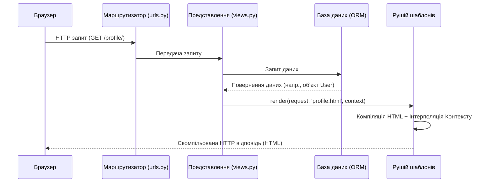

# Шаблони Django

Цей матеріал розкриває рівень представлення (Presentation Layer) у Django з точки зору системної архітектури. Шаблони в Django — це не просто HTML-файли; це потужний механізм обробки та інтерполяції даних.

## 1. Основний механізм (Core Mechanism)

Коли викликається функція `render()`, Django не просто читає файл. Він завантажує "сирий" рядок HTML, **компілює його у дерево об'єктів `Node**` у пам'яті та відображає ваш словник контексту Python на ці вузли. Рушій шаблонів обчислює змінні, замінює плейсхолдери реальними даними та повертає повністю скомпільований потік байтів HTML.

### Внутрішні механізми рушія шаблонів

Обробка шаблону — це внутрішній двохетапний процес:

1. **Компіляція (Compiling):** Django розбиває сирий текст шаблону на список об'єктів `Node`.
2. **Рендеринг (Rendering):** Django викликає метод `render()` для кожного `Node`, використовуючи наданий Контекст. Результати об'єднуються у фінальний рядок.

## 2. Потік виконання (Execution Flow)



> **Ментальна модель:**
> Уявіть, що шаблон — це **бланк документа з пропусками**. Представлення (View) — це кухар, який збирає інгредієнти (дані) з комори (бази даних). Рушій шаблонів — це процес "сервірування", який розкладає сирі дані на тарілці так, щоб вони виглядали привабливо для клієнта.

## 3. Система контексту (The Context System)

Контекст — це словник Python, який зіставляє імена змінних з об'єктами Python. У шаблоні Django використовує **крапкову нотацію** для пошуку значень.

Коли ви пишете `{{ foo.bar }}`, Django послідовно намагається виконати:

1. Пошук за ключем словника (`foo['bar']`).
2. Пошук атрибута або методу (`foo.bar`).
3. Пошук за індексом списку (`foo[bar]`).

### Доступ до даних та атрибутів об'єкта

| Об'єкт та атрибут | Технічний опис |
| --- | --- |
| `{{ post.title }}` | Отримання заголовка об'єкта моделі |
| `{{ post.author }}` | Доступ до пов'язаного об'єкта (Foreign Key) |
| `{{ post.pk }}` | Доступ до первинного ключа (Primary Key) |
| `{{ row.first_name }}` | Доступ до даних із Raw SQL (якщо використано `dictfetchall` або `namedtuplefetchall`) |

## 4. Безпека та Граничні випадки

### Інтуїція безпеки (Запобігання XSS)

Щоб запобігти атакам міжсайтового скриптингу (XSS), Django **автоматично екранує** небезпечні символи (наприклад, `<`, `>`, та `&`) при виведенні змінних.

* **Сценарій:** Зловмисник вводить ім'я `<script>alert('XSS')</script>`.
* **Результат:** Django безпечно відрендерить це як текст: `&lt;script&gt;alert('XSS')&lt;/script&gt;`, і браузер не виконає шкідливий код.

### Граничні випадки (Мовчазне ігнорування)

Якщо шаблон посилається на змінну, якої **немає** у словнику контексту, Django не викликає помилку (Error/Exception). Він працює мовчки і виводить порожній рядок. Це запобігає падінню сайту, але іноді ускладнює пошук зниклих даних.

> **Інтуїція налагодження:** Якщо сторінка завантажується, але на ній відсутні дані, проблема майже завжди полягає у словнику Контексту у `views.py`, а не в HTML. Використовуйте Django Debug Toolbar для перевірки переданого контексту.

## 5. Довідник синтаксису (Словник DTL)

Django Template Language (DTL) навмисно обмежує логіку, щоб забезпечити розділення зон відповідальності: презентація належить шаблону, а бізнес-логіка — `views.py`.

### Основні Теги (Tags - ``)

* ``: Успадкування шаблонів (має бути першим рядком у файлі).
* `...`: Визначення зон, які можуть бути перевизначені.
* `......`: Цикл для перебору QuerySet або списків. `` спрацьовує, якщо список порожній.
* `.........`: Логічне розгалуження.
* ``: Безпечна генерація посилань на основі імен маршрутів з `urls.py`.
* ``: Обов'язковий токен безпеки для будь-якої HTML-форми, що використовує POST-запит.
* ``: Підключення статичних файлів (CSS, JS). Використовується як ``.

### Основні Фільтри (Filters - `{{ var|filter }}`)

* `|lower`, `|upper`, `|capfirst`: Зміна регістру тексту.
* `|date:"Y-m-d"`: Форматування об'єктів дати та часу (наприклад, `{{ post.published_date|date:"d.m.Y" }}`).
* `|default:"Невідомо"`: Значення за замовчуванням, якщо змінна порожня або `None`.
* `|length`: Підрахунок кількості елементів у списку.
* `|safe`: Відключення автоматичного екранування (використовуйте з обережністю, лише для довіреного HTML).
* `|truncatewords:30`: Обрізання довгого тексту.

---

## 6. Практичні приклади коду

### Логіка (views.py)

Тут ми створюємо дані (Контекст) та передаємо їх рушію шаблонів.

```python
from django.shortcuts import render
from .models import Post

def post_list(request):
    # Отримуємо всі пости з бази даних
    posts = Post.objects.all()
    # Формуємо словник контексту
    context = {
        "username": request.user.username,
        "posts": posts
    }
    # Компіляція та рендеринг
    return render(request, "blog/post_list.html", context)

```

### Скелет презентації (base.html)

Django використовує об'єктно-орієнтоване успадкування шаблонів. Створюється базовий файл-скелет (`base.html`), який містить загальні елементи (навігація, футер, підключення стилів).

```html
<!DOCTYPE html>
<html lang="uk">
<head>
    <meta charset="UTF-8">
    <title>Мій Блог</title>
    <!-- Підключення статики -->
    
    <link rel="stylesheet" href="">
</head>
<body>
    <header>
        <nav>Навігація сайту</nav>
    </header>

    <main class="container mt-4">
        <!-- Блок, який замінюватимуть дочірні шаблони -->
        
        
    </main>

    <footer>&copy; 2026 Всі права захищено</footer>
</body>
</html>

```

### Дочірній шаблон (post_list.html)

Дочірній шаблон вказує, від кого він успадковується, і заповнює лише необхідні ``. Це запобігає дублюванню коду на сотнях сторінок.

```html


Список публікацій


    <h1>Привіт, {{ username|capfirst }}! Ось останні записи:</h1>
    
    <div class="row">
        
            <div class="col-md-4 mb-3">
                <div class="card">
                    <div class="card-body">
                        <!-- Динамічна генерація URL -->
                        <h5 class="card-title">
                            <a href="">
                                {{ post.title }}
                            </a>
                        </h5>
                        
                        <!-- Форматування дати -->
                        
                            <h6 class="text-muted">{{ post.published_date|date:"d.m.Y" }}</h6>
                        
                        
                        <!-- Обрізання тексту -->
                        <p class="card-text">{{ post.text|truncatewords:20 }}</p>
                    </div>
                </div>
            </div>
        
            <div class="col-12">
                <p class="alert alert-warning">Наразі немає жодної публікації.</p>
            </div>
        
    </div>


```

## 7. Архітектурна актуальність (Real-World Relevance)

Рендеринг на стороні сервера (Server-Side Rendering - SSR), який забезпечує Django, ідеально підходить для SEO та швидкого початкового завантаження сторінок. У сучасних гібридних архітектурах Django генерує початковий HTML для швидкості, а фронтенд-фреймворки (як Vue або React) використовують прогресивне покращення для додавання інтерактивності.

Ви можете використовувати тег `` у Django, щоб заборонити рушію обробляти певні блоки, дозволяючи React/Vue працювати з їхнім власним синтаксисом `{{ }}` всередині HTML.

## Питання для самоперевірки (Reflection Questions)

1. Якщо вам потрібно змінити формат дати для певної локалі, чи слід форматувати її в Python (`views.py`), чи використати фільтр шаблону в HTML? Чому?
2. Чому тег `` обов'язково має бути найпершим тегом у дочірньому шаблоні?