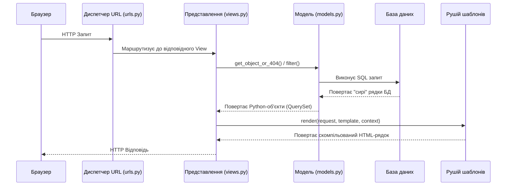

# Представлення (Views) у Django

## 1. Основний механізм (Core Mechanism)

Представлення (View) у Django — це просто Python-об'єкт, який можна викликати (функція або метод класу). Він приймає об'єкт `HttpRequest` як свій перший параметр і обов'язково повертає об'єкт `HttpResponse`.

Коли HTTP-запит досягає сервера, диспетчер URL-адрес Django знаходить відповідний шаблон маршруту і автоматично викликає пов'язане з ним представлення, передаючи сам запит та будь-які захоплені параметри URL.

## 2. Життєвий цикл запиту (Execution Flow)

Конвеєр бекенду дотримується суворої послідовності кроків:

1. **Запит від браузера:** HTTP Request.
Клієнт надсилає HTTP-запит до сервера.


2. **Маршрутизація URL:** URL Routing.
Django сканує `urls.py` зверху вниз, щоб знайти перший шлях, який збігається із запитом.


3. **Виклик View:** View Invocation.
Знайдене представлення викликається з передачею об'єкта `HttpRequest`.


4. **Делегація у Service або Selector:** Business / Data Layer.
View передає `validated_data` у `service` (мутації) або `selector` (читання). ORM-запити і бізнес-логіка не живуть у View.


5. **Отримання результату:** Domain Object.
Service або Selector повертає доменний об'єкт або QuerySet.


6. **Підготовка контексту:** Context Preparation.
Дані пакуються у звичайний Python-словник (Контекст).


7. **Рендеринг шаблону:** Template Rendering.
Рушій шаблонів замінює плейсхолдери в HTML-файлі на реальні дані з контексту.


8. **Генерація HTTP-відповіді:** HTTP Response Generation.
Згенерований HTML-рядок пакується в об'єкт `HttpResponse` і відправляється назад у браузер.


---

## 3. Архітектурна візуалізація

Ця діаграма ілюструє, як бекенд-система координує маршрутизацію, бізнес-логіку, отримання даних та презентацію:



> **Ментальна модель:**
> Уявіть, що View — це **Шеф-кухар ресторану**. Кухар отримує замовлення від офіціанта (`HttpRequest`), бере сирі інгредієнти з комори (База даних / Моделі), готує страву за певним рецептом (Бізнес-логіка), і красиво викладає її на тарілку (Шаблон), щоб відправити клієнту (`HttpResponse`).

## 4. Роль View у чистій архітектурі

View — це **тонкий HTTP-оркестратор**, а не місце для бізнес-логіки. Django дотримується принципу "слабкого зв'язування" (loose coupling): View лише з'єднує HTTP-шар з доменним шаром.

**View робить три речі:**
1. Парсить і валідує вхідний запит (через `InputSerializer`)
2. Делегує роботу у `service` (мутації) або `selector` (читання)
3. Форматує відповідь (через `OutputSerializer`) і повертає `Response`

Перевірки автентифікації — через `permissions.py`. Бізнес-логіка — у `services.py`. ORM-запити — у `selectors.py`. View не знає SQL і не містить обчислень.

> **Стандартна Django документація** описує View як "центр бізнес-логіки". Це вірно для навчальних прикладів. У production-архітектурі ця роль переходить до `services.py` і `selectors.py`.

## 5. Взаємодія з базою даних та Контекст

* **Система контексту:** Контекст — це словник, який пов'язує імена змінних з об'єктами Python. Він є мостом між бекенд-логікою та фронтенд-презентацією. Коли викликається `render()`, рушій шаблонів безпечно розпаковує цей словник у динамічний HTML.
* **Ліниві запити (Lazy QuerySets):** Важливий архітектурний концепт полягає в тому, що запити ORM є лінивими. Написання `Book.objects.filter(title="Django")` **не звертається** до бази даних одразу. ORM лише перетворює запит на SQL і виконує його тоді, коли код суворо вимагає даних (наприклад, під час ітерації в циклі, зрізу чи виведення на екран).

## 6. Граничні випадки та глибокі приклади коду (FBV)

Щоб запобігти помилці `500 Internal Server Error`, викликаній відсутністю об'єктів у базі, бекенд-інженери використовують скорочення `get_object_or_404()`. Воно перехоплює виняток `DoesNotExist` і коректно повертає відповідь `404 Not Found`.

Ось мінімальний, але глибокий приклад представлення на основі функції (Function-Based View):

```python
from django.shortcuts import render, get_object_or_404
from .models import Course

def course_detail(request, course_id):
    # 1. Взаємодія з БД (Граничний випадок оброблено безпечно)
    course = get_object_or_404(Course, id=course_id)

    # 2. Бізнес-логіка та підготовка контексту
    user_enrolled = request.user.is_authenticated and request.user in course.students.all()
    context = {
        'course': course, 
        'is_enrolled': user_enrolled
    }

    # 3. Рендеринг шаблону та генерація HTTP Відповіді
    return render(request, 'courses/detail.html', context)

```

---

## 7. Еволюція архітектури: Перехід до Class-Based Views (CBVs)

У міру зростання додатку ви часто повторюватимете одну й ту саму шаблонну логіку: отримання запису, обробка GET/POST запитів, рендеринг шаблону. CBVs вирішують це, використовуючи об'єктно-орієнтоване програмування.

### Переваги CBV:

1. **Розділення методів:** Замість довгих блоків `if request.method == 'POST':` в одній функції, CBVs розділяють HTTP-методи на чисті, виділені методи класу, такі як `get()` та `post()`.
2. **Успадкування та Міксини (Mixins):** Ви можете ділитися спільною поведінкою між кількома представленнями (наприклад, `LoginRequiredMixin`), що значно зменшує дублювання коду.
3. **Дженерики (Generic Views):** Django надає вбудовані універсальні представлення (`ListView`, `DetailView`, `CreateView`), які автоматично обробляють типові патерни веб-розробки.

### Порівняння: Функція проти Класу

**Функціональний підхід:**

```python
def my_view(request):
    if request.method == 'GET':
        return HttpResponse("Обробка GET-запиту")
    elif request.method == 'POST':
        return HttpResponse("Обробка POST-запиту")

```

**Класовий підхід:**

```python
from django.views import View

class MyView(View):
    def get(self, request):
        return HttpResponse("Обробка GET-запиту")

    def post(self, request):
        return HttpResponse("Обробка POST-запиту")

```

*(Щоб підключити CBV до `urls.py`, потрібно викликати метод `.as_view()`: `path('my-path/', MyView.as_view())`).*

### Магія Generic Views (Приклад ListView)

Замість того, щоб писати ручні запити та викликати `render()`, `ListView` бере всю рутину на себе:

```python
from django.views.generic import ListView
from .models import Book

class BookListView(ListView):
    model = Book  
    context_object_name = 'books'  
    template_name = 'books/book_list.html'

```

У цьому коді **взагалі немає** ручних SQL-запитів. `model = Book` автоматично виконує `Book.objects.all()`, пакує результат у змінну `books` і рендерить вказаний шаблон.

---

## 8. Типові помилки та Налагодження

* **Хибне розміщення логіки:** Початківці часто розміщують логіку БД або обчислення в HTML-шаблонах — це неправильно. У навчальних проєктах логіку переносять у View. У production-архітектурі View залишається тонким оркестратором, а бізнес-логіка йде у `services.py`, ORM-запити — у `selectors.py`.
* **Вузькі місця продуктивності:** Якщо представлення працює повільно, вузьким місцем рідко є швидкість виконання Python — майже завжди це неефективні запити до бази даних (проблема N+1). Інструмент Django Debug Toolbar дозволяє перехоплювати потік виконання та перевіряти згенерований SQL.
* **REST API:** Представлення не зобов'язані повертати HTML. Вони можуть повертати JSON для API, генерувати PDF-файли або виводити CSV.

## 9. Питання для самоперевірки (Reflection Questions)

1. Чому архітектурно безпечніше використовувати `request.method == 'POST'` для обробки та зміни даних, замість того, щоб приймати дані для зміни стану через GET-запит в URL?
2. Що станеться з бекенд-вебсервером, якщо запит до бази даних всередині вашого View виконуватиметься 10 секунд?