# Django Architecture — Mermaid-схеми

> Усі схеми — візуалізація концепцій із `django_architecture.md`.

---

## 1. Django Request Lifecycle — загальна схема (MVT)

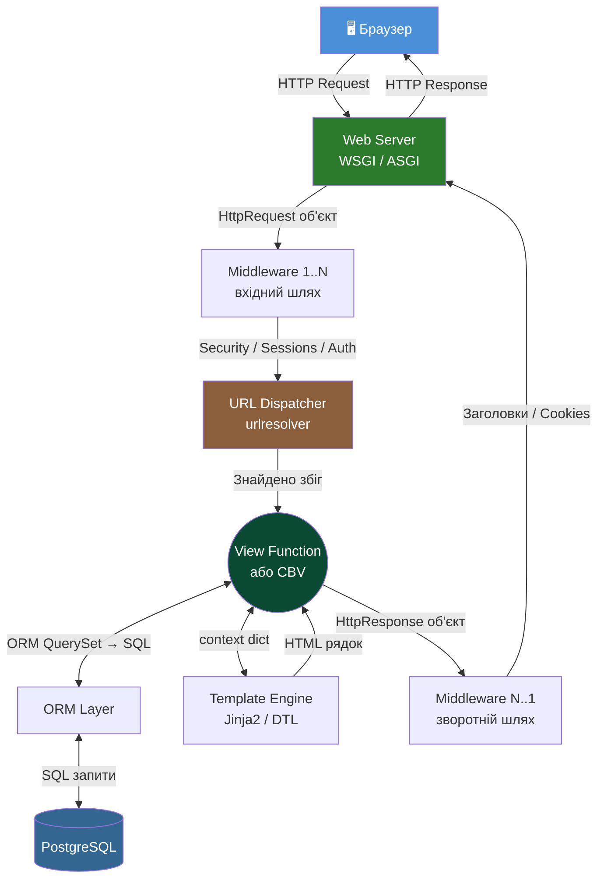

---

## 2. Браузер → Django → База даних — повний sequence

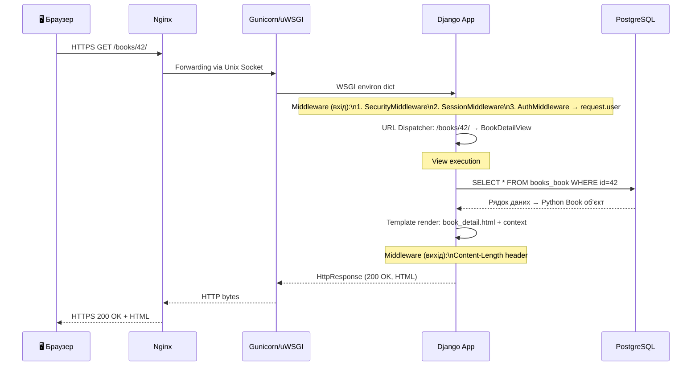

---

## 3. URL Dispatcher — логіка маршрутизації

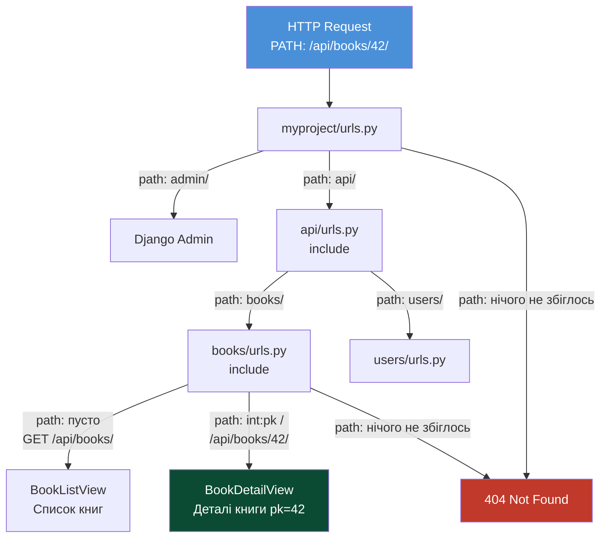

---

## 4. Middleware Chain — "цибулина" запиту

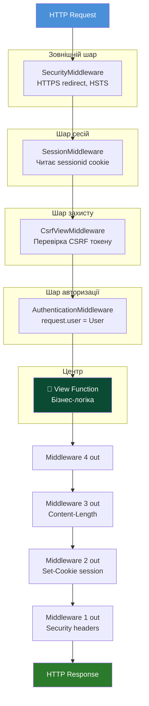

---

## 5. ORM Architecture — Model → SQL → Python

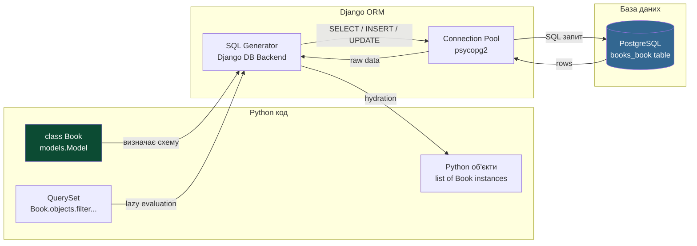

---

## 6. Структура Django проєкту

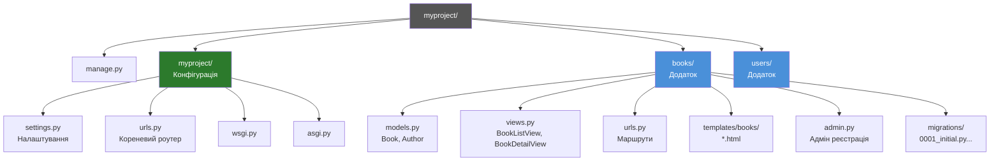

---

## 7. Authentication Flow — Login/Logout

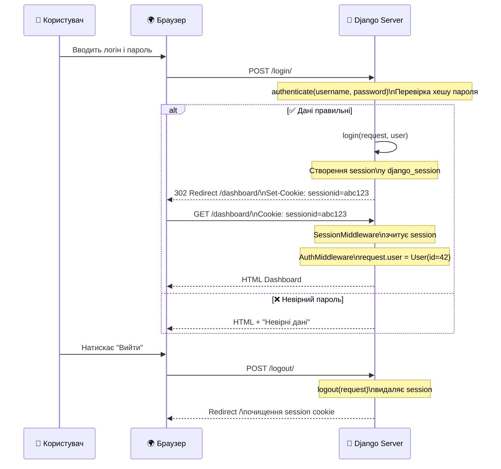

---

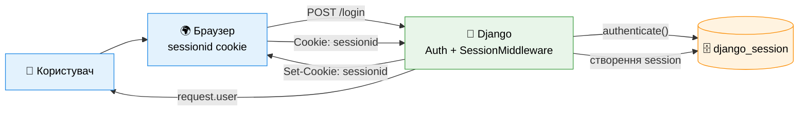

---

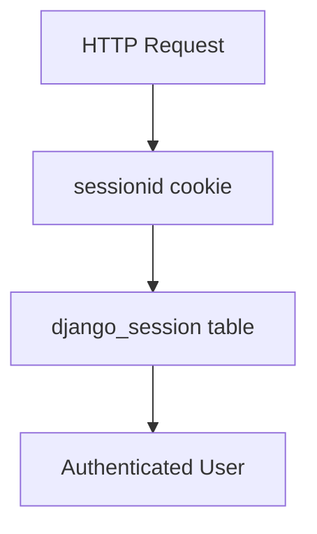

---

## 8. Session Lifecycle

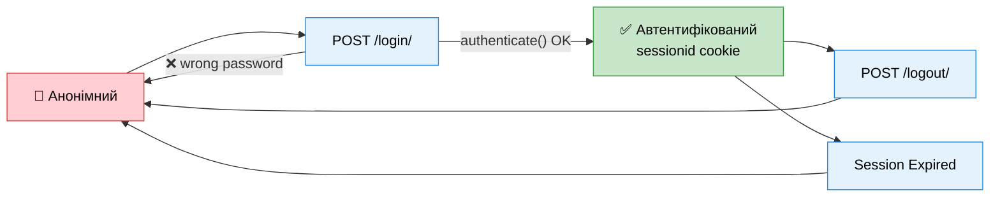

---

# Session + Cookie Architecture

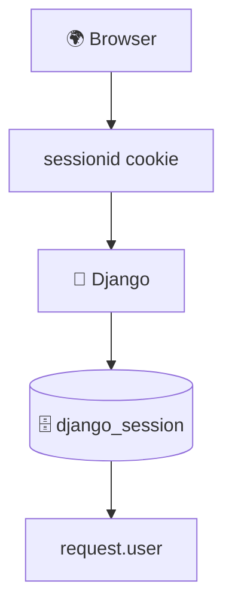

---

#  Що реально відбувається на кожному request.

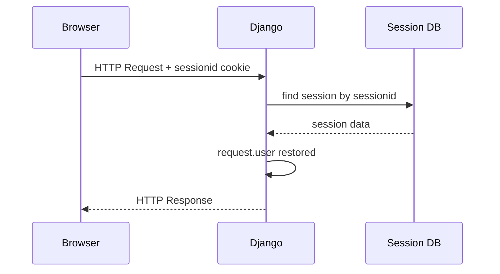

---

## 9. WSGI vs ASGI — модель конкурентності

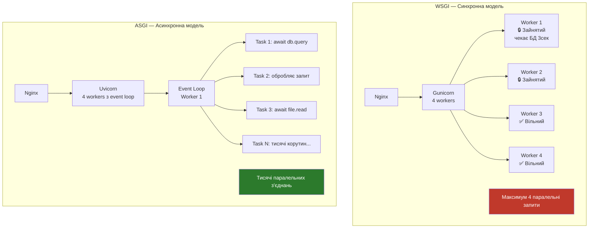

---

## 10. Django + PostgreSQL з'єднання

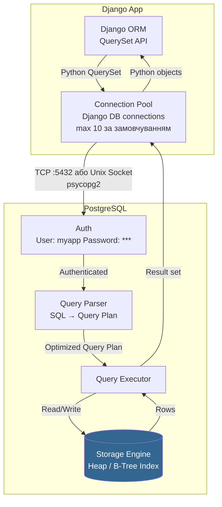

---

## 11. Django + Redis + Celery

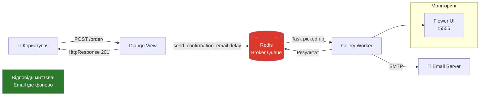

---

## 12. Production Deployment Architecture (Nginx + Gunicorn + Docker)

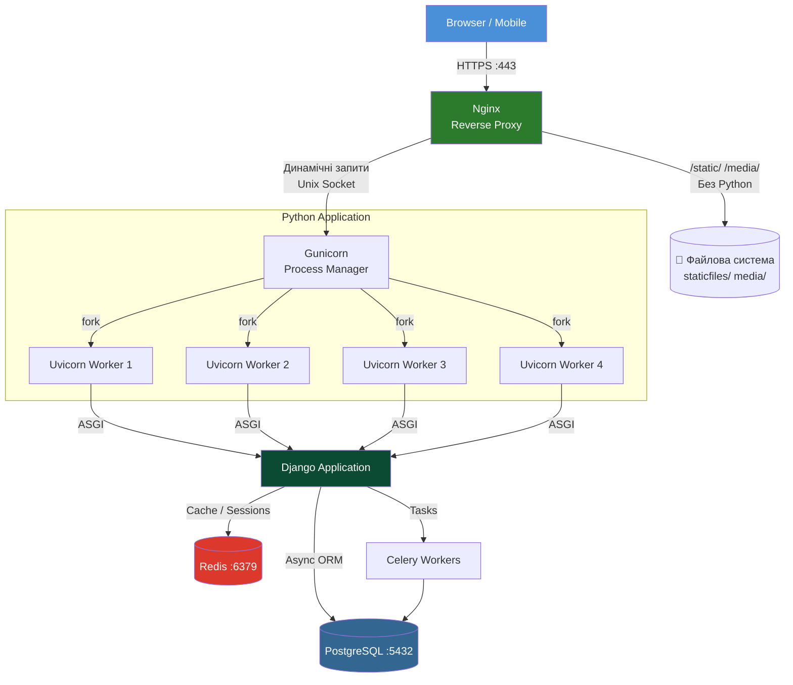

---

## 13. Django Request Lifecycle — детальний sequence

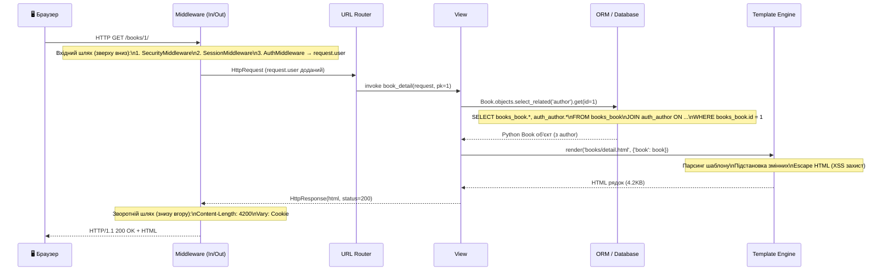

---

## 14. Django Admin Panel — архітектура

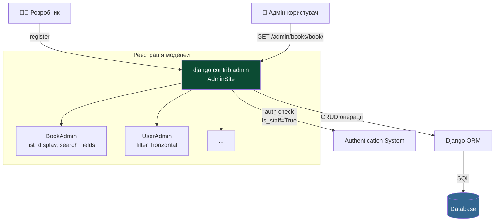

---

## 15. Масштабування Django у продакшні

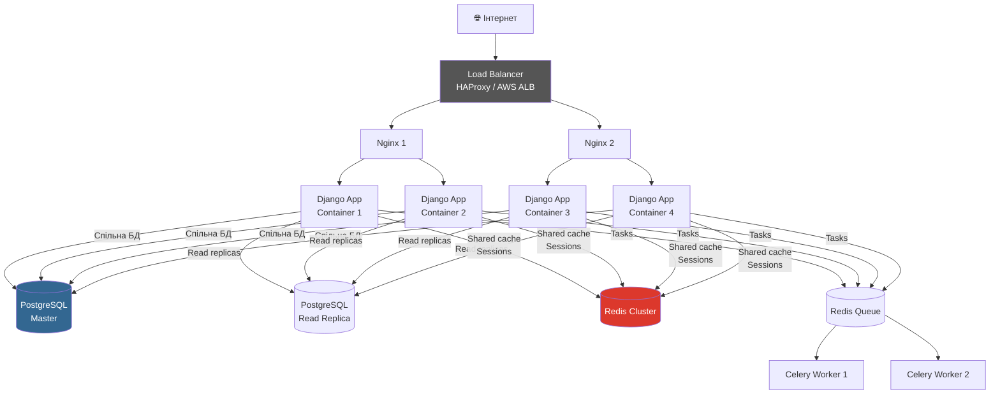
