# Мережевий фундамент — Mermaid-схеми

> Усі схеми цього файлу — візуалізація концепцій із `network_foundation.md`.
> Рендеруються в будь-якому Markdown-переглядачі з підтримкою Mermaid (GitHub, Obsidian, VSCode).

---

## 1. Огляд Інтернету — від браузера до сервера

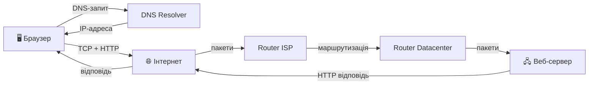

---

## 2. Повний маршрут запиту: Клієнт → Router → ISP → Сервер

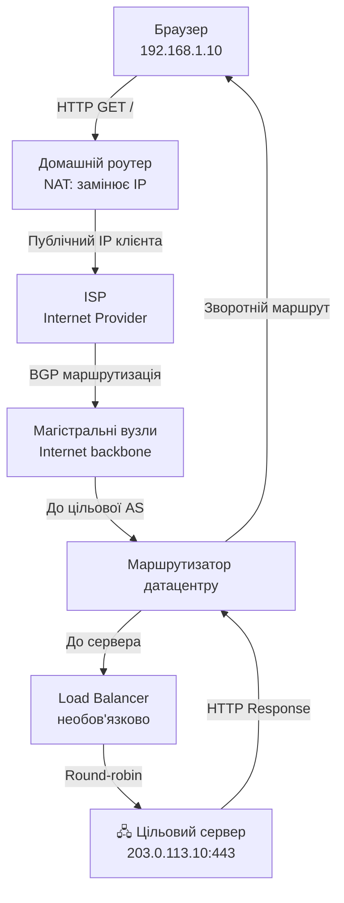

---

## 3. DNS-резолюція — покроково

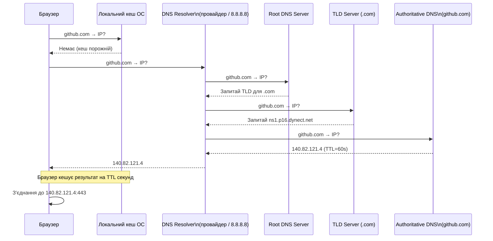

---

## 4. TCP — Three-Way Handshake + HTTP + Teardown

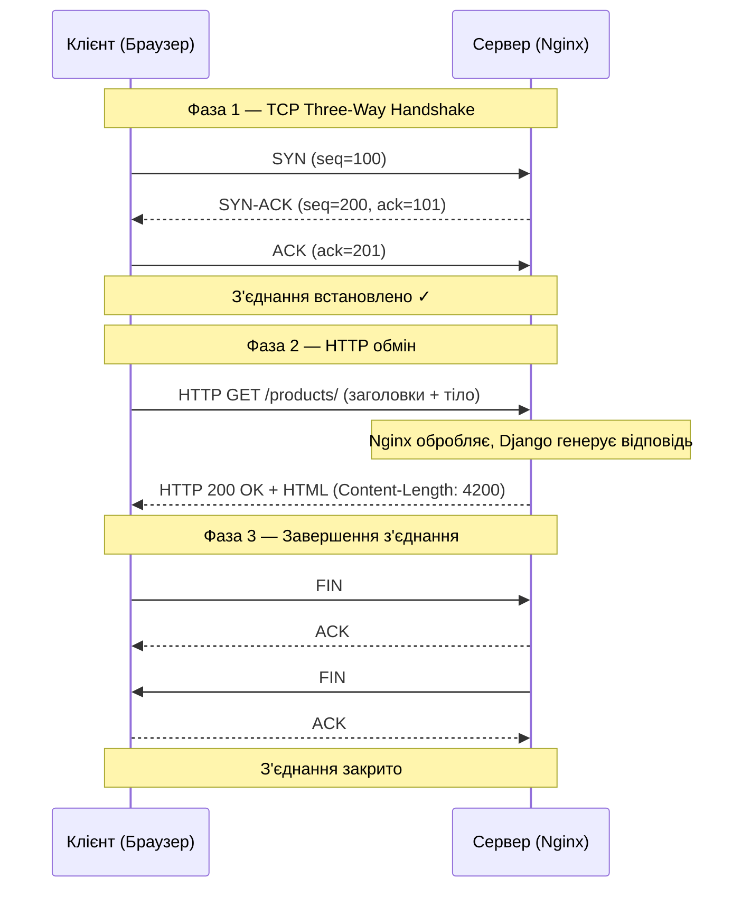

---

## 5. HTTP Request/Response Lifecycle

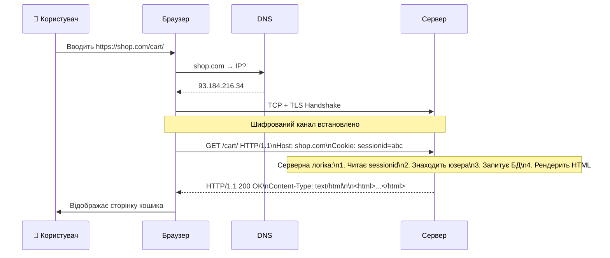

---

## 6. HTTPS / TLS Handshake

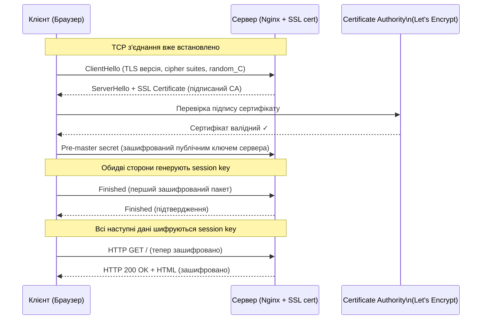

---

## 7. Браузер → Бекенд → База даних (повний стек)

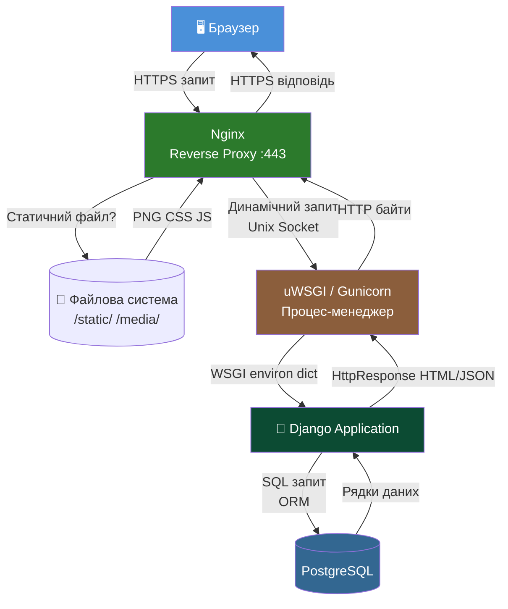

---

## 8. Socket-комунікація

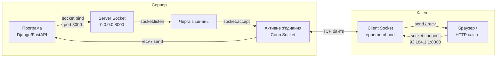

---

## 9. REST API Flow — повний цикл

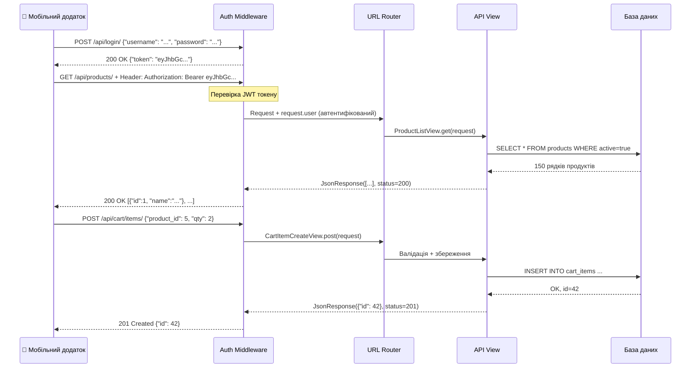

---

## 10. Клієнт-серверна архітектура — концептуальний огляд

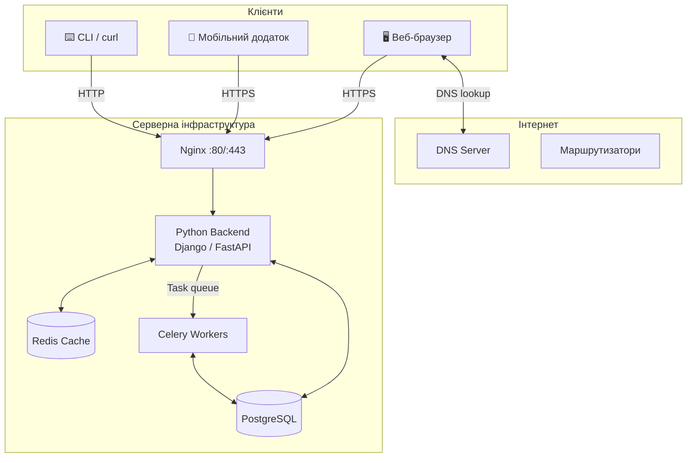

---

## 11. Packets та маршрутизація IP

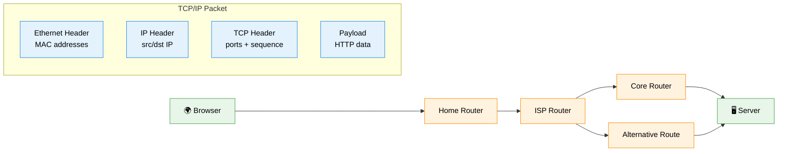

---

## Довідкова таблиця протоколів

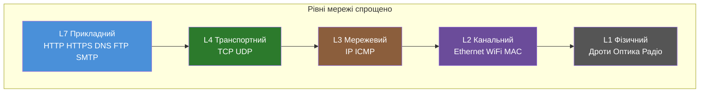
