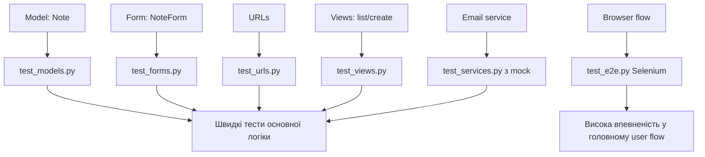
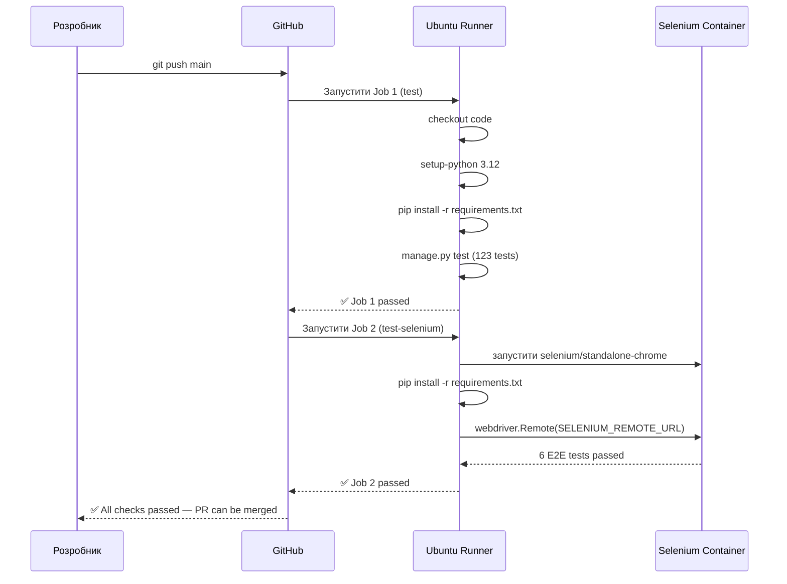
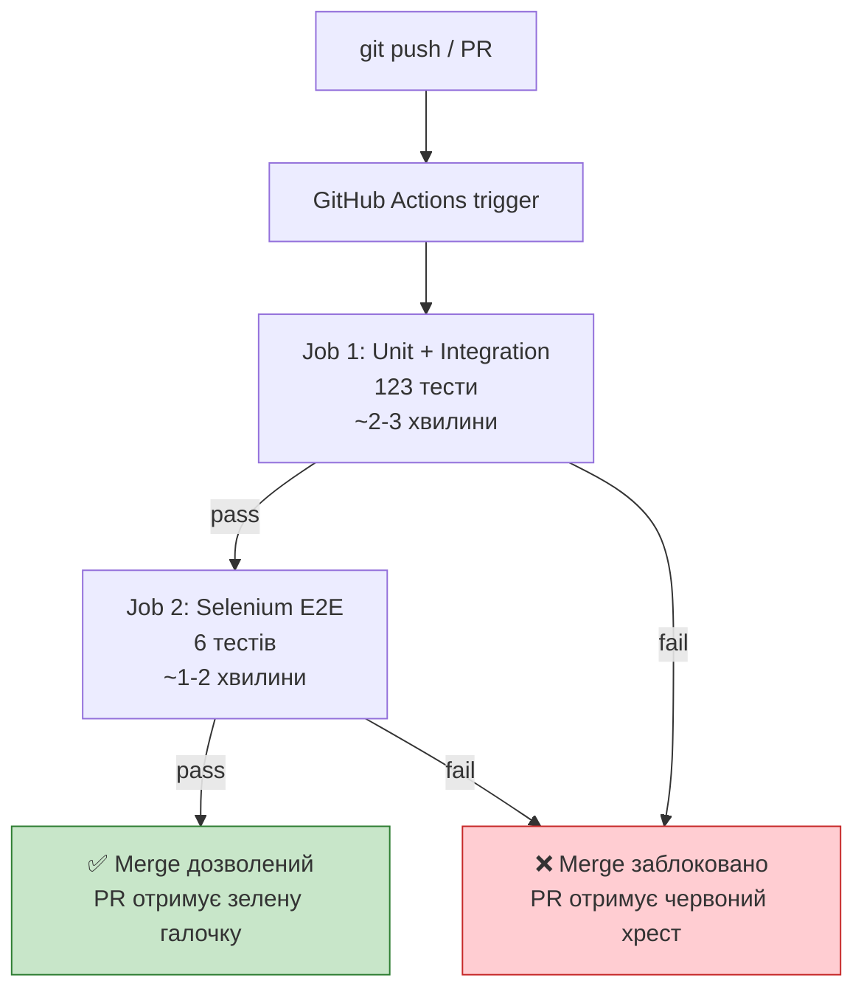

# Практичний проєкт: тестуємо notes_project від model до Selenium

> Після цього файлу ти збереш повний навчальний сценарій тестування Django notes app: model, form, URL, view, permissions, service з email, mock, Selenium E2E, Docker headless і coverage.

---

## 1. Навіщо це потрібно

Окремі приклади корисні, але в реальному навчанні студенту потрібен маршрут.

Не просто:

```text
Ось model test.
Ось mock.
Ось Selenium.
```

А так:

```text
1. Ось маленький notes app.
2. Ось яку поведінку ми очікуємо.
3. Ось які тести пишемо першими.
4. Ось як запускати.
5. Ось як виглядає помилка.
6. Ось коли додаємо Selenium.
```

Цей файл — фінальний практичний урок. Він збирає всі попередні теми в один проєкт.

---

## 2. Ментальна модель

Тестування застосунку схоже на перевірку маршруту доставки.

Спочатку перевіряємо маленькі речі:

- чи коробка має правильну назву;
- чи адреса валідна;
- чи кур’єр не бере чужу посилку.

Потім перевіряємо більший маршрут:

- користувач заходить;
- створює нотатку;
- бачить її у списку;
- не бачить чужі нотатки.

І тільки один-два найважливіші маршрути перевіряємо через реальний браузер Selenium.

---

## 3. Що будуємо

Проєкт: `notes_project`

App: `notes`

Функціональність:

1. користувач може створити нотатку;
2. нотатка має `title`, `content`, `owner`, `is_archived`;
3. список показує тільки нотатки поточного користувача;
4. форма обрізає пробіли в title;
5. title `admin` заборонений;
6. при створенні нотатки викликається email-service;
7. Selenium перевіряє головний шлях: login -> create note -> note appears.

Структура:

```text
notes_project/
├── manage.py
├── notes_project/
│   ├── settings.py
│   └── urls.py
└── notes/
    ├── models.py
    ├── forms.py
    ├── services.py
    ├── views.py
    ├── urls.py
    ├── templates/
    │   └── notes/
    │       ├── note_form.html
    │       └── note_list.html
    └── tests/
        ├── test_models.py
        ├── test_forms.py
        ├── test_urls.py
        ├── test_views.py
        ├── test_services.py
        └── test_e2e.py
```

---

## 4. Код застосунку

### 4.1 Model

```python
# notes/models.py
from django.conf import settings
from django.db import models


class Note(models.Model):
    owner = models.ForeignKey(
        settings.AUTH_USER_MODEL,
        on_delete=models.CASCADE,
        related_name="notes",
    )
    title = models.CharField(max_length=120)
    content = models.TextField()
    is_archived = models.BooleanField(default=False)
    created_at = models.DateTimeField(auto_now_add=True)

    def __str__(self):
        return self.title

    def archive(self):
        self.is_archived = True
        self.save(update_fields=["is_archived"])
```

Що тут наше:

- `__str__`;
- `archive`;
- ownership через `owner`.

Сам факт, що `CharField` зберігає рядок, тестувати не треба. Це вже тестує Django.

### 4.2 Form

```python
# notes/forms.py
from django import forms

from notes.models import Note


class NoteForm(forms.ModelForm):
    class Meta:
        model = Note
        fields = ["title", "content"]

    def clean_title(self):
        title = self.cleaned_data["title"].strip()

        if title.lower() == "admin":
            raise forms.ValidationError("Title cannot be admin.")

        return title
```

Що тестувати:

- valid data;
- missing title;
- strip spaces;
- reserved title.

### 4.3 Service

```python
# notes/services.py
from django.core.mail import send_mail


def send_note_created_email(email, title):
    send_mail(
        subject="Note created",
        message=f"Your note '{title}' was created.",
        from_email="noreply@example.com",
        recipient_list=[email],
    )
```

Email у тестах будемо мокати.

### 4.4 Views

```python
# notes/views.py
from django.contrib.auth.decorators import login_required
from django.shortcuts import redirect, render

from notes.forms import NoteForm
from notes.models import Note
from notes.services import send_note_created_email


@login_required
def note_list(request):
    notes = Note.objects.filter(
        owner=request.user,
        is_archived=False,
    ).order_by("-created_at")

    return render(request, "notes/note_list.html", {"notes": notes})


@login_required
def note_create(request):
    if request.method == "POST":
        form = NoteForm(request.POST)

        if form.is_valid():
            note = form.save(commit=False)
            note.owner = request.user
            note.save()
            send_note_created_email(request.user.email, note.title)
            return redirect("note_list")
    else:
        form = NoteForm()

    return render(request, "notes/note_form.html", {"form": form})
```

### 4.5 URLs

```python
# notes/urls.py
from django.urls import path

from notes import views


urlpatterns = [
    path("notes/", views.note_list, name="note_list"),
    path("notes/new/", views.note_create, name="note_create"),
]
```

У project urls:

```python
# notes_project/urls.py
from django.contrib import admin
from django.urls import include, path


urlpatterns = [
    path("admin/", admin.site.urls),
    path("", include("django.contrib.auth.urls")),
    path("", include("notes.urls")),
]
```

---

## 5. План тестів

Пишемо тести не хаотично, а шарами.

| Крок | Файл | Що перевіряємо |
|---:|---|---|
| 1 | `test_models.py` | `__str__`, `archive()` |
| 2 | `test_forms.py` | valid/invalid form, `clean_title()` |
| 3 | `test_urls.py` | URL names ведуть до правильних views |
| 4 | `test_views.py` | GET/POST, redirects, templates, ownership |
| 5 | `test_services.py` | email-service через mock |
| 6 | `test_e2e.py` | головний шлях у браузері |
| 7 | coverage | що реально виконувалось |

---

## 6. Model tests

```python
# notes/tests/test_models.py
from django.contrib.auth import get_user_model
from django.test import TestCase

from notes.models import Note


User = get_user_model()


class NoteModelTest(TestCase):
    def setUp(self):
        self.user = User.objects.create_user(
            username="student",
            email="student@example.com",
            password="pw",
        )

    def test_note_str_returns_title(self):
        note = Note.objects.create(
            owner=self.user,
            title="First note",
            content="Hello",
        )

        self.assertEqual(str(note), "First note")

    def test_archive_marks_note_as_archived(self):
        note = Note.objects.create(
            owner=self.user,
            title="Archive me",
            content="Hello",
        )

        note.archive()
        note.refresh_from_db()

        self.assertTrue(note.is_archived)
```

Запуск:

```bash
python manage.py test notes.tests.test_models
```

---

## 7. Form tests

```python
# notes/tests/test_forms.py
from django.test import TestCase

from notes.forms import NoteForm


class NoteFormTest(TestCase):
    def test_form_is_valid_with_title_and_content(self):
        form = NoteForm(data={
            "title": "My note",
            "content": "Hello",
        })

        self.assertTrue(form.is_valid())

    def test_form_is_invalid_without_title(self):
        form = NoteForm(data={
            "title": "",
            "content": "Hello",
        })

        self.assertFalse(form.is_valid())
        self.assertIn("title", form.errors)

    def test_form_strips_title_spaces(self):
        form = NoteForm(data={
            "title": "  My note  ",
            "content": "Hello",
        })

        self.assertTrue(form.is_valid())
        self.assertEqual(form.cleaned_data["title"], "My note")

    def test_form_rejects_reserved_admin_title(self):
        form = NoteForm(data={
            "title": "admin",
            "content": "Hello",
        })

        self.assertFalse(form.is_valid())
        self.assertIn("title", form.errors)
```

Що студент має помітити:

- form test не потребує browser;
- form test не потребує створювати Note в БД;
- ми перевіряємо validation logic напряму.

---

## 8. URL tests

```python
# notes/tests/test_urls.py
from django.test import SimpleTestCase
from django.urls import resolve, reverse

from notes.views import note_create, note_list


class NoteUrlsTest(SimpleTestCase):
    def test_note_list_url_resolves_to_note_list_view(self):
        match = resolve(reverse("note_list"))

        self.assertEqual(match.func, note_list)

    def test_note_create_url_resolves_to_note_create_view(self):
        match = resolve(reverse("note_create"))

        self.assertEqual(match.func, note_create)
```

Тут `SimpleTestCase`, бо база не потрібна.

---

## 9. View tests: list

```python
# notes/tests/test_views.py
from unittest.mock import patch

from django.contrib.auth import get_user_model
from django.test import TestCase
from django.urls import reverse

from notes.models import Note


User = get_user_model()


class NoteListViewTest(TestCase):
    def setUp(self):
        self.user = User.objects.create_user(
            username="student",
            email="student@example.com",
            password="pw",
        )

    def test_anonymous_user_redirects_to_login(self):
        response = self.client.get(reverse("note_list"))

        self.assertEqual(response.status_code, 302)

    def test_logged_user_can_open_note_list(self):
        self.client.login(username="student", password="pw")

        response = self.client.get(reverse("note_list"))

        self.assertEqual(response.status_code, 200)
        self.assertTemplateUsed(response, "notes/note_list.html")

    def test_note_list_shows_only_current_user_notes(self):
        other_user = User.objects.create_user(username="other", password="pw")
        own_note = Note.objects.create(
            owner=self.user,
            title="Mine",
            content="Hello",
        )
        Note.objects.create(
            owner=other_user,
            title="Other user note",
            content="Secret",
        )

        self.client.login(username="student", password="pw")
        response = self.client.get(reverse("note_list"))

        notes = list(response.context["notes"])
        self.assertIn(own_note, notes)
        self.assertEqual(len(notes), 1)

    def test_archived_notes_are_hidden(self):
        Note.objects.create(
            owner=self.user,
            title="Archived",
            content="Hello",
            is_archived=True,
        )

        self.client.login(username="student", password="pw")
        response = self.client.get(reverse("note_list"))

        self.assertEqual(list(response.context["notes"]), [])
```

Ці тести важливіші, ніж просто `status_code == 200`, бо вони перевіряють бізнес-правила.

---

## 10. View tests: create + mock email

```python
# notes/tests/test_views.py
class NoteCreateViewTest(TestCase):
    def setUp(self):
        self.user = User.objects.create_user(
            username="student",
            email="student@example.com",
            password="pw",
        )

    def test_anonymous_user_cannot_open_create_page(self):
        response = self.client.get(reverse("note_create"))

        self.assertEqual(response.status_code, 302)

    def test_logged_user_can_open_create_page(self):
        self.client.login(username="student", password="pw")

        response = self.client.get(reverse("note_create"))

        self.assertEqual(response.status_code, 200)
        self.assertTemplateUsed(response, "notes/note_form.html")

    @patch("notes.views.send_note_created_email")
    def test_logged_user_can_create_note(self, mock_send_email):
        self.client.login(username="student", password="pw")

        response = self.client.post(reverse("note_create"), {
            "title": "Created from test",
            "content": "Hello",
        })

        self.assertRedirects(response, reverse("note_list"))
        note = Note.objects.get(title="Created from test")
        self.assertEqual(note.owner, self.user)
        mock_send_email.assert_called_once_with(
            "student@example.com",
            "Created from test",
        )

    @patch("notes.views.send_note_created_email")
    def test_invalid_form_does_not_create_note_or_send_email(self, mock_send_email):
        self.client.login(username="student", password="pw")

        response = self.client.post(reverse("note_create"), {
            "title": "",
            "content": "Hello",
        })

        self.assertEqual(response.status_code, 200)
        self.assertFalse(Note.objects.exists())
        mock_send_email.assert_not_called()
```

Чому patch саме `notes.views.send_note_created_email`?

Бо view імпортує і використовує це ім’я у файлі `notes/views.py`. Мокаємо місце використання.

---

## 11. Service test

Окремо можна протестувати email service:

```python
# notes/tests/test_services.py
from unittest.mock import patch

from django.test import SimpleTestCase

from notes.services import send_note_created_email


class NoteEmailServiceTest(SimpleTestCase):
    @patch("notes.services.send_mail")
    def test_send_note_created_email_calls_send_mail(self, mock_send_mail):
        send_note_created_email("student@example.com", "My note")

        mock_send_mail.assert_called_once_with(
            subject="Note created",
            message="Your note 'My note' was created.",
            from_email="noreply@example.com",
            recipient_list=["student@example.com"],
        )
```

Тут база не потрібна, тому `SimpleTestCase`.

---

## 12. Selenium E2E smoke test

Selenium не треба писати на кожну дрібницю. Але один smoke test для головного маршруту корисний.

Встановлення:

```bash
pip install selenium
```

Тест:

```python
# notes/tests/test_e2e.py
from django.contrib.auth import get_user_model
from django.contrib.staticfiles.testing import StaticLiveServerTestCase
from selenium import webdriver
from selenium.webdriver.common.by import By
from selenium.webdriver.support import expected_conditions as EC
from selenium.webdriver.support.ui import WebDriverWait


User = get_user_model()


class NoteAppE2ETest(StaticLiveServerTestCase):
    @classmethod
    def setUpClass(cls):
        super().setUpClass()
        cls.browser = webdriver.Firefox()
        cls.browser.implicitly_wait(3)

    @classmethod
    def tearDownClass(cls):
        cls.browser.quit()
        super().tearDownClass()

    def setUp(self):
        User.objects.create_user(
            username="student",
            email="student@example.com",
            password="password123",
        )

    def test_user_can_login_and_create_note(self):
        self.browser.get(f"{self.live_server_url}/login/")

        self.browser.find_element(By.NAME, "username").send_keys("student")
        self.browser.find_element(By.NAME, "password").send_keys("password123")
        self.browser.find_element(By.CSS_SELECTOR, "button[type='submit']").click()

        create_link = WebDriverWait(self.browser, 5).until(
            EC.element_to_be_clickable((By.ID, "create-note-link"))
        )
        create_link.click()

        self.browser.find_element(By.NAME, "title").send_keys("Selenium Note")
        self.browser.find_element(By.NAME, "content").send_keys("E2E works")
        self.browser.find_element(By.ID, "submit-note").click()

        note_title = WebDriverWait(self.browser, 5).until(
            EC.visibility_of_element_located((By.CSS_SELECTOR, ".note-title"))
        )

        self.assertEqual(note_title.text, "Selenium Note")
```

Що треба додати в HTML:

```html
<!-- notes/note_list.html -->
<a id="create-note-link" href="">Create note</a>


  <h2 class="note-title">{{ note.title }}</h2>

```

```html
<!-- notes/note_form.html -->
<form method="post">
  
  {{ form.as_p }}
  <button id="submit-note" type="submit">Save</button>
</form>
```

Стабільні selectors — частина тестованості UI.

---

## 13. Selenium у Docker/CI headless

На CI-сервері немає монітора. Є три стратегії запустити Selenium без фізичного дисплею.

---

### 13.1 Стратегія A — встановити geckodriver/chromedriver у Dockerfile

**Firefox + geckodriver** — скачати бінарник з GitHub Releases:

```dockerfile
ARG GECKODRIVER_VERSION=0.35.0

RUN apt-get update && apt-get install -y firefox-esr wget \
    && rm -rf /var/lib/apt/lists/* \
    && wget -q "https://github.com/mozilla/geckodriver/releases/download/v${GECKODRIVER_VERSION}/geckodriver-v${GECKODRIVER_VERSION}-linux64.tar.gz" \
    && tar -xzf geckodriver-v${GECKODRIVER_VERSION}-linux64.tar.gz \
    && mv geckodriver /usr/local/bin/ \
    && rm geckodriver-v${GECKODRIVER_VERSION}-linux64.tar.gz
```

**Chrome + chromedriver** — простіше через пакет:

```dockerfile
RUN apt-get update && apt-get install -y \
    chromium \
    chromium-driver \
    && rm -rf /var/lib/apt/lists/*
```

У тестах — headless режим:

```python
# Firefox headless
from selenium.webdriver.firefox.options import Options as FirefoxOptions
options = FirefoxOptions()
options.add_argument("--headless")
driver = webdriver.Firefox(options=options)

# Chrome headless
from selenium.webdriver.chrome.options import Options as ChromeOptions
options = ChromeOptions()
options.add_argument("--headless=new")
options.add_argument("--no-sandbox")             # обов'язково в Docker
options.add_argument("--disable-dev-shm-usage")  # shared memory в контейнері
driver = webdriver.Chrome(options=options)
```

| Аргумент | Навіщо |
|---|---|
| `--headless=new` | Запуск без GUI вікна (нова headless реалізація Chrome 112+) |
| `--no-sandbox` | Chrome sandbox конфліктує з Docker namespaces |
| `--disable-dev-shm-usage` | `/dev/shm` за замовчуванням 64 MB у Docker → Chrome падає |

Як запустити (якщо є `xvfb` для старих Firefox без `--headless`):

```bash
xvfb-run -s "-screen 0 1024x768x24" python manage.py test
```

---

### 13.2 Стратегія B — офіційні Selenium Docker-образи (рекомендована для CI)

`selenium/standalone-chrome` і `selenium/standalone-firefox` — готові образи від Selenium Project.
Вже містять: браузер + драйвер + VNC сервер. Нічого встановлювати і завантажувати не треба.

**docker-compose.yml** — два сервіси: `web` (Django тести) + `selenium` (браузер):

```yaml
version: "3.9"
services:
  web:
    build: .
    command: python manage.py test
    environment:
      - SELENIUM_REMOTE_URL=http://selenium:4444/wd/hub
    depends_on:
      selenium:
        condition: service_healthy
    networks:
      - test-net

  selenium:
    image: selenium/standalone-chrome:latest
    shm_size: "2gb"   # Chrome потребує shared memory для рендеру
    healthcheck:
      test: ["CMD", "curl", "-f", "http://localhost:4444/status"]
      interval: 5s
      timeout: 3s
      retries: 5
    networks:
      - test-net

networks:
  test-net:
```

У тестах — функція, що перемикається між Local та Remote через env-var:

```python
import os
from selenium import webdriver
from selenium.webdriver.firefox.options import Options as FirefoxOptions

SELENIUM_REMOTE_URL = os.environ.get("SELENIUM_REMOTE_URL")


def _make_driver():
    if SELENIUM_REMOTE_URL:
        # CI / docker-compose → Remote WebDriver до Selenium-контейнера
        options = webdriver.ChromeOptions()
        return webdriver.Remote(
            command_executor=SELENIUM_REMOTE_URL,
            options=options,
        )
    # Локально → headless Firefox (якщо geckodriver встановлений)
    options = FirefoxOptions()
    options.add_argument("--headless")
    return webdriver.Firefox(options=options)
```

Запуск:

```bash
docker compose up --build --abort-on-container-exit
```

Бонус: VNC доступний на `http://localhost:7900` (пароль: `secret`) — можна бачити що браузер робить.

---

### 13.3 Стратегія C — GitHub Actions готовий рецепт

```yaml
# .github/workflows/tests.yml
name: Django Tests

on: [push, pull_request]

jobs:
  test:
    runs-on: ubuntu-latest

    services:
      selenium:
        image: selenium/standalone-chrome:latest
        options: --shm-size=2gb
        ports:
          - 4444:4444

    steps:
      - uses: actions/checkout@v4

      - name: Set up Python
        uses: actions/setup-python@v5
        with:
          python-version: "3.12"

      - name: Install dependencies
        run: pip install -r requirements.txt selenium

      - name: Run tests
        env:
          SELENIUM_REMOTE_URL: http://localhost:4444/wd/hub
        run: python manage.py test
```

Той самий `SELENIUM_REMOTE_URL` env-var підхоплює `_make_driver()` — і локально, і в CI код однаковий.

---

### 13.4 Яку стратегію обрати

| Стратегія | Де geckodriver | Складність | Рекомендовано для |
|---|---|---|---|
| xvfb + Firefox | встановлений локально | ⭐⭐ | CI без Docker, Linux |
| Dockerfile + wget geckodriver | у Dockerfile | ⭐⭐ | власний Docker-образ |
| `selenium/standalone-chrome` + Remote | у Selenium-образі | ⭐ | docker-compose, GitHub Actions |

Для нових проєктів: `selenium/standalone-chrome` + `webdriver.Remote()` — найпростіше, браузер завжди однаковий у всіх середовищах.

---

## 14. Coverage

Запуск:

```bash
pip install coverage
coverage run manage.py test
coverage report
coverage html
```

Як читати:

```text
Name                    Stmts   Miss  Cover
-------------------------------------------
notes/models.py            18      0   100%
notes/forms.py             20      2    90%
notes/views.py             45      8    82%
```

Не женись сліпо за 100%. Питай:

- чи перевірені permissions?
- чи є invalid form tests?
- чи є edge cases?
- чи перевірений payment/email/API через mock?
- чи є хоча б один Selenium smoke test для головного маршруту?

---

## 15. Mermaid-схема



---

## 16. Типові помилки початківців

| Помилка | Чому виникає | Як виправити |
| ------- | ------------ | ------------ |
| Починають із Selenium | Він виглядає “найповнішим” | Спочатку model/form/view tests |
| Не тестують ownership | Думають тільки про свого user | Створи User A і User B |
| Мокають form/model | Хочуть ізоляції | Form/model краще тестувати реально через test DB |
| Не додають stable selectors | HTML пишеться тільки для очей | Додай `id` або `data-test-id` для E2E |
| Використовують `time.sleep()` | Простий спосіб чекати | Використовуй `WebDriverWait` |
| Coverage є, а assertions слабкі | Дивляться на цифру | Перевіряй зміст тестів |

---

## 17. Практика

1. Реалізуй `Note` model.
2. Напиши model tests.
3. Реалізуй `NoteForm`.
4. Напиши form tests.
5. Реалізуй `note_list` і `note_create`.
6. Напиши view tests:
   - anonymous redirect;
   - logged user 200;
   - User A не бачить User B notes;
   - POST створює note;
   - invalid POST не створює note.
7. Додай mock для email.
8. Додай Selenium smoke test.
9. Запусти:

```bash
python manage.py test
```

10. Запусти:

```bash
coverage run manage.py test
coverage report
```

---

## 18. Питання для самоперевірки

1. Чому в цьому проєкті ownership tests критично важливі?
2. Чому email треба мокати у view test?
3. Чому form validation краще тестувати без Selenium?
4. Що перевіряє Selenium smoke test, чого не перевіряє Django Client?
5. Навіщо `StaticLiveServerTestCase`?
6. Чому stable selectors важливі для E2E?
7. Що coverage може показати, а що ні?

---

## 19. CI/CD та GitHub Actions

### 19.1 Що таке CI і навіщо

**CI (Continuous Integration)** — практика автоматичного запуску тестів щоразу коли код потрапляє у репозиторій.

Без CI:
```
Розробник пише код → push → тести запускаються вручну (або взагалі ні) → баг потрапляє в main
```

З CI:
```
Розробник пише код → push → GitHub автоматично запускає тести → якщо тест впав → merge заблокований
```

**GitHub Actions** — вбудований CI/CD у GitHub. Безкоштовний для публічних репозиторіїв і для приватних у межах ліміту.

### 19.2 Де повинен лежати файл — ВАЖЛИВО

GitHub Actions читає `.yml` файли **тільки** з кореневої папки репозиторію:

```
<repo-root>/.github/workflows/*.yml   ← GitHub бачить і запускає
```

Файл в будь-якому іншому місці — **ігнорується**:

```
module_5/lesson_Django_Testing/crispy_notes_project/.github/workflows/  ← НЕ ПРАЦЮЄ
```

Правильна структура для нашого курсу (репозиторій `PY-Course-Victor-Nikoriak-23_02`):

```text
PY-Course-Victor-Nikoriak-23_02/       ← корінь репозиторію
├── .github/
│   └── workflows/
│       └── django-tests.yml           ← ТУТ, не всередині module_5/
├── module_5/
│   └── lesson_Django_Testing/
│       └── crispy_notes_project/
│           ├── manage.py
│           └── requirements.txt
```

У workflow файлі вказуємо шлях до проєкту через `working-directory`:

```yaml
defaults:
  run:
    working-directory: module_5/lesson_Django_Testing/crispy_notes_project
```

**YAML формат** — GitHub Actions використовує YAML для опису pipeline.

### 19.3 Повний workflow файл з поясненням

```yaml
# .github/workflows/django-tests.yml

name: Django Tests       # назва pipeline у GitHub UI

# ── Тригери ──────────────────────────────────────────────────────────────────
on:
  push:
    branches: [ main, master ]   # запускати при push у main
  pull_request:
    branches: [ main, master ]   # запускати при PR у main
  workflow_dispatch:             # кнопка "Run workflow" у GitHub UI

# ── Jobs ─────────────────────────────────────────────────────────────────────
jobs:

  # ── Job 1: Unit + Integration (швидкі тести без браузера) ─────────────────
  test:
    name: Unit & Integration Tests
    runs-on: ubuntu-latest       # тип runner (VM від GitHub)

    steps:
      # Крок 1: завантажити код
      - name: Checkout code
        uses: actions/checkout@v4

      # Крок 2: встановити Python
      - name: Set up Python 3.12
        uses: actions/setup-python@v5
        with:
          python-version: "3.12"

      # Крок 3: кеш pip (прискорює повторні запуски)
      - name: Cache pip
        uses: actions/cache@v4
        with:
          path: ~/.cache/pip
          key: ${{ runner.os }}-pip-${{ hashFiles('requirements.txt') }}

      # Крок 4: встановити залежності
      - name: Install dependencies
        run: pip install -r requirements.txt

      # Крок 5: перевірка конфігурації Django
      - name: Django system check
        run: python manage.py check

      # Крок 6: запустити тести без Selenium
      - name: Run tests
        run: |
          python manage.py test \
            hello_app.tests.test_models \
            hello_app.tests.test_services \
            hello_app.tests.test_forms \
            hello_app.tests.test_views \
            -v 2

      # Крок 7: coverage
      - name: Coverage report
        run: |
          coverage run manage.py test hello_app.tests.test_models \
            hello_app.tests.test_services \
            hello_app.tests.test_forms \
            hello_app.tests.test_views
          coverage report
          coverage xml

      # Крок 8: зберегти coverage як artifact
      - name: Upload coverage
        uses: actions/upload-artifact@v4
        with:
          name: coverage-report
          path: coverage.xml


  # ── Job 2: Selenium E2E тести ─────────────────────────────────────────────
  test-selenium:
    name: Selenium E2E Tests
    runs-on: ubuntu-latest
    needs: test              # запускати тільки після успіху Job 1

    # Selenium як окремий Docker-сервіс
    services:
      selenium:
        image: selenium/standalone-chrome:latest
        options: --shm-size=2gb
        ports:
          - 4444:4444

    steps:
      - name: Checkout code
        uses: actions/checkout@v4

      - name: Set up Python 3.12
        uses: actions/setup-python@v5
        with:
          python-version: "3.12"

      - name: Install dependencies
        run: pip install -r requirements.txt

      # SELENIUM_REMOTE_URL → _make_driver() використає Remote WebDriver
      - name: Run Selenium tests
        env:
          SELENIUM_REMOTE_URL: http://localhost:4444/wd/hub
        run: python manage.py test hello_app.tests.test_selenium -v 2
```

### 19.4 Як GitHub виконує pipeline



### 19.5 Як бачити результати на GitHub

1. Відкрий репозиторій на GitHub
2. Клацни вкладку **Actions**
3. Зліва — список workflow-ів, справа — history запусків
4. Клацни на конкретний run → бачиш jobs → клацни job → бачиш steps

Якщо тест впав:

```
❌ Run tests
  FAILED: hello_app.tests.test_views.NoteAuthorizationTest.test_bob_cannot_edit_alice_note
  AssertionError: 200 != 403
  ...
```

Текст помилки видно прямо в GitHub UI.

### 19.6 Status badge (бейдж статусу)

Додай у `README.md` щоб показувати чи тести проходять:

```markdown

```

Виглядає так:

```
[passing] Django Tests
```

Колеги і роботодавці одразу бачать що проєкт має CI і тести зелені.

### 19.7 Захист гілки (Branch Protection)

У налаштуваннях репозиторію:

```
Settings → Branches → Add branch protection rule
  ☑ Require status checks to pass before merging
  ☑ Require branches to be up to date before merging
      Status checks: "Unit & Integration Tests"
```

Після цього **merge у main заблокований** якщо тести впали.

```
❌ Cannot merge — "Unit & Integration Tests" check failed
```

### 19.8 Схема: що CI перевіряє на кожен push



### 19.9 Де зберігати секрети (SECRET_KEY, паролі)

Для production-like тестів де SECRET_KEY не можна комітити у код:

```
GitHub репозиторій → Settings → Secrets and variables → Actions → New secret
  Name:  SECRET_KEY
  Value: super-secret-value
```

У workflow:

```yaml
- name: Run tests
  env:
    SECRET_KEY: ${{ secrets.SECRET_KEY }}
    DATABASE_URL: ${{ secrets.DATABASE_URL }}
  run: python manage.py test
```

У `settings.py`:

```python
import os
SECRET_KEY = os.environ.get("SECRET_KEY", "django-insecure-dev-only")
```

### 19.10 Matrix Testing: перевірка на кількох версіях Python

```yaml
jobs:
  test:
    strategy:
      matrix:
        python-version: ["3.11", "3.12", "3.13"]

    runs-on: ubuntu-latest
    name: Test on Python ${{ matrix.python-version }}

    steps:
      - uses: actions/checkout@v4
      - uses: actions/setup-python@v5
        with:
          python-version: ${{ matrix.python-version }}
      - run: pip install -r requirements.txt
      - run: python manage.py test
```

Результат: три паралельні jobs — `Test on Python 3.11`, `3.12`, `3.13`.

---

## 20. Питання для самоперевірки (CI/CD)

1. Що відбувається якщо тест впаде у GitHub Actions?
2. Де на GitHub можна подивитись результати запуску тестів?
3. Навіщо `needs: test` у Job 2?
4. Навіщо `selenium/standalone-chrome` як service, а не встановлювати Chrome на runner?
5. Як `SELENIUM_REMOTE_URL` дозволяє одному `test_selenium.py` працювати і локально, і в CI?
6. Що таке Branch Protection і як він пов'язаний з CI?
7. Чому не можна зберігати `SECRET_KEY` прямо у YAML файлі?
8. Для чого потрібен `matrix.python-version`?
