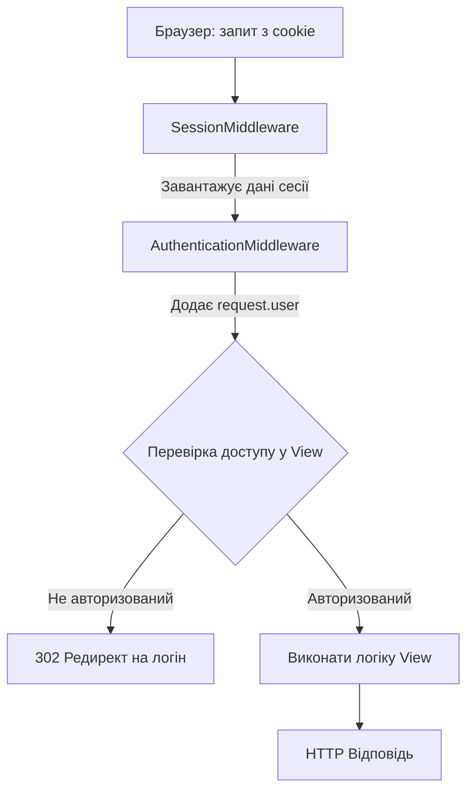
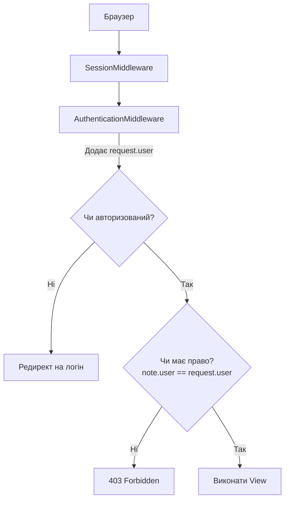

# Автентифікація vs Авторизація — Основи

> **Для кого:** Студенти, які вперше вивчають безпеку вебзастосунків у Django.
> **Проєкт:** `crispy_notes_project` (lesson_Django_authentication_and_security)

---

## 1. Що таке Автентифікація і Авторизація?

Це два абсолютно різних поняття, які часто плутають. Запам'ятай:

| Поняття | Запитання | Приклад |
|---------|-----------|---------|
| **Автентифікація** (Authentication) | **Хто ти?** | Перевірка логіну і пароля |
| **Авторизація** (Authorization) | **Що тобі можна?** | Чи маєш право видалити цю нотатку? |

**Аналогія з реального життя:**
- Ти приходиш на роботу і показуєш посвідчення охоронцю → це **автентифікація** (хто ти)
- Охоронець перевіряє, чи маєш ти доступ до серверної кімнати → це **авторизація** (що тобі дозволено)

> У реальних системах ці процеси суворо розділені. Користувач може успішно **автентифікуватись** (увійти в систему), але не мати **авторизації** на перегляд чужих нотаток.

---

## 2. Архітектура автентифікації Django

Django має вбудовану систему автентифікації. Ось ключові компоненти:

### `User` — основна модель
```python
from django.contrib.auth.models import User

# Кожен зареєстрований користувач — це об'єкт User:
user = User.objects.get(username='alice')
print(user.username)      # 'alice'
print(user.is_authenticated)  # True
```

### `request.user` — хто зараз відвідує сторінку
```python
# У кожному view є request.user:
def my_view(request):
    if request.user.is_authenticated:
        # Користувач увійшов у систему
        print(f"Привіт, {request.user.username}!")
    else:
        # Анонімний відвідувач
        print("Будь ласка, увійдіть")
```

Django автоматично додає `request.user` до кожного запиту через **Middleware**.

### `authenticate()` і `login()` / `logout()`

```python
from django.contrib.auth import authenticate, login, logout

# Перевіряє логін і пароль:
user = authenticate(request, username='alice', password='secret')
# Якщо пароль вірний → повертає об'єкт User
# Якщо невірний → повертає None

if user is not None:
    login(request, user)   # Зберігає user ID у сесії (cookie)
    # Тепер request.user == user
    
# Вихід:
logout(request)  # Видаляє сесію. request.user стає AnonymousUser
```

---

## 3. Lifecycle HTTP-запиту та роль Middleware

**Проблема:** HTTP — це **протокол без стану** (stateless). Кожен запит незалежний, сервер не "пам'ятає" попередні.

**Рішення:** Cookies та сесії. Коли Аліса входить, сервер:
1. Зберігає її ID у базі даних (запис сесії)
2. Відправляє браузеру cookie з **session ID** (унікальний рядок)
3. При наступному запиті браузер автоматично надсилає цей cookie
4. Сервер знаходить сесію та знає, що це Аліса

### Як Middleware обробляє кожен запит

**Middleware** — це як фільтри, крізь які проходить кожен запит перед тим, як потрапити до твого `view`:

```
Браузер надсилає запит
       ↓
SecurityMiddleware      ← перевіряє HTTPS, заголовки безпеки
       ↓
SessionMiddleware       ← зчитує cookie, завантажує сесію з БД
       ↓
CsrfViewMiddleware      ← перевіряє CSRF-токен для POST-запитів
       ↓
AuthenticationMiddleware ← знаходить ID юзера в сесії, ставить request.user
       ↓
Твій View              ← тут вже є request.user з правильним юзером
```

### Діаграма lifecycle



---

## 4. Практичний приклад: @login_required

Декоратор `@login_required` — найпростіший спосіб захистити view:

```python
from django.contrib.auth.decorators import login_required

@login_required  # Якщо не авторизований → redirect на /accounts/login/
def note_list(request):
    # Тут гарантовано request.user.is_authenticated == True
    notes = Note.objects.filter(user=request.user)  # ← ОБОВ'ЯЗКОВО фільтруй!
    return render(request, 'note_list.html', {'notes': notes})
```

**Важливо:** `@login_required` перевіряє лише факт входу в систему, але НЕ перевіряє чи нотатки належать саме цьому юзеру. Тому треба завжди фільтрувати queryset по `user=request.user`.

---

## 5. Повна діаграма автентифікації та авторизації



---

## Де це в нашому проєкті?

| Де | Що відбувається |
|----|-----------------|
| `settings.py` → MIDDLEWARE | Порядок Middleware: SessionMiddleware → AuthenticationMiddleware |
| `hello_app/views.py` | `@login_required` на кожному захищеному view |
| `selectors.py` | `Note.objects.filter(user=user)` — фільтрація по власнику |
| `settings.py` | `LOGIN_URL`, `LOGIN_REDIRECT_URL` — куди перенаправляти |
