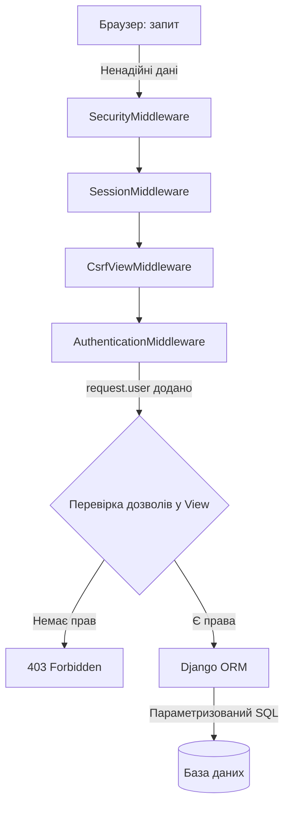
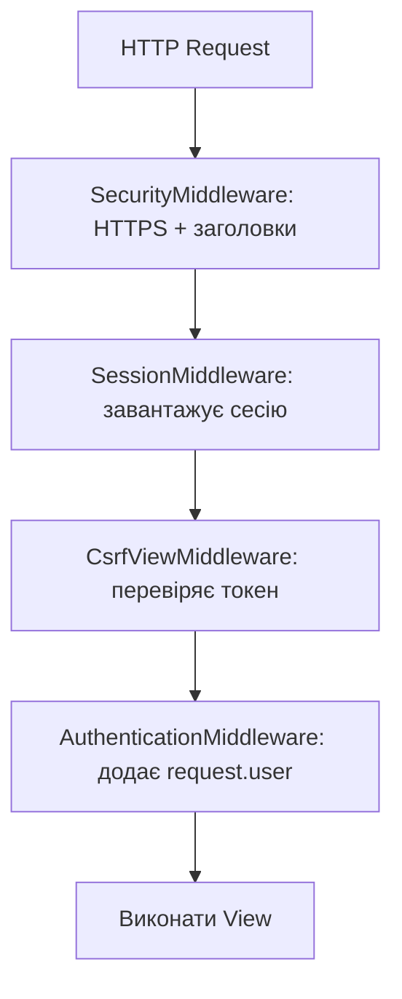
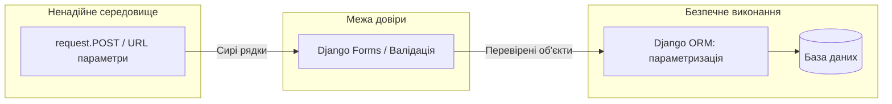

# Архітектура безпеки Django

> Django дотримується філософії **"безпечний за замовчуванням"** (secure by default).
> Це означає, що фреймворк сам захищає від більшості поширених атак —
> тобі потрібно лише правильно його використовувати і не вимикати захисти.

---

## 1. Lifecycle безпечного запиту

Коли користувач надсилає дані (натискає кнопку, надсилає форму), запит проходить через суворий ланцюжок захисту:

```
1. Браузер         → надсилає HTTP-запит (ненадійні дані)
2. SecurityMiddleware → перевіряє HTTPS, додає захисні заголовки
3. SessionMiddleware  → зчитує cookie, завантажує сесію з БД
4. CsrfViewMiddleware → перевіряє CSRF-токен для POST-запитів
5. AuthenticationMiddleware → знаходить юзера в сесії, ставить request.user
6. Твій View       → перевіряє дозволи: чи може request.user зробити це?
7. Django ORM      → будує параметризований SQL-запит (захист від SQL-ін'єкцій)
8. База даних      → виконує безпечний запит
```



---

## 2. Порядок Middleware — чому це критично

Middleware — це як ряд охоронців, через яких проходить кожен запит. Їх порядок у `settings.py` має значення:

```python
MIDDLEWARE = [
    "django.middleware.security.SecurityMiddleware",    # 1. HTTPS, заголовки
    "django.contrib.sessions.middleware.SessionMiddleware",  # 2. Завантажити сесію
    "django.middleware.common.CommonMiddleware",         # 3. URL-нормалізація
    "django.middleware.csrf.CsrfViewMiddleware",         # 4. Перевірити CSRF
    "django.contrib.auth.middleware.AuthenticationMiddleware",  # 5. Знайти юзера
    "django.contrib.messages.middleware.MessageMiddleware",     # 6. Flash-повідомлення
    "django.middleware.clickjacking.XFrameOptionsMiddleware",   # 7. X-Frame-Options
]
```

### Що кожен Middleware робить для безпеки:

**SecurityMiddleware** — додає HTTP-заголовки:
- `Strict-Transport-Security (HSTS)` → браузер завжди використовує HTTPS
- `X-Content-Type-Options: nosniff` → браузер не вгадує тип файлу

**SessionMiddleware** → зчитує `sessionid` з cookie, завантажує дані сесії з бази даних. *Повинен бути перед AuthenticationMiddleware.*

**CsrfViewMiddleware** → перевіряє секретний CSRF-токен у POST/PUT/DELETE запитах. *Захищає від підроблених форм з інших сайтів.*

**XFrameOptionsMiddleware** → додає заголовок `X-Frame-Options: DENY`. *Захищає від clickjacking — коли твій сайт вставляють в невидимий `<iframe>` на шахрайському сайті.*



---

## 3. Автентифікація, Сесії та Хешування паролів

### Як Django зберігає паролі?

**Django НІКОЛИ не зберігає пароль у відкритому вигляді.** Замість цього:

```
Пароль: "mypassword123"
         ↓
PBKDF2 + SHA256 + salt (випадковий рядок) + 870,000 ітерацій
         ↓
"pbkdf2_sha256$870000$abc123salt$XyZ..." ← тільки це зберігається в БД
```

**Чому так?**
- `salt` — унікальний для кожного юзера. Навіть якщо два юзери мають однаковий пароль — хеші різні.
- `870,000 ітерацій` — навіть якщо зловмисник отримає БД, підбір займе роки.
- Нападник не може отримати оригінальний пароль з хешу.

### Сесії — як Django "пам'ятає" юзера

```
1. Alice вводить логін/пароль → POST /login/
2. Django перевіряє: authenticate(username='alice', password='secret')
3. Пароль вірний → create session в БД: session_id = 'abc123xyz'
4. Відповідь з cookie: Set-Cookie: sessionid=abc123xyz; HttpOnly
5. Наступний запит Alice: браузер автоматично надсилає cookie
6. SessionMiddleware знаходить session_id → завантажує дані сесії
7. AuthenticationMiddleware: request.user = Alice
```

**SESSION_COOKIE_HTTPONLY = True** → JavaScript не може прочитати `document.cookie`. Це захист від XSS-атак де JS намагається вкрасти сесійний токен.

---

## 4. Авторизація та безпека Django Admin

### Модель-рівневі дозволи

Django автоматично створює 4 дозволи для кожної моделі:

```python
# Для моделі Note автоматично є:
'hello_app.add_note'     # Може створювати нотатки
'hello_app.view_note'    # Може переглядати
'hello_app.change_note'  # Може редагувати
'hello_app.delete_note'  # Може видаляти

# Перевірка у view:
from django.contrib.auth.decorators import permission_required

@permission_required('hello_app.delete_note')
def note_delete(request, pk):
    # Тільки юзери з дозволом delete_note потрапляють сюди
    pass
```

### Django Admin: is_staff vs is_superuser

```python
user.is_staff = True       # Може заходити на /admin/, але без прав за замовчуванням
user.is_superuser = True   # Автоматично ВСІ права (обходить будь-які перевірки!)

# ПРАВИЛО: Ніколи не використовуй superuser для щоденної роботи!
# Причина: has_perm() завжди True для superuser →
#           ти можеш не помітити баги авторизації в своєму коді
```

---

## 5. ORM та захист від SQL-ін'єкцій

### Як ORM захищає від SQL-ін'єкцій

**SQL-ін'єкція** — атака, де зловмисник вставляє SQL-код у запит.

```python
# Класична SQL-ін'єкція (без ORM):
username = "alice' OR '1'='1"
query = f"SELECT * FROM users WHERE username = '{username}'"
# Результат: SELECT * FROM users WHERE username = 'alice' OR '1'='1'
# Атакер отримує ВСІХ юзерів!

# Django ORM — БЕЗПЕЧНО:
User.objects.filter(username=username)
# ORM будує: SELECT * FROM users WHERE username = %s
# Підставляє: ('alice\' OR \'1\'=\'1',)  ← безпечно екранований рядок
```



**SQL-ін'єкція можлива тільки якщо ти обходиш ORM:**

```python
# НЕБЕЗПЕЧНО — конкатенація рядків з user input:
User.objects.raw(f"SELECT * FROM users WHERE name = '{user_input}'")

# БЕЗПЕЧНО — параметризований запит:
User.objects.raw("SELECT * FROM users WHERE name = %s", [user_input])

# НАЙКРАЩЕ — просто використовуй ORM:
User.objects.filter(username=user_input)  # автоматично безпечно
```

---

## 6. Захист від CSRF та XSS

### CSRF (Cross-Site Request Forgery) — підробка запитів між сайтами

**Сценарій атаки:**
1. Alice авторизована на `mybank.com`
2. Alice заходить на `evil.com`
3. `evil.com` містить прихований тег: `<form action="mybank.com/transfer" method="POST">`
4. Браузер Alice автоматично надсилає cookie на `mybank.com` → переказ відбувається!

**Django захист:**
```html
<!-- Кожна форма ОБОВ'ЯЗКОВО має csrf_token: -->
<form method="post">
    
    <!-- Django генерує прихований токен, прив'язаний до сесії -->
    <!-- evil.com не може знати цей токен → атака провалюється -->
</form>
```

### XSS (Cross-Site Scripting) — впровадження шкідливого скрипту

**Сценарій:** Зловмисник зберігає `<script>alert('hacked')</script>` як назву нотатки. Коли інший юзер переглядає сторінку — скрипт виконується.

**Django захист — автоматичне екранування:**
```html
<!-- Django шаблонізатор автоматично перетворює: -->
{{ note.title }}
<!-- "<script>alert('hacked')</script>" → "&lt;script&gt;alert(&#x27;hacked&#x27;)&lt;/script&gt;" -->
<!-- Браузер відображає як текст, а не виконує як код -->

<!-- НЕБЕЗПЕЧНО — ніколи так з user input: -->
{{ note.content|safe }}      <!-- вимикає захист! -->
...
```

---

## 7. Безпека завантаження файлів

**Проблема:** Атакер завантажує файл `virus.html` замасковний як `photo.png`. Якщо сервер відображає його — браузер виконує HTML-код.

**Захист:**
- Обмеж максимальний розмір файлу в nginx (захист від DoS)
- Зберігай та відображай user-файли з **окремого домену** (не з основного сайту):

```
# Правильно:
myapp.com             ← основний сайт (Django)
usercontent.myapp.com ← медіа-файли юзерів (окремий домен!)

# Чому: same-origin policy → JS з usercontent.myapp.com
#       не має доступу до cookies myapp.com
```

---

## 8. Безпечні налаштування settings.py

```python
# ── КРИТИЧНО для production ──────────────────────────────────────────────────
DEBUG = False                           # НІКОЛИ True в production!
# DEBUG = True: відображає стектрейси, env-змінні, всі SQL-запити → дар для хакера

SECRET_KEY = os.environ['DJANGO_SECRET_KEY']   # Зберігай у .env, НЕ в коді!
# SECRET_KEY: захищає підпис сесій і токенів. Витік → підробка сесій!

ALLOWED_HOSTS = ['mysite.com', 'www.mysite.com']   # СУВОРО визначай
# Без цього: Host header poisoning → підміна домену в emails і редиректах

# ── HTTPS ─────────────────────────────────────────────────────────────────────
SECURE_SSL_REDIRECT = True          # HTTP → HTTPS примусово
SECURE_HSTS_SECONDS = 31536000      # HSTS: браузер "запам'ятовує" HTTPS на рік

# ── Cookies ───────────────────────────────────────────────────────────────────
SESSION_COOKIE_SECURE = True        # Cookie тільки через HTTPS
SESSION_COOKIE_HTTPONLY = True      # JS не може прочитати sessionid
SESSION_COOKIE_SAMESITE = "Lax"    # CSRF захист для cookies

CSRF_COOKIE_SECURE = True           # CSRF cookie тільки через HTTPS

# ── Заголовки ─────────────────────────────────────────────────────────────────
X_FRAME_OPTIONS = "DENY"            # Захист від clickjacking
SECURE_CONTENT_TYPE_NOSNIFF = True  # Захист від MIME-sniffing
```

> **Навіщо все це?** Уяви, що твій сайт — це будинок. `DEBUG=True` в production — це залишити всі двері відчиненими і повісити табличку "Тут є сейф і ось його код".
