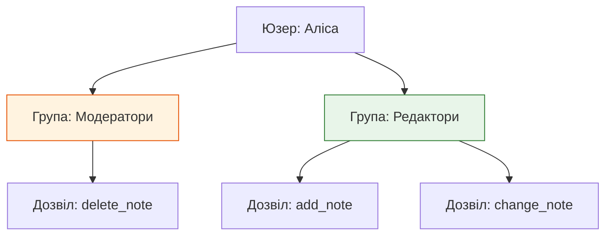
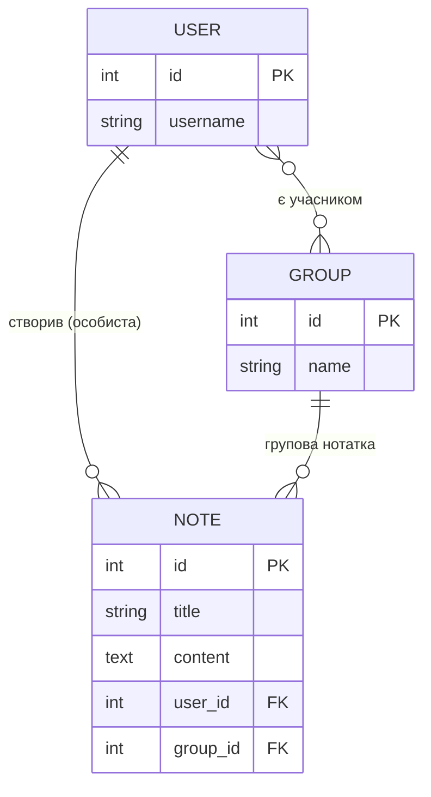

# Дозволи та Групи — Permissions & Groups

> **Для кого:** Студенти, що вивчають як контролювати доступ до ресурсів у Django.
>
> **Головне питання цього документа:** Як зробити так, щоб Аліса могла редагувати лише **свої** нотатки, а не нотатки Боба?

---

## 1. Що таке Дозволи (Permissions)?

Django автоматично створює 4 базових дозволи для кожної моделі:

```python
# Для моделі Note Django автоматично створює:
'hello_app.add_note'     # може створювати нотатки
'hello_app.view_note'    # може переглядати
'hello_app.change_note'  # може редагувати
'hello_app.delete_note'  # може видаляти

# Приклад використання:
from django.contrib.auth.decorators import permission_required

@permission_required('hello_app.delete_note')  # ← перевіряє дозвіл
def admin_delete_note(request, pk):
    # Тільки юзери з явним дозволом delete_note потрапляють сюди
    note = get_object_or_404(Note, pk=pk)
    note.delete()
```

---

## 2. Object-Level Permissions — Перевірка на рівні конкретного об'єкта

**Проблема:** `@permission_required('hello_app.change_note')` перевіряє лише *"чи може цей юзер редагувати нотатки взагалі"*. Але не перевіряє *"чи належить ця конкретна нотатка йому"*.

```python
# НЕБЕЗПЕЧНО — IDOR (Insecure Direct Object Reference):
@login_required
def note_edit(request, pk):
    note = get_object_or_404(Note, pk=pk)   # pk=42 → Аліса редагує нотатку Боба!
    # ...

# БЕЗПЕЧНО — перевіряємо власника:
@login_required
def note_edit(request, pk):
    note = get_object_or_404(Note, pk=pk, user=request.user)   # pk=42 і user=Alice?
    # Якщо нотатка 42 належить Бобу → Django поверне 404 для Аліси ✓
```

**Що таке IDOR (Insecure Direct Object Reference)?**

> Аліса знає що URL нотатки — `/notes/42/edit/`.
> Вона змінює число на `/notes/43/edit/` і намагається редагувати нотатку Боба.
> Якщо view не перевіряє власника — атака вдається!

```python
# Правило: завжди додавай user=request.user до get_object_or_404

# Для ВЛАСНИХ об'єктів:
note = get_object_or_404(Note, pk=pk, user=request.user)

# Для СПІЛЬНИХ об'єктів (своє АБО в групі):
from django.core.exceptions import PermissionDenied
from django.db.models import Q

note = get_object_or_404(Note, pk=pk)
user_groups = request.user.groups.all()
has_access = (note.user == request.user) or (note.group and note.group in user_groups)
if not has_access:
    raise PermissionDenied   # → 403 Forbidden
```

---

## 3. Групи (Groups) — управління доступом через ролі

**Проблема:** У тебе є 50 модераторів. Призначати кожному по 10 дозволів вручну — погана ідея. При зміні правил треба оновлювати 50 юзерів.

**Рішення:** Групи (Groups).

```
Замість:
  Alice → [can_delete_note, can_edit_note, can_view_reports, ...]
  Bob   → [can_delete_note, can_edit_note, can_view_reports, ...]
  ...

Краще:
  Group "Moderators" → [can_delete_note, can_edit_note, can_view_reports]
  Alice → Group "Moderators"
  Bob   → Group "Moderators"
  
  При зміні прав → оновлюєш тільки групу ✓
```

### Архітектура груп та дозволів



---

## 4. Групи у нашому проєкті — Спільний доступ до нотаток

У `crispy_notes_project` ми використовуємо Django вбудовану модель `Group` **не для дозволів**, а для **спільного доступу до нотаток і списків покупок**.

**Ідея:** Аліса створює групу "Сімя" і додає Боба. Коли Аліса створює нотатку і вказує групу "Сімя" — Боб теж бачить цю нотатку.

```python
# models.py
from django.contrib.auth.models import Group

class Note(models.Model):
    user = models.ForeignKey(User, on_delete=models.CASCADE)  # особистий власник
    group = models.ForeignKey(                                  # опціональна група
        Group, on_delete=models.SET_NULL, null=True, blank=True
    )
    title = models.CharField(max_length=200)
    content = models.TextField(blank=True)
```

**selectors.py** — запит: "показати всі нотатки юзера та його груп":
```python
from django.db.models import Q

def get_user_notes(user):
    user_groups = user.groups.all()
    return Note.objects.filter(
        Q(user=user) |                   # власні нотатки
        Q(group__in=user_groups)         # нотатки груп
    ).distinct()
    # Аліса в групах "Сімя" і "Робота" → бачить і свої і групові нотатки
```

---

## 5. Управління групами — Group Views

У проєкті є views для управління групами:

| URL | View | Дія |
|-----|------|-----|
| `/groups/` | `group_list` | Список груп юзера |
| `/groups/new/` | `group_create` | Створити нову групу |
| `/groups/<pk>/` | `group_detail` | Перегляд учасників, додавання/видалення |
| `/groups/<pk>/delete/` | `group_delete` | Видалення групи |

**Приклад: створення групи "Сімя":**
```python
# services.py
def create_group(*, name, creator):
    group = Group.objects.create(name=name)
    group.user_set.add(creator)   # ← creator автоматично стає першим учасником
    return group

# Додавання учасника:
def add_user_to_group(group, username):
    from django.contrib.auth.models import User
    try:
        user = User.objects.get(username=username)
    except User.DoesNotExist:
        return False, f'Юзера «{username}» не знайдено.'
    group.user_set.add(user)
    return True, ''
```

---

## 6. ER-діаграма: Юзер, Група, Нотатка



**Читання діаграми:**
- `USER ||--o{ NOTE` → один юзер може мати багато нотаток (`||` = один, `o{` = багато або нуль)
- `GROUP ||--o{ NOTE` → одна група може мати багато нотаток
- `USER }o--o{ GROUP` → юзер може бути в кількох групах, група може мати кількох юзерів (M:N)

---

## Де це в нашому проєкті?

| Файл | Що реалізовано |
|------|----------------|
| `hello_app/models.py` | `Note.group FK`, `ShoppingList.group FK` |
| `hello_app/views.py` | `group_list`, `group_create`, `group_detail`, `group_delete` |
| `hello_app/services.py` | `create_group`, `add_user_to_group`, `remove_user_from_group` |
| `hello_app/selectors.py` | `get_user_notes` (Q filter), `get_user_groups`, `get_group_with_members` |
| `hello_app/forms.py` | `GroupCreateForm`, `GroupAddMemberForm` |
| `hello_app/templates/hello_app/` | `group_list.html`, `group_form.html`, `group_detail.html` |
