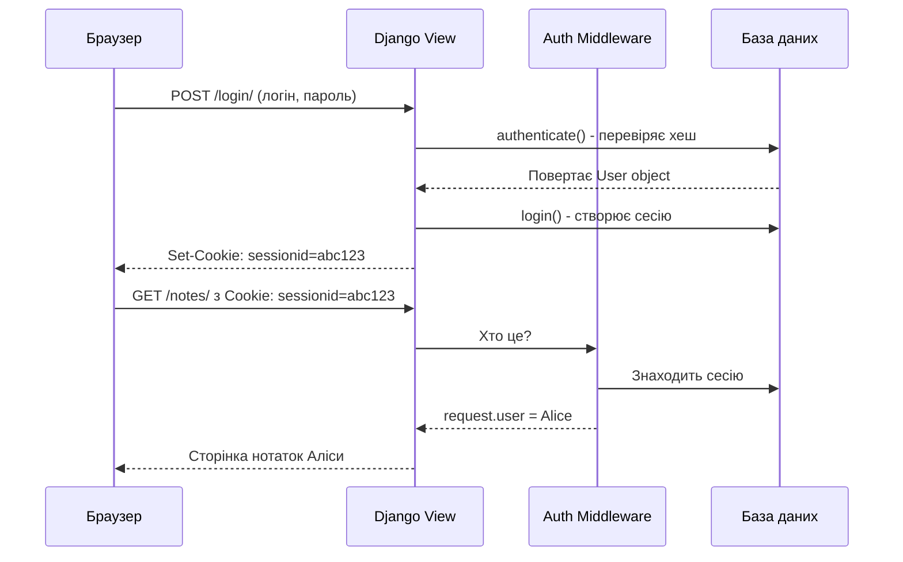
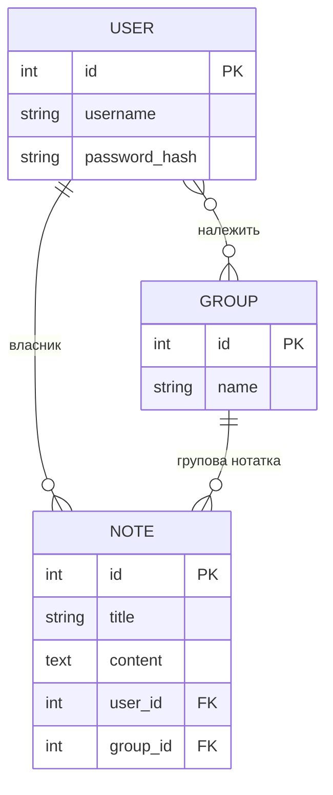

# Сесії, Login/Logout та Власність даних

> **Для кого:** Студенти, що вивчають як Django "пам'ятає" залогіненого юзера між запитами.

---

## 1. Чому HTTP не "пам'ятає" юзера?

HTTP — **протокол без стану (stateless)**. Кожен запит — ніби перший. Сервер не знає хто надіслав запит, якщо ти не скажеш.

**Аналогія:** Уяви магазин де продавець кожного разу забуває тебе. Щоразу треба знову показувати паспорт. Незручно? Django вирішує це через **сесії та cookies**.

---

## 2. Як Django вирішує проблему: Cookies + Sessions

**Крок 1: Вхід (Login)**
```
Аліса → POST /login/ { username: 'alice', password: 'secret' }
               ↓
Django: authenticate('alice', 'secret') → перевіряє хеш пароля → OK
               ↓
Django: login() → створює запис сесії в базі даних:
        | session_id         | user_id | created_at |
        | 'xK9mPq...'       |    42   | 2025-01-15 |
               ↓
Відповідь: HTTP 302 Redirect
Headers: Set-Cookie: sessionid=xK9mPq...; HttpOnly; SameSite=Lax
```

**Крок 2: Наступний запит Аліси**
```
Браузер автоматично надсилає: Cookie: sessionid=xK9mPq...
               ↓
SessionMiddleware: знаходить сесію в БД → завантажує
               ↓
AuthenticationMiddleware: user_id=42 → request.user = User(id=42, username='alice')
               ↓
View: request.user вже "знає" що це Аліса ✓
```

**Крок 3: Вихід (Logout)**
```
POST /accounts/logout/ (з CSRF-токеном)
               ↓
Django logout(): видаляє сесію з БД
               ↓
Відповідь: Set-Cookie: sessionid=; expires=Thu, 01 Jan 1970...
               ↓
Браузер видаляє cookie. Аліса стала AnonymousUser.
```

### Діаграма login/logout



---

## 3. Власність даних та безпечна фільтрація

**Головне правило безпеки:** Кожен юзер бачить ТІЛЬКИ свої дані.

```python
# НЕБЕЗПЕЧНО — Аліса бачить нотатки всіх юзерів:
def note_list(request):
    notes = Note.objects.all()   # ← Критична помилка!
    return render(request, 'notes.html', {'notes': notes})

# БЕЗПЕЧНО — Аліса бачить тільки свої нотатки:
@login_required
def note_list(request):
    notes = Note.objects.filter(user=request.user)   # ← Завжди фільтруй!
    return render(request, 'notes.html', {'notes': notes})
```

### ER-діаграма: Юзер та його нотатки



**Пояснення зв'язків:**
- `user_id FK` — кожна нотатка має власника (обов'язковий)
- `group_id FK` — нотатка може належати групі (необов'язково, null дозволено)
- Якщо `group_id = NULL` → особиста нотатка
- Якщо `group_id = 5` → групова нотатка, видна всім членам групи 5

---

## 4. URL-маршрутизація та вбудовані Views Django

Django надає готові views для login/logout — їх не треба писати самостійно:

```python
# hello_project/urls.py
from django.contrib.auth import views as auth_views

urlpatterns = [
    # Django вбудовані views для auth:
    path('accounts/', include('django.contrib.auth.urls')),
    # Це підключає:
    # /accounts/login/           → LoginView
    # /accounts/logout/          → LogoutView
    # /accounts/password_change/ → PasswordChangeView
    # /accounts/password_reset/  → PasswordResetView
    # ... та інші
]
```

**settings.py** — налаштування редиректів:
```python
LOGIN_URL = '/accounts/login/'         # куди перенаправляти незалогінених
LOGIN_REDIRECT_URL = '/notes/'         # куди після успішного входу
LOGOUT_REDIRECT_URL = '/accounts/login/'  # куди після виходу
```

---

## 5. Password Reset Flow — Відновлення паролю

Повний цикл відновлення паролю (вже реалізований у проєкті):

```
1. /accounts/password_reset/
   → Форма введення email (password_reset_form.html)
   
2. POST email → Django шукає юзера з цим email
   → Генерує унікальний токен (одноразовий, діє 24 год)
   → Надсилає email з посиланням
   
   [DEV: email виводиться в консоль — EMAIL_BACKEND = console]
   
3. /accounts/password_reset/done/
   → Повідомлення "перевір пошту" (password_reset_done.html)
   
4. /accounts/reset/<uidb64>/<token>/
   → Форма нового пароля (password_reset_confirm.html)
   → Django перевіряє токен. Якщо недійсний → повідомлення про помилку
   
5. Успішна зміна → /accounts/reset/done/ (password_reset_complete.html)
```

---

## Де це в нашому проєкті?

| Концепція | Файл | Рядок |
|-----------|------|--------|
| login/logout URLs | `hello_project/urls.py` | `include('django.contrib.auth.urls')` |
| Password reset templates | `templates/registration/password_reset_*.html` | всі 5 файлів |
| Password change templates | `templates/registration/password_change_*.html` | 2 файли |
| Посилання "Забули пароль?" | `templates/registration/login.html` | `` |
| Посилання "Змінити пароль" | `templates/layouts/dashboard.html` | dropdown menu |
| EMAIL_BACKEND | `hello_project/settings.py` | `console.EmailBackend` |
